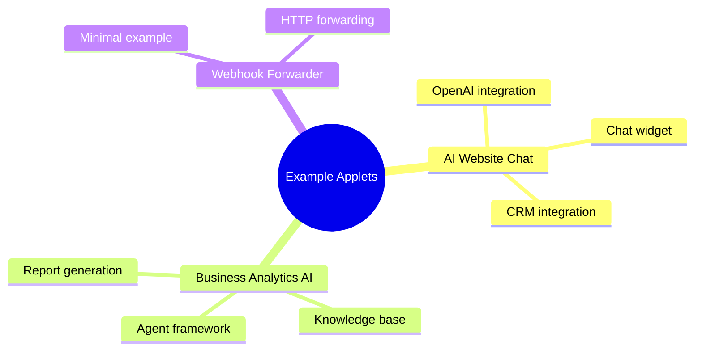
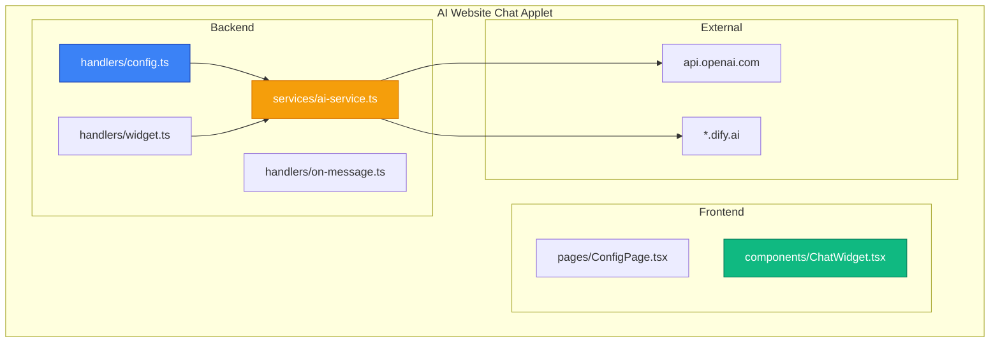
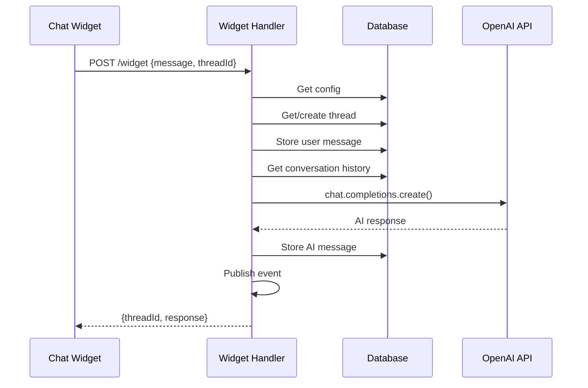
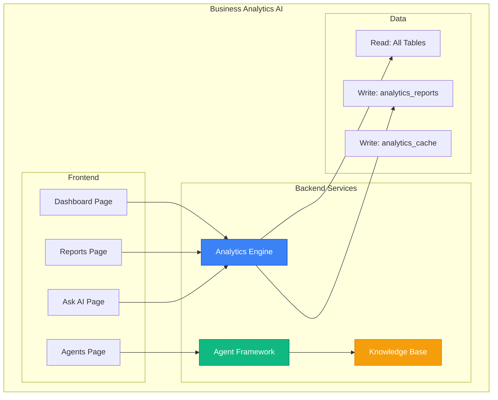
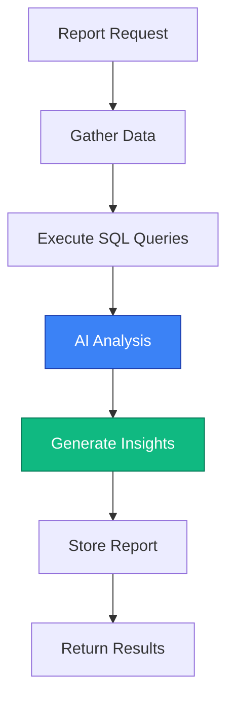
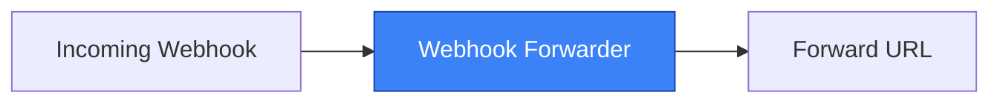
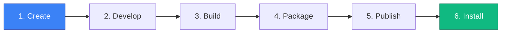

# Example Applets

**Status:** Draft

## Overview

This document provides reference implementations based on existing IOTA SDK modules that would be good candidates for applets.



## Example 1: AI Website Chat (Based on Website Module)

The Website module's AI chat functionality is an ideal applet candidate.



### Capabilities

| Feature | Description |
|---------|-------------|
| Embeddable chat widget | For external websites |
| AI-powered responses | Using OpenAI/Dify |
| CRM integration | Client tracking |
| Message routing | Thread management |

### Manifest

```yaml
# manifest.yaml
manifestVersion: "1.0"
id: "ai-website-chat"
version: "1.0.0"
name:
  en: "AI Website Chat"
  ru: "AI Чат для сайта"
  uz: "Veb-sayt uchun AI Chat"
description:
  en: "Embeddable AI chatbot for your website with CRM integration"
  ru: "Встраиваемый AI чат-бот для вашего сайта с интеграцией CRM"
author:
  name: "IOTA Team"
  email: "team@iota.uz"
license: "MIT"
icon: "assets/icon.svg"
category: "communication"
minSdkVersion: "2.0.0"

runtime:
  engine: "bun"
  entrypoint: "dist/backend/server.js"
  resources:
    maxMemoryMB: 256
    maxCpuPercent: 50

permissions:
  database:
    read:
      - clients
      - chats
      - chat_messages
      - users
    write:
      - clients
      - chats
      - chat_messages
    createTables: true
  http:
    external:
      - "api.openai.com"
      - "*.dify.ai"
  events:
    subscribe:
      - "chat.message.created"
    publish:
      - "ai.response.generated"
  ui:
    navigation: true
    pages: true
    widgets: true
  secrets:
    - name: "OPENAI_API_KEY"
      description: "OpenAI API key for chat completions"
      required: true
    - name: "DIFY_API_KEY"
      description: "Dify API key for RAG (optional)"
      required: false

tables:
  - name: "configs"
    description: "AI chat configuration per tenant"
    columns:
      - name: id
        type: bigserial
        primary: true
      - name: tenant_id
        type: uuid
        required: true
        index: true
      - name: model_name
        type: varchar(100)
        default: "gpt-4"
      - name: system_prompt
        type: text
        nullable: true
      - name: temperature
        type: decimal(3,2)
        default: 0.7
      - name: max_tokens
        type: integer
        default: 2000
      - name: welcome_message
        type: text
        nullable: true
      - name: widget_color
        type: varchar(20)
        default: "#3b82f6"
    indexes:
      - columns: [tenant_id]
        unique: true

  - name: "threads"
    description: "Chat thread tracking for AI context"
    columns:
      - name: id
        type: uuid
        primary: true
        default: gen_random_uuid()
      - name: tenant_id
        type: uuid
        required: true
      - name: chat_id
        type: bigint
        required: true
        foreignKey:
          table: chats
          column: id
          onDelete: CASCADE
      - name: openai_thread_id
        type: varchar(100)
        nullable: true
      - name: context_summary
        type: text
        nullable: true

backend:
  handlers:
    - type: http
      path: "/api/applets/ai-chat/config"
      methods: [GET, POST, PUT]
      handler: "handlers/config.ts"
      auth: required
      permissions:
        - "ai-chat.config.read"
        - "ai-chat.config.write"

    - type: http
      path: "/api/applets/ai-chat/widget"
      methods: [POST]
      handler: "handlers/widget.ts"
      auth: optional
      rateLimit:
        requests: 60
        window: 60

    - type: http
      path: "/api/applets/ai-chat/embed.js"
      methods: [GET]
      handler: "handlers/embed-script.ts"
      auth: none

    - type: event
      events:
        - "chat.message.created"
      handler: "handlers/on-message.ts"
      async: true

frontend:
  framework: react
  navigation:
    - label:
        en: "AI Chat"
        ru: "AI Чат"
      icon: "chat"
      path: "/website/ai-chat"
      permissions:
        - "ai-chat.config.read"
      parent: "website"

  pages:
    - path: "/website/ai-chat"
      title:
        en: "AI Chat Configuration"
        ru: "Настройка AI Чата"
      component: "pages/ConfigPage"
      permissions:
        - "ai-chat.config.read"

    - path: "/website/ai-chat/embed"
      title:
        en: "Embed Widget"
      component: "pages/EmbedPage"
      public: true

  widgets:
    - target: "crm.chats.detail"
      position: "sidebar-right"
      component: "widgets/AiAssistButton"
      permissions:
        - "ai-chat.assist"

  embeddables:
    - name: "chat-widget"
      component: "components/ChatWidget"
      config:
        - name: "theme"
          type: "string"
          options: ["light", "dark", "auto"]
          default: "auto"

appletPermissions:
  - key: "ai-chat.config.read"
    name:
      en: "View AI Chat Configuration"
  - key: "ai-chat.config.write"
    name:
      en: "Edit AI Chat Configuration"
  - key: "ai-chat.assist"
    name:
      en: "Use AI Assistant"

dependencies:
  modules:
    - "crm"
```

### Backend Implementation

#### Server Entry Point

```typescript
// src/backend/server.ts
import { serve } from "bun";
import { AppletServer } from "@iota/applet-sdk/server";
import { configHandler } from "./handlers/config";
import { widgetHandler } from "./handlers/widget";
import { onMessageHandler } from "./handlers/on-message";

const server = new AppletServer({
  handlers: {
    "handlers/config.ts": configHandler,
    "handlers/widget.ts": widgetHandler,
    "handlers/on-message.ts": onMessageHandler,
  },
});

serve({
  unix: process.env.SOCKET_PATH,
  fetch: server.handleRequest,
});
```

#### Configuration Handler

```typescript
// src/backend/handlers/config.ts
import { Handler, Context } from "@iota/applet-sdk";

interface AIConfig {
  modelName: string;
  systemPrompt: string;
  temperature: number;
  maxTokens: number;
  welcomeMessage: string;
  widgetColor: string;
}

export const configHandler: Handler = async (ctx: Context) => {
  const { method, body } = ctx.request;
  const { db, permissions } = ctx.sdk;

  if (method === "GET") {
    if (!permissions.check("ai-chat.config.read")) {
      return ctx.forbidden();
    }

    const config = await db.table("applet_ai_chat_configs")
      .where("tenant_id", ctx.tenantId)
      .first();

    return ctx.json(config || getDefaultConfig());
  }

  if (method === "POST" || method === "PUT") {
    if (!permissions.check("ai-chat.config.write")) {
      return ctx.forbidden();
    }

    const data = body as AIConfig;

    // Validate
    if (data.temperature < 0 || data.temperature > 2) {
      return ctx.badRequest("Temperature must be between 0 and 2");
    }

    // Upsert config
    const existing = await db.table("applet_ai_chat_configs")
      .where("tenant_id", ctx.tenantId)
      .first();

    if (existing) {
      await db.table("applet_ai_chat_configs")
        .where("id", existing.id)
        .update(data);
    } else {
      await db.table("applet_ai_chat_configs").insert({
        ...data,
        tenant_id: ctx.tenantId,
      });
    }

    return ctx.json({ success: true });
  }
};

function getDefaultConfig(): AIConfig {
  return {
    modelName: "gpt-4",
    systemPrompt: "You are a helpful assistant for our company.",
    temperature: 0.7,
    maxTokens: 2000,
    welcomeMessage: "Hello! How can I help you today?",
    widgetColor: "#3b82f6",
  };
}
```

#### Widget Handler



```typescript
// src/backend/handlers/widget.ts
import { Handler, Context } from "@iota/applet-sdk";
import OpenAI from "openai";

export const widgetHandler: Handler = async (ctx: Context) => {
  const { message, threadId } = ctx.request.body;
  const { db, secrets, http } = ctx.sdk;

  // Get config
  const config = await db.table("applet_ai_chat_configs")
    .where("tenant_id", ctx.tenantId)
    .first();

  if (!config) {
    return ctx.badRequest("AI Chat not configured");
  }

  // Get or create thread
  let thread = threadId
    ? await db.table("applet_ai_chat_threads")
        .where("id", threadId)
        .first()
    : null;

  if (!thread) {
    // Create new chat in CRM
    const chat = await db.table("chats").insert({
      source: "website_widget",
      status: "open",
    });

    thread = await db.table("applet_ai_chat_threads").insert({
      chat_id: chat.id,
    });
  }

  // Store user message
  await db.table("chat_messages").insert({
    chat_id: thread.chat_id,
    content: message,
    sender_type: "client",
  });

  // Get conversation history
  const history = await db.table("chat_messages")
    .where("chat_id", thread.chat_id)
    .orderBy("created_at", "asc")
    .limit(20)
    .get();

  // Call OpenAI
  const openai = new OpenAI({
    apiKey: secrets.get("OPENAI_API_KEY"),
  });

  const completion = await openai.chat.completions.create({
    model: config.model_name,
    temperature: config.temperature,
    max_tokens: config.max_tokens,
    messages: [
      { role: "system", content: config.system_prompt },
      ...history.map((msg) => ({
        role: msg.sender_type === "client" ? "user" : "assistant",
        content: msg.content,
      })),
    ],
  });

  const aiResponse = completion.choices[0].message.content;

  // Store AI response
  await db.table("chat_messages").insert({
    chat_id: thread.chat_id,
    content: aiResponse,
    sender_type: "ai",
  });

  // Publish event
  await ctx.sdk.events.publish("ai.response.generated", {
    threadId: thread.id,
    chatId: thread.chat_id,
    response: aiResponse,
  });

  return ctx.json({
    threadId: thread.id,
    response: aiResponse,
  });
};
```

### Frontend Implementation

#### Configuration Page

```tsx
// src/frontend/pages/ConfigPage.tsx
import { useState, useEffect } from "react";
import {
  Card,
  Input,
  Select,
  Textarea,
  Slider,
  Button,
  ColorPicker,
} from "@iota/components";
import { useAppletContext } from "@iota/applet-sdk/react";

interface AIConfig {
  modelName: string;
  systemPrompt: string;
  temperature: number;
  maxTokens: number;
  welcomeMessage: string;
  widgetColor: string;
}

const MODELS = [
  { value: "gpt-4", label: "GPT-4" },
  { value: "gpt-4-turbo", label: "GPT-4 Turbo" },
  { value: "gpt-3.5-turbo", label: "GPT-3.5 Turbo" },
  { value: "claude-3-opus", label: "Claude 3 Opus" },
  { value: "claude-3-sonnet", label: "Claude 3 Sonnet" },
];

export function ConfigPage() {
  const { t, api, toast, permissions } = useAppletContext();
  const [config, setConfig] = useState<AIConfig | null>(null);
  const [loading, setLoading] = useState(true);
  const [saving, setSaving] = useState(false);

  const canEdit = permissions.check("ai-chat.config.write");

  useEffect(() => {
    loadConfig();
  }, []);

  async function loadConfig() {
    try {
      const data = await api.get<AIConfig>("/config");
      setConfig(data);
    } catch (error) {
      toast.error(t("Config.LoadError"));
    } finally {
      setLoading(false);
    }
  }

  async function handleSave() {
    if (!config) return;

    setSaving(true);
    try {
      await api.put("/config", config);
      toast.success(t("Config.Saved"));
    } catch (error) {
      toast.error(t("Config.SaveError"));
    } finally {
      setSaving(false);
    }
  }

  if (loading) {
    return <Card><Skeleton lines={6} /></Card>;
  }

  return (
    <div className="space-y-6">
      <Card title={t("Config.AISettings")}>
        <div className="space-y-4">
          <Select
            label={t("Config.Model")}
            value={config?.modelName}
            onChange={(v) => setConfig({ ...config!, modelName: v })}
            options={MODELS}
            disabled={!canEdit}
          />

          <Textarea
            label={t("Config.SystemPrompt")}
            value={config?.systemPrompt}
            onChange={(v) => setConfig({ ...config!, systemPrompt: v })}
            rows={6}
            disabled={!canEdit}
            help={t("Config.SystemPromptHelp")}
          />

          <Slider
            label={t("Config.Temperature")}
            value={config?.temperature}
            onChange={(v) => setConfig({ ...config!, temperature: v })}
            min={0}
            max={2}
            step={0.1}
            disabled={!canEdit}
          />

          <Input
            label={t("Config.MaxTokens")}
            type="number"
            value={config?.maxTokens}
            onChange={(v) => setConfig({ ...config!, maxTokens: parseInt(v) })}
            disabled={!canEdit}
          />
        </div>
      </Card>

      <Card title={t("Config.WidgetSettings")}>
        <div className="space-y-4">
          <Textarea
            label={t("Config.WelcomeMessage")}
            value={config?.welcomeMessage}
            onChange={(v) => setConfig({ ...config!, welcomeMessage: v })}
            rows={3}
            disabled={!canEdit}
          />

          <ColorPicker
            label={t("Config.WidgetColor")}
            value={config?.widgetColor}
            onChange={(v) => setConfig({ ...config!, widgetColor: v })}
            disabled={!canEdit}
          />
        </div>
      </Card>

      {canEdit && (
        <div className="flex justify-end">
          <Button
            variant="primary"
            onClick={handleSave}
            loading={saving}
          >
            {t("Common.Save")}
          </Button>
        </div>
      )}
    </div>
  );
}
```

#### Chat Widget Component

```tsx
// src/frontend/components/ChatWidget.tsx
import { useState, useRef, useEffect } from "react";

interface ChatWidgetProps {
  tenantId: string;
  theme?: "light" | "dark" | "auto";
  position?: "bottom-right" | "bottom-left";
}

interface Message {
  id: string;
  content: string;
  sender: "user" | "ai";
  timestamp: Date;
}

export function ChatWidget({ tenantId, theme = "auto", position = "bottom-right" }: ChatWidgetProps) {
  const [isOpen, setIsOpen] = useState(false);
  const [messages, setMessages] = useState<Message[]>([]);
  const [input, setInput] = useState("");
  const [threadId, setThreadId] = useState<string | null>(null);
  const [loading, setLoading] = useState(false);
  const messagesEndRef = useRef<HTMLDivElement>(null);

  useEffect(() => {
    messagesEndRef.current?.scrollIntoView({ behavior: "smooth" });
  }, [messages]);

  async function sendMessage() {
    if (!input.trim() || loading) return;

    const userMessage: Message = {
      id: crypto.randomUUID(),
      content: input,
      sender: "user",
      timestamp: new Date(),
    };

    setMessages((prev) => [...prev, userMessage]);
    setInput("");
    setLoading(true);

    try {
      const response = await fetch(`/api/applets/ai-chat/widget`, {
        method: "POST",
        headers: {
          "Content-Type": "application/json",
          "X-Tenant-ID": tenantId,
        },
        body: JSON.stringify({
          message: input,
          threadId,
        }),
      });

      const data = await response.json();

      setThreadId(data.threadId);

      const aiMessage: Message = {
        id: crypto.randomUUID(),
        content: data.response,
        sender: "ai",
        timestamp: new Date(),
      };

      setMessages((prev) => [...prev, aiMessage]);
    } catch (error) {
      console.error("Failed to send message:", error);
    } finally {
      setLoading(false);
    }
  }

  return (
    <div className={`chat-widget chat-widget--${position} chat-widget--${theme}`}>
      {isOpen ? (
        <div className="chat-widget__container">
          <div className="chat-widget__header">
            <span>Chat with us</span>
            <button onClick={() => setIsOpen(false)}>×</button>
          </div>

          <div className="chat-widget__messages">
            {messages.map((msg) => (
              <div key={msg.id} className={`chat-message chat-message--${msg.sender}`}>
                {msg.content}
              </div>
            ))}
            {loading && (
              <div className="chat-message chat-message--ai">
                <span className="typing-indicator">...</span>
              </div>
            )}
            <div ref={messagesEndRef} />
          </div>

          <div className="chat-widget__input">
            <input
              type="text"
              value={input}
              onChange={(e) => setInput(e.target.value)}
              onKeyPress={(e) => e.key === "Enter" && sendMessage()}
              placeholder="Type a message..."
              disabled={loading}
            />
            <button onClick={sendMessage} disabled={loading}>
              Send
            </button>
          </div>
        </div>
      ) : (
        <button className="chat-widget__toggle" onClick={() => setIsOpen(true)}>
          💬
        </button>
      )}
    </div>
  );
}
```

---

## Example 2: Business Analytics AI (Conceptual)

Based on the Shyona module, this represents a more complex applet.



### Key Features

| Feature | Description |
|---------|-------------|
| Natural language queries | Ask business questions in plain English |
| SQL generation | AI generates and executes safe queries |
| Agent orchestration | Multi-agent task automation |
| Knowledge base | Vector search for business context |

### Manifest (Condensed)

```yaml
manifestVersion: "1.0"
id: "business-analytics-ai"
version: "1.0.0"
name:
  en: "AI Business Analytics"
  ru: "AI Бизнес-Аналитика"

runtime:
  engine: "bun"
  entrypoint: "dist/backend/server.js"
  resources:
    maxMemoryMB: 512
    maxCpuPercent: 70

permissions:
  database:
    read:
      - "*"  # Read access to all tables for analytics
    write:
      - analytics_reports
      - analytics_cache
    createTables: true
  http:
    external:
      - "api.openai.com"
      - "api.anthropic.com"
  events:
    subscribe:
      - "*"  # Subscribe to all events for analytics
    publish:
      - "analytics.report.generated"
      - "analytics.insight.discovered"
```

### Analytics Engine Service



```typescript
// src/backend/services/analytics-engine.ts
import OpenAI from "openai";
import { Context } from "@iota/applet-sdk";

export class AnalyticsEngine {
  private openai: OpenAI;
  private ctx: Context;

  constructor(ctx: Context) {
    this.ctx = ctx;
    this.openai = new OpenAI({
      apiKey: ctx.sdk.secrets.get("OPENAI_API_KEY"),
    });
  }

  async generateReport(type: string, params: Record<string, any>) {
    // Gather data based on report type
    const data = await this.gatherData(type, params);

    // Use AI to analyze and generate insights
    const analysis = await this.analyzeWithAI(type, data);

    // Store report
    const report = await this.ctx.sdk.db.table("applet_analytics_reports").insert({
      report_type: type,
      parameters: params,
      result: analysis,
      generated_at: new Date(),
    });

    return report;
  }

  private async gatherData(type: string, params: Record<string, any>) {
    const { db } = this.ctx.sdk;
    const { startDate, endDate } = params;

    switch (type) {
      case "financial_summary":
        return {
          payments: await db.table("payments")
            .whereBetween("created_at", [startDate, endDate])
            .get(),
          expenses: await db.table("expenses")
            .whereBetween("created_at", [startDate, endDate])
            .get(),
          revenue: await db.raw(`
            SELECT SUM(amount) as total
            FROM payments
            WHERE created_at BETWEEN $1 AND $2
          `, [startDate, endDate]),
        };

      case "sales_performance":
        return {
          orders: await db.table("orders")
            .whereBetween("created_at", [startDate, endDate])
            .get(),
          topProducts: await db.raw(`
            SELECT p.name, SUM(oi.quantity) as total_sold
            FROM order_items oi
            JOIN products p ON oi.product_id = p.id
            WHERE oi.created_at BETWEEN $1 AND $2
            GROUP BY p.id
            ORDER BY total_sold DESC
            LIMIT 10
          `, [startDate, endDate]),
        };

      default:
        throw new Error(`Unknown report type: ${type}`);
    }
  }

  private async analyzeWithAI(type: string, data: any) {
    const prompt = this.buildAnalysisPrompt(type, data);

    const response = await this.openai.chat.completions.create({
      model: "gpt-4",
      messages: [
        {
          role: "system",
          content: "You are a business analyst. Analyze the provided data and generate actionable insights.",
        },
        {
          role: "user",
          content: prompt,
        },
      ],
      response_format: { type: "json_object" },
    });

    return JSON.parse(response.choices[0].message.content!);
  }

  private buildAnalysisPrompt(type: string, data: any): string {
    return `
Analyze the following ${type} data and provide:
1. Key metrics summary
2. Trends and patterns
3. Anomalies or concerns
4. Actionable recommendations

Data:
${JSON.stringify(data, null, 2)}

Respond in JSON format with sections: summary, metrics, trends, anomalies, recommendations.
    `;
  }
}
```

---

## Example 3: Webhook Forwarder (Minimal Applet)

A minimal applet demonstrating the simplest possible implementation.



### Manifest

```yaml
# manifest.yaml
manifestVersion: "1.0"
id: "webhook-forwarder"
version: "1.0.0"
name:
  en: "Webhook Forwarder"

runtime:
  engine: "bun"
  entrypoint: "dist/server.js"

permissions:
  http:
    external:
      - "*"  # Forward to any URL
  secrets:
    - name: "FORWARD_URL"
      required: true

backend:
  handlers:
    - type: http
      path: "/api/applets/webhook/receive"
      methods: [POST]
      handler: "handlers/receive.ts"
      auth: none
```

### Handler

```typescript
// src/handlers/receive.ts
import { Handler, Context } from "@iota/applet-sdk";

export const receiveHandler: Handler = async (ctx: Context) => {
  const forwardUrl = ctx.sdk.secrets.get("FORWARD_URL");
  const payload = ctx.request.body;

  // Forward the webhook
  const response = await fetch(forwardUrl, {
    method: "POST",
    headers: {
      "Content-Type": "application/json",
      "X-Forwarded-From": "iota-sdk",
      "X-Tenant-ID": ctx.tenantId,
    },
    body: JSON.stringify(payload),
  });

  if (!response.ok) {
    return ctx.json({
      success: false,
      error: `Forward failed: ${response.status}`,
    }, 502);
  }

  return ctx.json({ success: true, forwarded: true });
};
```

---

## Development Workflow Summary



### Commands

```bash
# 1. Create new applet
npx create-iota-applet my-applet
cd my-applet

# 2. Development
bun dev          # Start dev server with hot reload
bun test         # Run tests
bun tsc --noEmit # Type check

# 3. Build & Package
bun run build    # Production build
bun run package  # Creates: my-applet-1.0.0.zip

# 4. Publish
iota-applet login
iota-applet publish

# 5. Install in SDK (via Admin UI)
# Settings > Applets > Browse > Search > Install
```

---

## Next Steps

- Review [Manifest](./manifest.md) for configuration details
- See [Distribution](./distribution.md) for publishing flow
- Check [Permissions](./permissions.md) for security model
