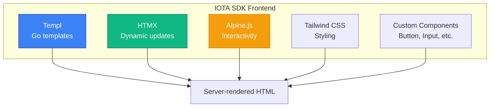
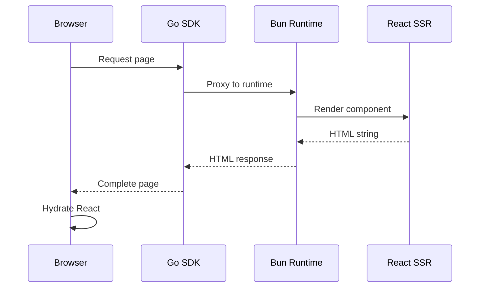
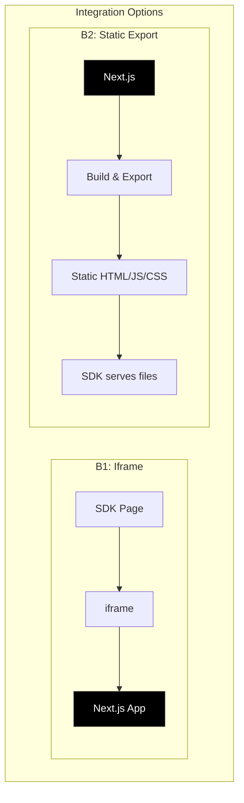
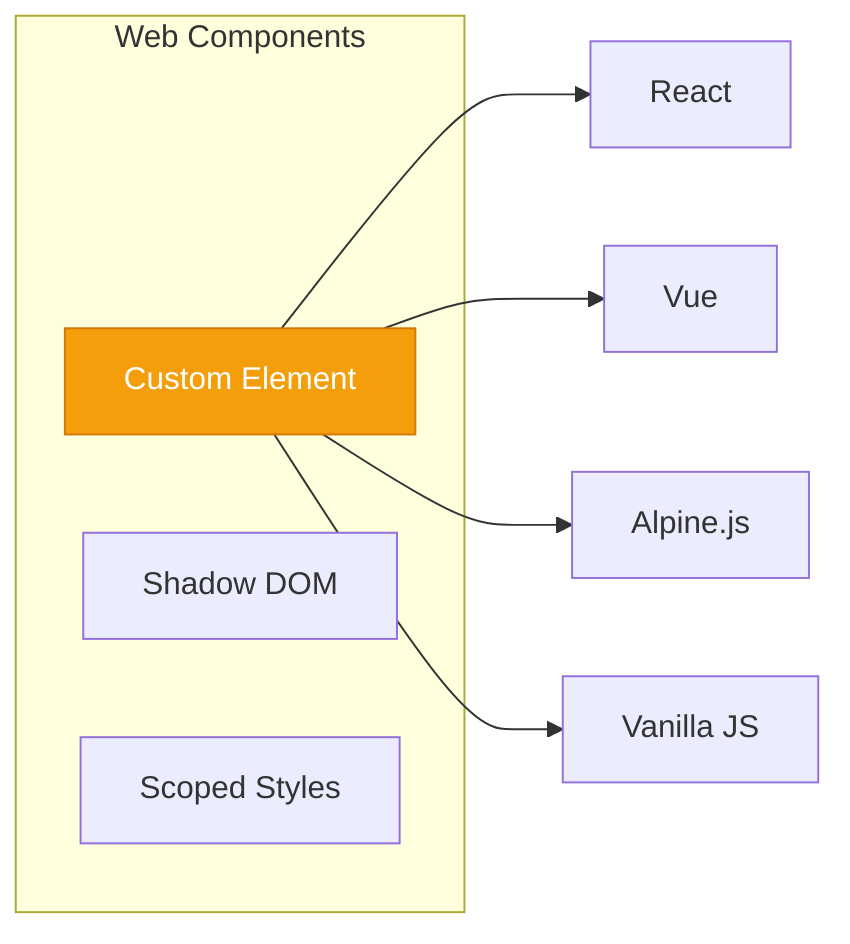
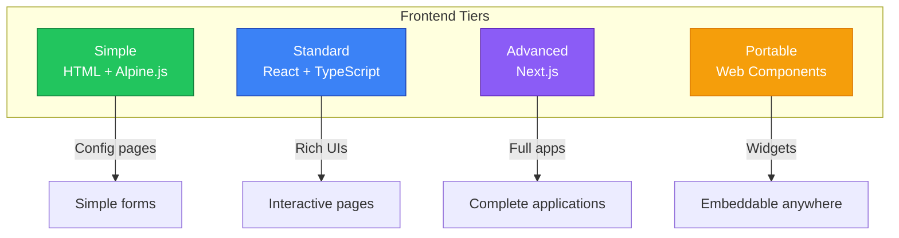
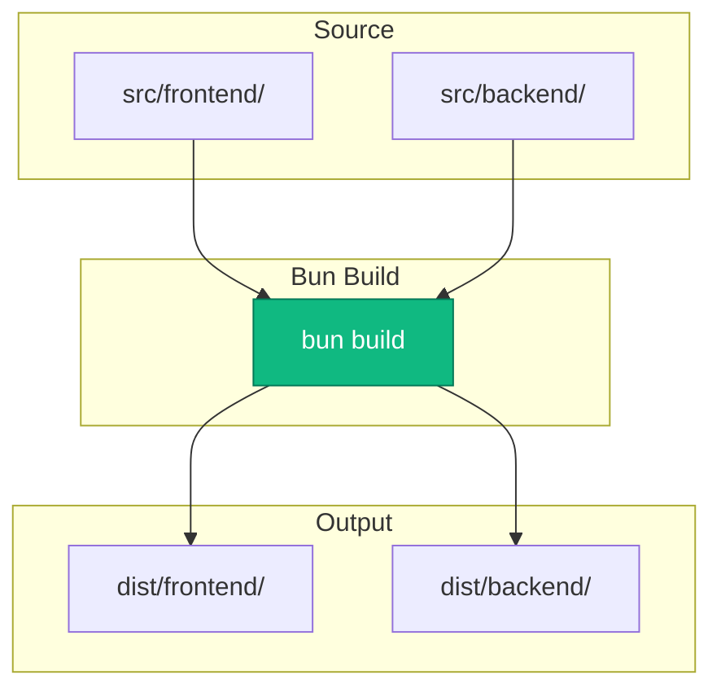
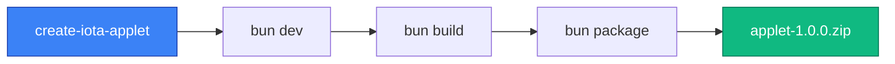

# Frontend Specification: Applet UI Development

**Status:** Draft

## Overview

This document covers frontend framework options for building applet user interfaces, including React, Next.js, Vue, and simpler alternatives. The goal is to enable rich, consistent UIs while maintaining compatibility with IOTA SDK's existing HTMX + Alpine.js + Templ stack.

## Current SDK Frontend Stack



**Key Characteristics:**
- Server-rendered HTML
- Minimal client-side JavaScript
- Progressive enhancement
- Fast initial load times

## Frontend Architecture Options

### Option A: React with SSR via Bun

**Description:** Applets written in React, server-rendered by Bun, integrated into SDK pages



**Project Structure:**
```
applet/
├── src/
│   └── frontend/
│       ├── pages/
│       │   ├── ConfigPage.tsx
│       │   └── ChatPage.tsx
│       ├── components/
│       │   ├── ChatWidget.tsx
│       │   └── ModelSelector.tsx
│       ├── hooks/
│       │   └── useAppletContext.ts
│       └── styles/
│           └── applet.css
├── package.json
└── tsconfig.json
```

**Example Component:**
```tsx
// src/frontend/pages/ConfigPage.tsx
import { useState } from 'react';
import { Button, Card, Select, Textarea } from '@iota/components';
import { useAppletContext } from '../hooks/useAppletContext';

export function ConfigPage() {
  const { t, api, toast } = useAppletContext();
  const [config, setConfig] = useState({
    modelName: '',
    systemPrompt: '',
    temperature: 0.7,
  });

  const handleSave = async () => {
    try {
      await api.post('/config', config);
      toast.success(t('Config.Saved'));
    } catch (error) {
      toast.error(t('Config.SaveFailed'));
    }
  };

  return (
    <Card title={t('Config.Title')}>
      <Select
        label={t('Config.Model')}
        value={config.modelName}
        onChange={(v) => setConfig({ ...config, modelName: v })}
        options={['gpt-4', 'gpt-3.5-turbo', 'claude-3']}
      />

      <Textarea
        label={t('Config.SystemPrompt')}
        value={config.systemPrompt}
        onChange={(v) => setConfig({ ...config, systemPrompt: v })}
        rows={6}
      />

      <Button onClick={handleSave} variant="primary">
        {t('Common.Save')}
      </Button>
    </Card>
  );
}
```

| Aspect | Details |
|--------|---------|
| **Pros** | Full React ecosystem, TypeScript support, component reusability, rich developer tools |
| **Cons** | Larger bundle sizes, hydration complexity, different paradigm from SDK's HTMX approach |

---

### Option B: Next.js as Applet Framework

**Description:** Each applet is a mini Next.js application



| Aspect | Details |
|--------|---------|
| **Pros** | Full Next.js features (routing, SSR, API routes), independent deployment possible |
| **Cons** | Heavy for simple applets, iframe isolation issues, overkill for most use cases |

---

### Option C: Preact (Lightweight React Alternative)

**Description:** React-compatible API with 3KB size

```tsx
// Same React code, but bundled with Preact
import { h, render } from 'preact';
import { useState } from 'preact/hooks';
```

| Aspect | Details |
|--------|---------|
| **Pros** | React-compatible API, tiny bundle size (3KB vs 40KB), fast execution |
| **Cons** | Some React features missing, fewer libraries guaranteed compatible |

---

### Option D: Vue.js 3

**Description:** Vue as an alternative to React


```vue
<!-- ConfigPage.vue -->
<template>
  <IotaCard :title="t('Config.Title')">
    <IotaSelect
      v-model="config.modelName"
      :label="t('Config.Model')"
      :options="models"
    />

    <IotaTextarea
      v-model="config.systemPrompt"
      :label="t('Config.SystemPrompt')"
      :rows="6"
    />

    <IotaButton @click="save" variant="primary">
      {{ t('Common.Save') }}
    </IotaButton>
  </IotaCard>
</template>

<script setup lang="ts">
import { ref } from 'vue';
import { useAppletContext } from '@/composables/appletContext';

const { t, api, toast } = useAppletContext();

const config = ref({
  modelName: '',
  systemPrompt: '',
  temperature: 0.7,
});

async function save() {
  try {
    await api.post('/config', config.value);
    toast.success(t('Config.Saved'));
  } catch (error) {
    toast.error(t('Config.SaveFailed'));
  }
}
</script>
```


| Aspect | Details |
|--------|---------|
| **Pros** | Excellent TypeScript support, SFC (Single File Components) are clean, strong ecosystem |
| **Cons** | Different from React (team needs to know both), different tooling (Vite) |

---

### Option E: Web Components (Framework Agnostic)

**Description:** Native browser components, usable anywhere



```typescript
// chat-widget.ts
class ChatWidget extends HTMLElement {
  private shadow: ShadowRoot;

  constructor() {
    super();
    this.shadow = this.attachShadow({ mode: 'open' });
  }

  connectedCallback() {
    const config = JSON.parse(this.getAttribute('config') || '{}');
    this.render(config);
  }

  private render(config: ChatConfig) {
    this.shadow.innerHTML = `
      <style>
        :host {
          display: block;
          font-family: var(--iota-font-family);
        }
        .chat-container {
          border-radius: var(--iota-border-radius);
          background: var(--iota-color-background);
        }
      </style>
      <div class="chat-container">
        <div class="messages"></div>
        <input type="text" placeholder="Type a message..." />
      </div>
    `;
  }
}

customElements.define('applet-chat-widget', ChatWidget);
```

**Usage in SDK:**
```html
<applet-chat-widget
  config='{"theme": "light"}'
></applet-chat-widget>
```

| Aspect | Details |
|--------|---------|
| **Pros** | Framework agnostic, native browser support, works with HTMX, style encapsulation |
| **Cons** | Lower-level than React/Vue, less developer tooling, state management is manual |

---

### Option F: HTML Templates + Alpine.js (Minimal JS)

**Description:** Match SDK's existing stack exactly

```html
<!-- config.html -->
<div x-data="configPage()" class="space-y-6">
  <div class="card">
    <h2 class="card-title" x-text="t('Config.Title')"></h2>

    <div class="form-field">
      <label x-text="t('Config.Model')"></label>
      <select x-model="config.modelName" class="select">
        <template x-for="model in models">
          <option :value="model" x-text="model"></option>
        </template>
      </select>
    </div>

    <div class="form-field">
      <label x-text="t('Config.SystemPrompt')"></label>
      <textarea
        x-model="config.systemPrompt"
        rows="6"
        class="textarea"
      ></textarea>
    </div>

    <button @click="save" class="btn btn-primary">
      <span x-text="t('Common.Save')"></span>
    </button>
  </div>
</div>

<script>
function configPage() {
  return {
    config: {
      modelName: '',
      systemPrompt: '',
      temperature: 0.7,
    },
    models: ['gpt-4', 'gpt-3.5-turbo', 'claude-3'],
    t(key) {
      return window.__APPLET_TRANSLATIONS__[key] || key;
    },
    async save() {
      const response = await fetch('/api/applets/ai-chat/config', {
        method: 'POST',
        headers: { 'Content-Type': 'application/json' },
        body: JSON.stringify(this.config),
      });
      if (response.ok) {
        window.__IOTA__.toast.success(this.t('Config.Saved'));
      }
    },
  };
}
</script>
```

| Aspect | Details |
|--------|---------|
| **Pros** | Matches SDK's existing stack exactly, no build step needed, small bundle size |
| **Cons** | No TypeScript, limited component reusability, harder to build complex UIs |

---

## Recommendation

### Hybrid Approach

Support multiple frontend options based on complexity:

```yaml
# manifest.yaml
frontend:
  framework: react  # Options: react, vue, alpine, webcomponent
  build:
    bundler: bun    # Options: bun, vite, esbuild
    target: es2020
    minify: true
```

### Tier System



| Tier | Framework | Use Case | Build |
|------|-----------|----------|-------|
| **Simple** | HTML + Alpine.js | Config pages, simple forms | None |
| **Standard** | React + TypeScript | Rich interfaces, interactive UIs | Bun/Vite |
| **Advanced** | Next.js | Full applications | Next build |
| **Portable** | Web Components | Widgets for embedding anywhere | Bun |

### Primary Recommendation: React + TypeScript + Bun

**Rationale:**
1. **TypeScript Support:** Full type safety
2. **Developer Familiarity:** Most web developers know React
3. **SSR with Bun:** Fast server-side rendering
4. **Ecosystem:** Rich library support
5. **Component Library:** Easier to build IOTA component library for React

### Build Pipeline



### SSR Integration

```typescript
// applet-server.ts (runs in Bun)
import { renderToString } from 'react-dom/server';
import { ConfigPage } from './frontend/pages/ConfigPage';

export async function renderPage(
  component: string,
  props: Record<string, unknown>,
  context: AppletContext
) {
  const Component = components[component];
  if (!Component) {
    throw new Error(`Component not found: ${component}`);
  }

  const html = renderToString(
    <AppletProvider context={context}>
      <Component {...props} />
    </AppletProvider>
  );

  return {
    html,
    // Include scripts for hydration
    scripts: [`/applets/${context.appletId}/frontend/${component}.js`],
    styles: [`/applets/${context.appletId}/frontend/${component}.css`],
  };
}
```

### Client Hydration

```tsx
// frontend/pages/ConfigPage.client.tsx
import { hydrateRoot } from 'react-dom/client';
import { ConfigPage } from './ConfigPage';

// Hydrate after SSR
const container = document.getElementById('applet-root');
const props = JSON.parse(container.dataset.props);

hydrateRoot(
  container,
  <AppletProvider context={window.__APPLET_CONTEXT__}>
    <ConfigPage {...props} />
  </AppletProvider>
);
```

## Development Workflow



```bash
# Create new applet
npx create-iota-applet my-applet

# Development with hot reload
cd my-applet
bun dev

# Build for production
bun build

# Package for installation
bun package
# Creates: my-applet-1.0.0.zip
```

## Type Definitions

```typescript
// @iota/applet-types

interface AppletContext {
  appletId: string;
  tenantId: string;
  userId?: number;
  locale: string;
  permissions: string[];
}

interface AppletAPI {
  get<T>(path: string): Promise<T>;
  post<T>(path: string, body: unknown): Promise<T>;
  put<T>(path: string, body: unknown): Promise<T>;
  delete(path: string): Promise<void>;
}

interface AppletHooks {
  useAppletContext(): AppletContext;
  useAPI(): AppletAPI;
  useTranslation(): { t: (key: string) => string };
  useToast(): { success: (msg: string) => void; error: (msg: string) => void };
}
```

---

## Next Steps

- Review [UI Consistency](./ui-consistency.md) for component library strategy
- See [Manifest](./manifest.md) for configuration schema
- Check [Examples](./examples.md) for reference implementations
