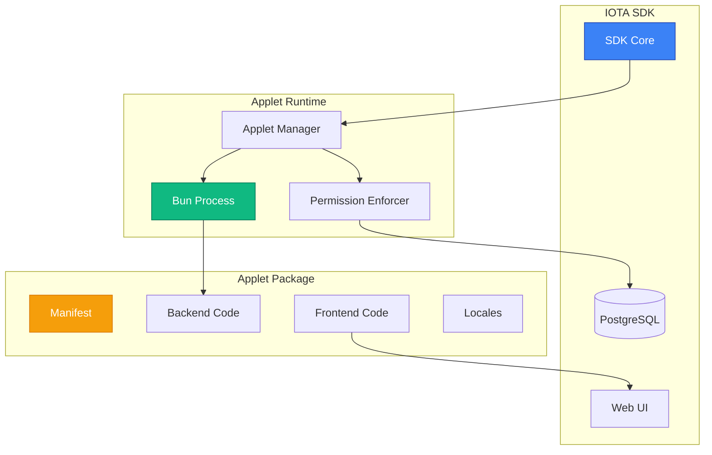
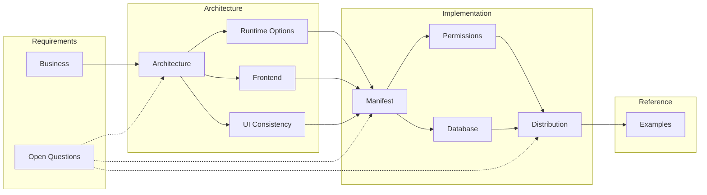
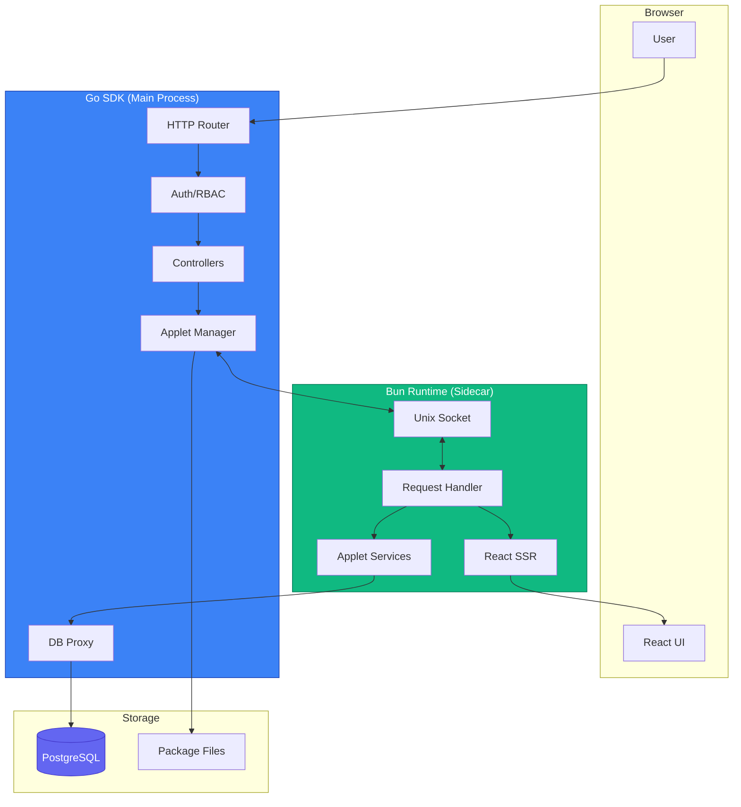
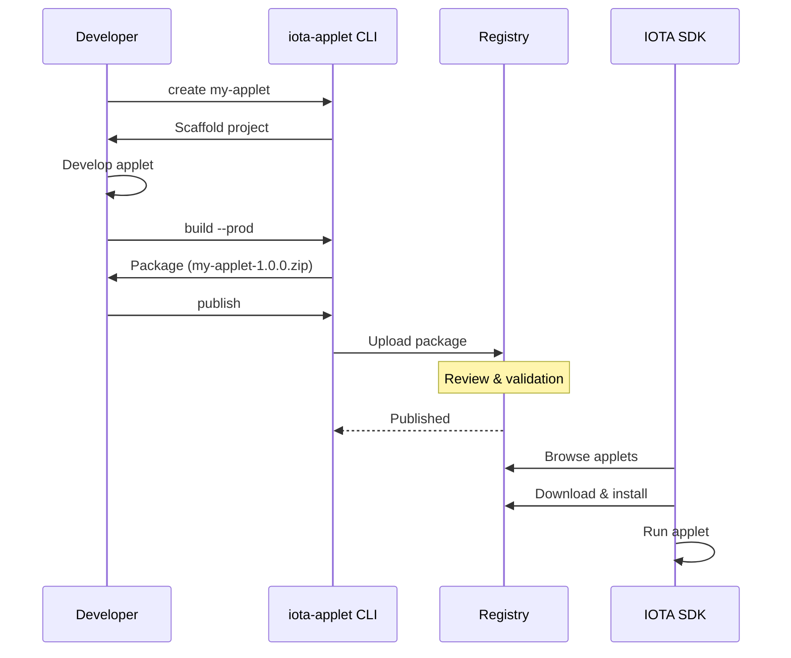

# Applet System Specification

**Status:** Draft - Complete Documentation
**Created:** 2024-12-31
**Last Updated:** 2024-12-31

## Overview

The Applet System enables IOTA SDK users to extend platform functionality through installable, runtime-loaded modules without requiring Go code or SDK recompilation. Applets are self-contained packages that can add UI pages, API endpoints, database tables, scheduled tasks, and event handlers.



**Vision:** Achieve plugin-level extensibility similar to Telegram Mini Apps, Shopify Apps, or Notion integrations, while maintaining UI consistency and security.

## Document Map



## Documents

| Document | Purpose | Status |
|----------|---------|--------|
| [Business Requirements](./business.md) | Use cases, target audience, success criteria | Complete |
| [Architecture](./architecture.md) | System architecture and component design | Complete |
| [Runtime Options](./runtime-options.md) | JavaScript runtime comparison (Goja, Bun, V8, Deno) | Complete |
| [Frontend](./frontend.md) | Frontend framework options (React, Next.js, Vue) | Complete |
| [UI Consistency](./ui-consistency.md) | UI component library and design system strategy | Complete |
| [Manifest](./manifest.md) | Applet manifest schema specification | Complete |
| [Permissions](./permissions.md) | Permission model and security sandboxing | Complete |
| [Database](./database.md) | Database access and custom table strategy | Complete |
| [Distribution](./distribution.md) | Packaging, registry, and installation flow | Complete |
| [Examples](./examples.md) | Reference applet implementations | Complete |
| [Open Questions](./open-questions.md) | Unresolved decisions and trade-offs | Complete |

## High-Level Architecture



## Key Design Decisions

### Recommended Stack

```mermaid
graph LR
    subgraph Runtime
        BUN[Bun v1.0+]
    end

    subgraph Frontend
        REACT[React 18]
        TS[TypeScript]
        COMP[@iota/components]
    end

    subgraph Backend
        HANDLERS[HTTP Handlers]
        EVENTS[Event Handlers]
        SCHED[Scheduled Tasks]
    end

    subgraph Integration
        IPC[Unix Socket IPC]
        PERM[Permission Enforcement]
        TENANT[Tenant Isolation]
    end

    BUN --> Frontend
    BUN --> Backend
    Backend --> Integration

    style BUN fill:#10b981,stroke:#047857,color:#fff
    style REACT fill:#61dafb,stroke:#0ea5e9,color:#000
    style TS fill:#3178c6,stroke:#1e40af,color:#fff
```

| Decision | Choice | Rationale |
|----------|--------|-----------|
| **Runtime** | Bun | Native TypeScript, fast startup, built-in bundler |
| **Frontend** | React + TypeScript | Developer familiarity, SSR support, ecosystem |
| **Communication** | Unix Socket IPC | Low latency, no network overhead |
| **UI Strategy** | Component Library | Guaranteed visual consistency |
| **Permissions** | Table-level + RBAC | Balance of security and flexibility |

## Reference Implementations

These existing IOTA SDK modules serve as reference for applet capabilities:

| Module | Location | Key Features |
|--------|----------|--------------|
| **Website/Ali** | `modules/website/` | AI chatbot widget, OpenAI integration, CRM message routing |
| **Shyona** | `shy-trucks/core/modules/shyona/` | Full AI assistant, multi-agent system, GraphQL, knowledge base |

## Quick Start (Conceptual)



## Glossary

| Term | Definition |
|------|------------|
| **Applet** | A self-contained extension package that adds functionality to IOTA SDK |
| **Manifest** | YAML/JSON configuration file declaring applet metadata, permissions, and structure |
| **Handler** | JavaScript function that responds to HTTP requests, events, or schedules |
| **Widget** | UI component that can be injected into existing SDK pages |
| **Design Token** | CSS variable for consistent styling (colors, spacing, typography) |

---

## Next Steps

1. Review [Business Requirements](./business.md) for use cases
2. Understand [Architecture Options](./architecture.md)
3. Explore [Runtime Comparison](./runtime-options.md)
4. Check [Open Questions](./open-questions.md) for pending decisions

---

For questions or feedback, please [open an issue](https://github.com/iota-uz/iota-sdk/issues) on GitHub.
