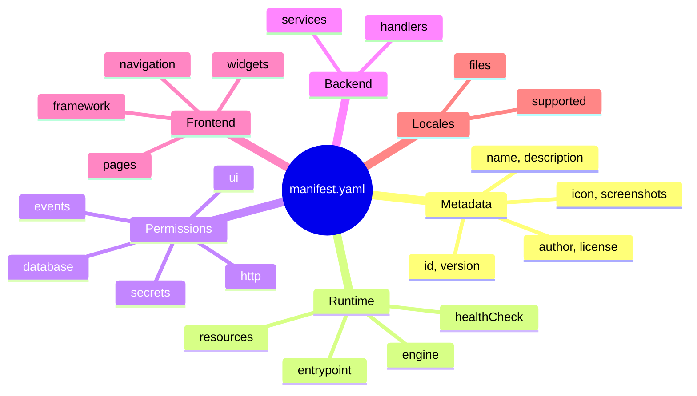
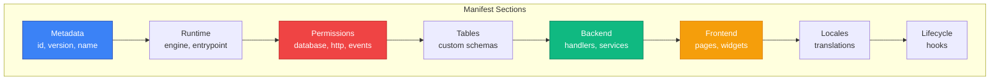
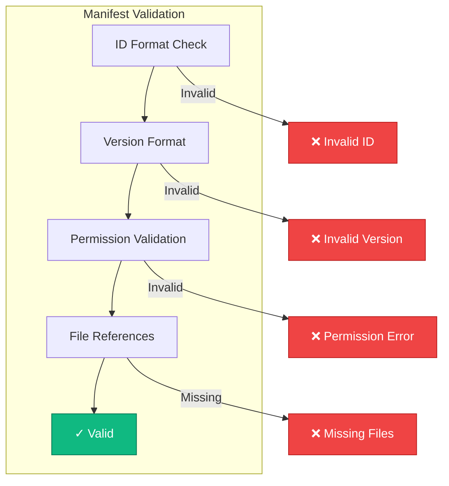

# Manifest Specification: Applet Package Definition

**Status:** Draft

## Overview

The manifest file (`manifest.yaml` or `manifest.json`) is the central configuration file for an applet. It declares metadata, permissions, entry points, and integration requirements.



## Schema Version

```yaml
manifestVersion: "1.0"
```

## Schema Structure



## Full Schema

```yaml
# =============================================================================
# APPLET MANIFEST SCHEMA v1.0
# =============================================================================

# -----------------------------------------------------------------------------
# METADATA
# -----------------------------------------------------------------------------
manifestVersion: "1.0"                    # Schema version
id: "ai-website-chat"                     # Unique identifier (kebab-case)
version: "1.0.0"                          # Semantic version
name:
  en: "AI Website Chat"
  ru: "AI Чат для сайта"
  uz: "Veb-sayt uchun AI Chat"
description:
  en: "Embeddable AI chatbot for your website with CRM integration"
  ru: "Встраиваемый AI чат-бот для вашего сайта с интеграцией CRM"
author:
  name: "IOTA Team"
  email: "team@iota.uz"
  url: "https://iota.uz"
license: "MIT"
repository: "https://github.com/iota-uz/applet-ai-chat"
homepage: "https://iota.uz/applets/ai-chat"
icon: "assets/icon.svg"                   # Applet icon
screenshots:                              # Gallery images
  - "assets/screenshot-1.png"
  - "assets/screenshot-2.png"
keywords:
  - ai
  - chatbot
  - website
  - crm
category: "communication"                 # Primary category
minSdkVersion: "2.0.0"                   # Minimum IOTA SDK version

# -----------------------------------------------------------------------------
# RUNTIME CONFIGURATION
# -----------------------------------------------------------------------------
runtime:
  engine: "bun"                           # Options: bun, goja, deno, node
  version: ">=1.0.0"                      # Engine version requirement
  entrypoint: "dist/server.js"            # Main entry file
  healthCheck:
    path: "/__health__"
    interval: 30                          # seconds
    timeout: 5                            # seconds
  resources:
    maxMemoryMB: 256                       # Memory limit
    maxCpuPercent: 50                      # CPU limit
    maxExecutionMs: 30000                  # Single request timeout
    maxConcurrentRequests: 100             # Concurrent request limit

# -----------------------------------------------------------------------------
# PERMISSIONS
# -----------------------------------------------------------------------------
permissions:
  # Database access
  database:
    read:
      - clients                           # CRM clients
      - chats                             # CRM chats
      - chat_messages                     # CRM messages
      - users                             # Core users
    write:
      - clients
      - chats
      - chat_messages
    createTables: true                    # Requires admin approval

  # External HTTP access
  http:
    external:
      - "api.openai.com"
      - "*.dify.ai"
      - "api.anthropic.com"

  # Event bus access
  events:
    subscribe:
      - "chat.message.created"
      - "client.created"
    publish:
      - "ai.response.generated"
      - "ai.chat.started"

  # UI integration
  ui:
    navigation: true
    pages: true
    widgets: true

  # Secret access
  secrets:
    - name: "OPENAI_API_KEY"
      description: "OpenAI API key for chat completions"
      required: true
    - name: "DIFY_API_KEY"
      description: "Dify API key for RAG"
      required: false

# -----------------------------------------------------------------------------
# DATABASE TABLES
# -----------------------------------------------------------------------------
tables:
  - name: "applet_ai_chat_configs"
    description: "AI chat configuration per tenant"
    columns:
      - name: id
        type: bigserial
        primary: true
      - name: tenant_id
        type: uuid
        required: true
        index: true
        foreignKey:
          table: tenants
          column: id
          onDelete: CASCADE
      - name: model_name
        type: varchar(100)
        default: "gpt-4"
      - name: system_prompt
        type: text
        nullable: true
      - name: temperature
        type: decimal(3,2)
        default: 0.7
      - name: created_at
        type: timestamptz
        default: now()
      - name: updated_at
        type: timestamptz
        default: now()
    indexes:
      - columns: [tenant_id]
        unique: true

# -----------------------------------------------------------------------------
# BACKEND HANDLERS
# -----------------------------------------------------------------------------
backend:
  handlers:
    - type: http
      path: "/api/applets/ai-chat/config"
      methods: [GET, POST, PUT]
      handler: "handlers/config.ts"
      auth: required
      permissions:
        - "ai-chat.config.read"
        - "ai-chat.config.write"

    - type: event
      events:
        - "chat.message.created"
      handler: "handlers/on-message.ts"
      async: true

    - type: scheduled
      cron: "0 * * * *"
      handler: "handlers/cleanup.ts"
      timezone: "UTC"

  services:
    - name: "aiConfigService"
      handler: "services/ai-config-service.ts"

# -----------------------------------------------------------------------------
# FRONTEND CONFIGURATION
# -----------------------------------------------------------------------------
frontend:
  framework: react
  build:
    bundler: bun
    entrypoint: "src/frontend/index.tsx"
    outdir: "dist/frontend"

  navigation:
    - label:
        en: "AI Chat"
        ru: "AI Чат"
      icon: "chat"
      path: "/website/ai-chat"
      permissions:
        - "ai-chat.config.read"
      parent: "website"
      order: 10

  pages:
    - path: "/website/ai-chat"
      title:
        en: "AI Chat Configuration"
        ru: "Настройка AI Чата"
      component: "pages/ConfigPage"
      layout: "standard"
      permissions:
        - "ai-chat.config.read"

  widgets:
    - target: "crm.chats.detail"
      position: "sidebar-right"
      component: "widgets/AiAssistButton"
      permissions:
        - "ai-chat.assist"

# -----------------------------------------------------------------------------
# LOCALIZATION
# -----------------------------------------------------------------------------
locales:
  supported: [en, ru, uz]
  default: en
  files:
    en: "locales/en.json"
    ru: "locales/ru.json"
    uz: "locales/uz.json"

# -----------------------------------------------------------------------------
# PERMISSIONS DEFINITIONS (RBAC)
# -----------------------------------------------------------------------------
appletPermissions:
  - key: "ai-chat.config.read"
    name:
      en: "View AI Chat Configuration"
      ru: "Просмотр настроек AI Чата"
  - key: "ai-chat.config.write"
    name:
      en: "Edit AI Chat Configuration"
      ru: "Редактирование настроек AI Чата"

# -----------------------------------------------------------------------------
# DEPENDENCIES
# -----------------------------------------------------------------------------
dependencies:
  modules:
    - "crm"
  applets: []

# -----------------------------------------------------------------------------
# LIFECYCLE HOOKS
# -----------------------------------------------------------------------------
lifecycle:
  onInstall: "hooks/on-install.ts"
  onUninstall: "hooks/on-uninstall.ts"
  onUpdate: "hooks/on-update.ts"
  onEnable: "hooks/on-enable.ts"
  onDisable: "hooks/on-disable.ts"
```

## Validation Rules



### ID Format
- Lowercase letters, numbers, hyphens
- Start with letter
- 3-50 characters
- Must be unique in registry

### Version Format
- Semantic versioning (MAJOR.MINOR.PATCH)
- Optional prerelease (-alpha.1, -beta.2)

### Permission Validation
- Cannot request more than declared capabilities
- External HTTP hosts validated against allowlist
- Database tables must exist or be declared

### File References
- All paths relative to manifest location
- Must exist at package time
- Max file size limits apply

## Example: Minimal Manifest

```yaml
manifestVersion: "1.0"
id: "hello-world"
version: "1.0.0"
name:
  en: "Hello World"

runtime:
  engine: "bun"
  entrypoint: "dist/server.js"

permissions:
  ui:
    pages: true

frontend:
  pages:
    - path: "/hello"
      title: { en: "Hello World" }
      component: "pages/HelloPage"
```

---

## Next Steps

- Review [Permissions](./permissions.md) for security model
- See [Database](./database.md) for data access patterns
- Check [Distribution](./distribution.md) for packaging
