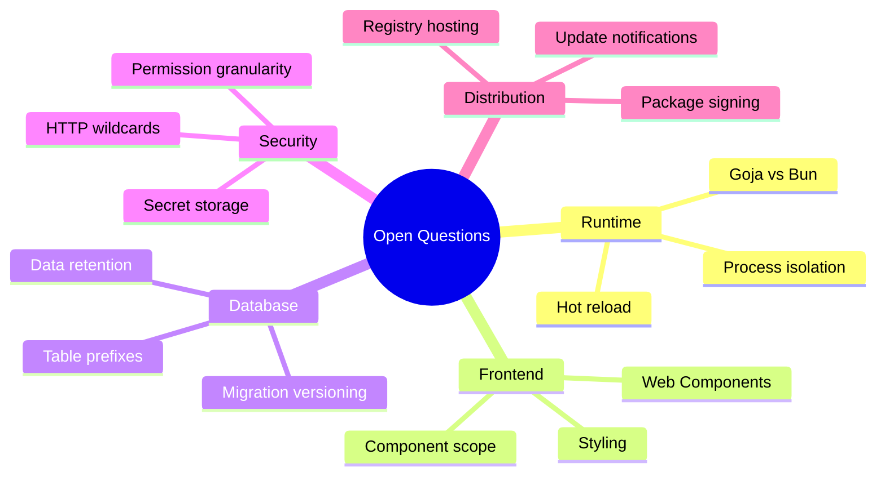
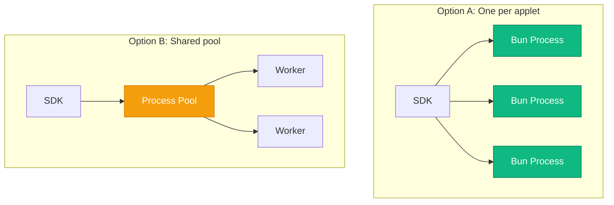
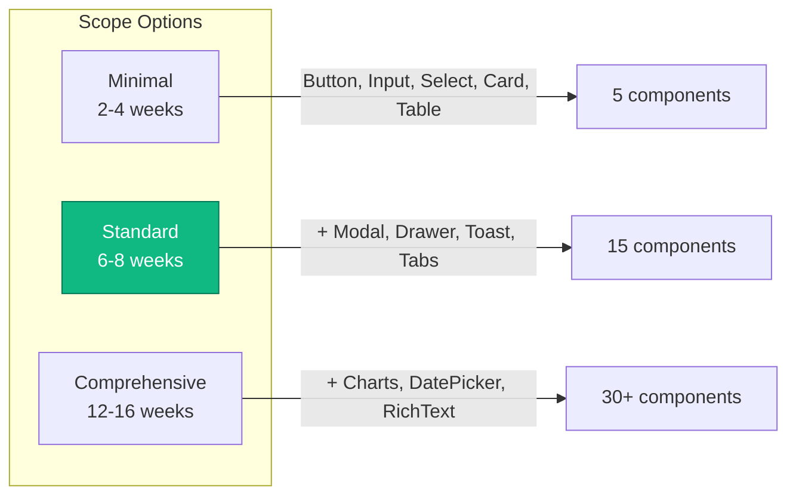
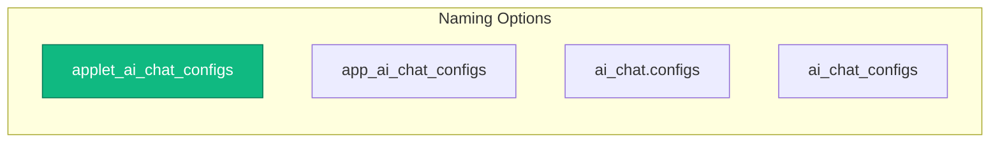
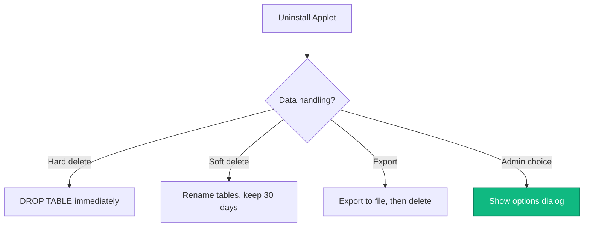
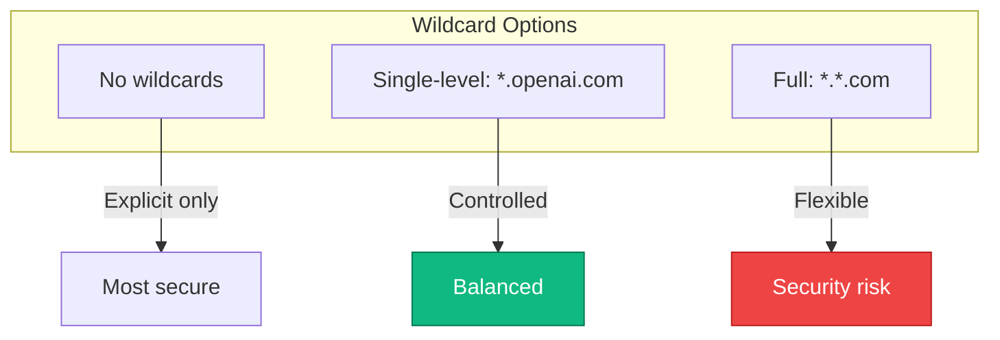
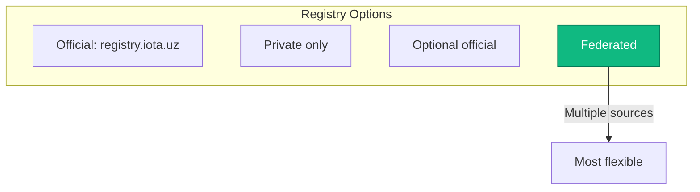
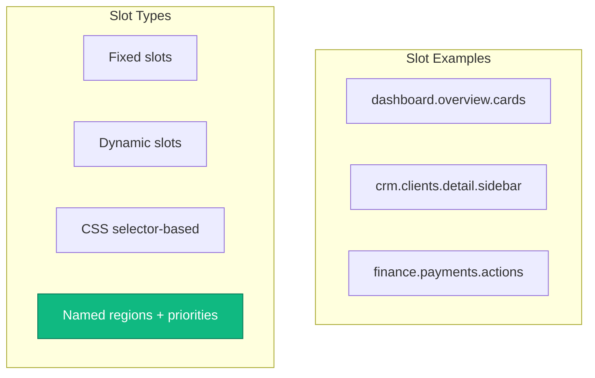
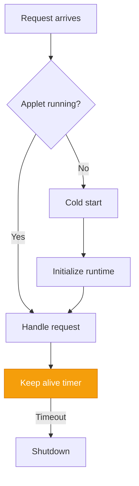

# Open Questions & Unresolved Decisions

**Status:** Draft

## Overview

This document captures unresolved decisions, trade-offs requiring input, and open questions for the Applet System.



---

## Runtime Architecture

### Q1: Single vs Multi-Process Runtime

**Question:** Should each applet run in its own Bun process, or share a process pool?



| Option | Pros | Cons |
|--------|------|------|
| **One process per applet** | Complete isolation, easy resource limits, crash isolation | Memory overhead, more processes to manage |
| **Shared process pool** | Lower memory usage, faster startup | Cross-applet interference risk, complex isolation |
| **Hybrid** | Best of both (separate for heavy, shared for light) | Complex management logic |

**Recommendation:** Start with one process per applet for simplicity and isolation.

---

### Q2: Goja vs Bun-Only Runtime

**Question:** Should we maintain Goja for simple scripts, or go Bun-only?

| Option | Pros | Cons |
|--------|------|------|
| **Bun only** | Simpler, one runtime to maintain, full TypeScript | Heavier for simple scripts |
| **Goja for scripts, Bun for applets** | Lighter for simple cases, embedded | Two runtimes to maintain |
| **Goja first, Bun optional** | Backward compatible | Two code paths |

**Recommendation:** Bun-only for applets, keep Goja for existing jsruntime scripts.

---

### Q3: Hot Reload Strategy

**Question:** How should applet code updates work during development?

| Option | Description |
|--------|-------------|
| Full process restart | Stop and restart on changes |
| Bun's built-in hot reload | Use native HMR |
| File watcher with graceful reload | Custom implementation |
| Manual reload only | Developer triggers |

**Considerations:**
- Development experience vs complexity
- State preservation during reload
- Connection handling during restart

---

## Frontend Framework

### Q4: React Component Library Scope

**Question:** How comprehensive should `@iota/components` be?



**Recommendation:** Start with Standard scope, add more as needed.

---

### Q5: Web Components Priority

**Question:** Should we build Web Components alongside React components?

| Option | Use Case |
|--------|----------|
| React only | Simpler, faster to build |
| Web Components for embeddables only | Chat widgets, buttons |
| Full parallel library | React + Web Components |

**Recommendation:** Web Components for embeddables only.

---

### Q6: Styling Strategy

**Question:** How should applet styles be handled?

| Strategy | Approach | Isolation |
|----------|----------|-----------|
| **CSS-in-JS** | Styled-components, Emotion | High |
| **Tailwind** | Utility classes | Medium |
| **CSS Modules** | Scoped CSS files | High |
| **Shadow DOM** | Web Component encapsulation | Complete |

**Recommendation:** Tailwind with CSS Modules for applet-specific styles.

---

## Database & Storage

### Q7: Custom Table Prefix Strategy

**Question:** How should applet tables be named?



| Option | Example | Notes |
|--------|---------|-------|
| `applet_{id}_{table}` | `applet_ai_chat_configs` | Clear prefix |
| `app_{id}_{table}` | `app_ai_chat_configs` | Shorter |
| Separate schema | `ai_chat.configs` | Schema isolation |
| No prefix | `ai_chat_configs` | Requires uniqueness validation |

**Recommendation:** Option 1 with underscore-separated ID.

---

### Q8: Migration Versioning

**Question:** How should applet database migrations be versioned?

| Option | Example | Notes |
|--------|---------|-------|
| Sequential numbers | 001, 002, 003 | Simple |
| Timestamps | 20241201120000 | Unique |
| Semantic versions | 1.0.0, 1.1.0 | Version-aligned |
| Manifest version + sequential | 1.0.0_001 | Combined |

**Recommendation:** Timestamps for uniqueness.

---

### Q9: Data Retention on Uninstall

**Question:** Default behavior when applet is uninstalled?



**Recommendation:** Admin chooses per uninstallation, soft delete as default.

---

## Security & Permissions

### Q10: Permission Granularity

**Question:** How granular should database permissions be?

| Level | Example | Complexity |
|-------|---------|------------|
| **Table** | Read `clients` table | Low |
| **Column** | Read `clients.name`, not `clients.email` | Medium |
| **Row** | Read clients where `type = 'active'` | High |
| **Cell** | Combination of column + row | Very High |

**Recommendation:** Table-level initially, column-level as Phase 2.

---

### Q11: External HTTP Wildcards

**Question:** Should wildcard domains be allowed in external HTTP permissions?



**Recommendation:** Single-level wildcards only.

---

### Q12: Secret Storage

**Question:** Where and how should applet secrets be stored?

| Option | Description | Multi-tenant |
|--------|-------------|--------------|
| Database (encrypted) | Encrypted column | ✓ |
| Environment variables | .env files | Limited |
| External manager | Vault, AWS Secrets | ✓ |
| SDK settings table | With encryption | ✓ |

**Recommendation:** Database with encryption for simplicity, external integration as option.

---

## Distribution & Registry

### Q13: Registry Hosting

**Question:** Should IOTA host an official applet registry?



**Recommendation:** Federated, with optional official registry.

---

### Q14: Package Signing

**Question:** Should applet packages be signed?

| Option | Description |
|--------|-------------|
| Required | All packages must be signed |
| Optional | Signing available but not required |
| Registry-dependent | Official requires, private doesn't |
| Verification levels | Unsigned, signed, verified |

**Recommendation:** Multiple verification levels.

---

### Q15: Update Notifications

**Question:** How should admins be notified of applet updates?

| Option | Description |
|--------|-------------|
| In-app badge | Notification indicator |
| Email digest | Periodic summary |
| Dashboard widget | Visual card |
| Manual check | No automatic notification |
| Configurable | All of the above |

**Recommendation:** Configurable notifications.

---

## UI Integration

### Q16: Widget Slot System

**Question:** How should widget injection points be defined?



**Recommendation:** Named regions with priorities.

---

### Q17: Navigation Nesting

**Question:** How deep can applet navigation be nested?

| Option | Description |
|--------|-------------|
| Top-level only | Applets get main nav items |
| One level under | Nest under existing items |
| Multiple levels | Applet manages sub-nav |
| Flat with grouping | Flat list with categories |

**Recommendation:** One level under existing items.

---

### Q18: Theme Customization

**Question:** Can applets customize beyond design tokens?

| Option | Description | Risk |
|--------|-------------|------|
| Tokens only | Colors, spacing, fonts | Low |
| Component overrides | Custom Button styles | Medium |
| Full CSS access | Complete control | High |
| Sandboxed CSS | Scoped to applet | Low |

**Recommendation:** Sandboxed CSS with token inheritance.

---

## Developer Experience

### Q19: CLI Tooling

**Question:** What CLI tools should be provided?

| Tool | Purpose | Priority |
|------|---------|----------|
| `create-iota-applet` | Scaffold new applet | High |
| `iota-applet dev` | Development server | High |
| `iota-applet build` | Production build | High |
| `iota-applet test` | Run tests | Medium |
| `iota-applet publish` | Publish to registry | Medium |
| `iota-applet validate` | Validate manifest | Medium |
| `iota-applet doctor` | Debug issues | Low |

**Recommendation:** High priority tools first, others in Phase 2.

---

### Q20: TypeScript SDK Package

**Question:** What should be included in `@iota/applet-sdk`?

```
@iota/applet-sdk/
├── server       # Backend utilities (Context, Handler types)
├── react        # React hooks and providers
├── types        # TypeScript definitions
├── testing      # Test utilities and mocks
└── cli          # CLI tooling
```

---

### Q21: Documentation Strategy

**Question:** Where should applet documentation live?

| Location | Purpose |
|----------|---------|
| Spec directory | Developer reference |
| Separate docs site | User-facing |
| In-code JSDoc | API reference |
| Storybook | Component documentation |

**Recommendation:** All of the above, with clear purposes.

---

## Performance & Scaling

### Q22: Cold Start Optimization

**Question:** How to handle applet cold starts?



| Option | Description |
|--------|-------------|
| Pre-warm all | Start all applets on SDK boot |
| Lazy start | Start on first request |
| Keep-alive | Warm for N minutes after use |
| Admin configures | Per-applet setting |

**Recommendation:** Lazy start with keep-alive.

---

### Q23: Request Timeout Handling

**Question:** What happens when an applet request times out?

| Option | Action |
|--------|--------|
| Kill and 504 | Return gateway timeout |
| Kill and restart | Restart applet process |
| Queue for retry | Retry later |
| Fail open | Return cached/default |

**Recommendation:** Kill and return 504 with circuit breaker pattern.

---

### Q24: Resource Limit Enforcement

**Question:** How strictly should resource limits be enforced?

| Level | CPU | Memory | Action |
|-------|-----|--------|--------|
| **Soft** | Warn | Warn | Log only |
| **Medium** | Throttle | Warn | Slow down |
| **Hard** | Kill | Kill | Terminate |

**Recommendation:** Medium limits with escalation to hard after threshold.

---

## Compatibility & Migration

### Q25: Minimum SDK Version

**Question:** What SDK version should support applets?

| Option | Description |
|--------|-------------|
| Current only | Clean start |
| Backport | Last major version |
| Feature flag | Multiple versions |

**Recommendation:** Current version only (clean start).

---

### Q26: Breaking Change Policy

**Question:** How should applet API breaking changes be handled?

| Option | Description |
|--------|-------------|
| Semver | Major version for breaking |
| Deprecation | Warn for N months |
| API versioning | `/api/v1/`, `/api/v2/` |
| Feature flags | Opt-in to new behavior |

**Recommendation:** API versioning with deprecation warnings.

---

## Implementation Priority

### Q27: Implementation Phases

```mermaid
timeline
    title Implementation Phases
    section Phase 1: Foundation (4-6 weeks)
        Manifest validation
        Bun runtime
        Basic permissions
        Database access
        HTTP handlers
    section Phase 2: Frontend (3-4 weeks)
        React components
        Page registration
        Navigation
        Design tokens
    section Phase 3: Distribution (3-4 weeks)
        Package format
        Installation flow
        Update mechanism
        Local registry
    section Phase 4: Advanced (4-6 weeks)
        Event system
        Widget slots
        Scheduled tasks
        Embeddables
    section Phase 5: Ecosystem (ongoing)
        Official registry
        CLI tooling
        Documentation
        Examples
```

---

## Summary: Critical Decisions Needed

| # | Question | Recommendation | Urgency |
|---|----------|----------------|---------|
| Q1 | Process isolation | One per applet | High |
| Q2 | Runtime choice | Bun only for applets | High |
| Q4 | Component scope | Standard | High |
| Q10 | Permission granularity | Table-level | High |
| Q13 | Registry strategy | Federated | Medium |
| Q16 | Widget slots | Named regions | Medium |
| Q22 | Cold start | Lazy + keep-alive | Medium |
| Q27 | Implementation phases | As proposed | High |

---

## Additional Considerations

### Multi-Tenancy Edge Cases
- Applet enabled for some tenants but not others
- Tenant-specific configuration vs global
- Cross-tenant data access (strictly forbidden)
- Tenant migration with applet data

### Error Handling Patterns
- Applet throws unhandled exception
- Applet makes invalid DB query
- Applet exceeds rate limits
- Applet calls blocked external URL

### Testing Strategy
- Unit tests for applet code
- Integration tests with SDK
- E2E tests for installed applets
- Performance/load testing

### Monitoring & Observability
- Applet-level metrics
- Error tracking and alerting
- Performance profiling
- Audit logging

### Compliance Considerations
- GDPR and data residency
- Applet access to PII
- Data processing agreements
- Security certifications

---

## Next Steps

- Review [Architecture](./architecture.md) for system design
- See [Permissions](./permissions.md) for security details
- Check [Examples](./examples.md) for implementation patterns
