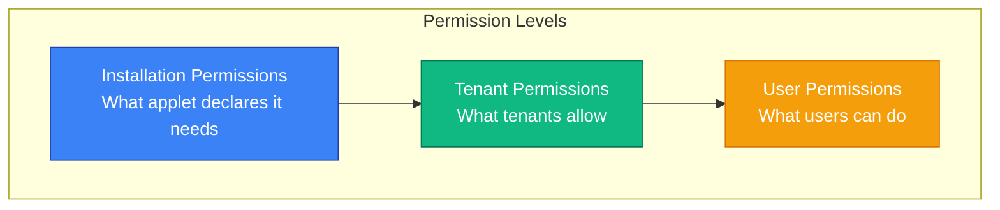
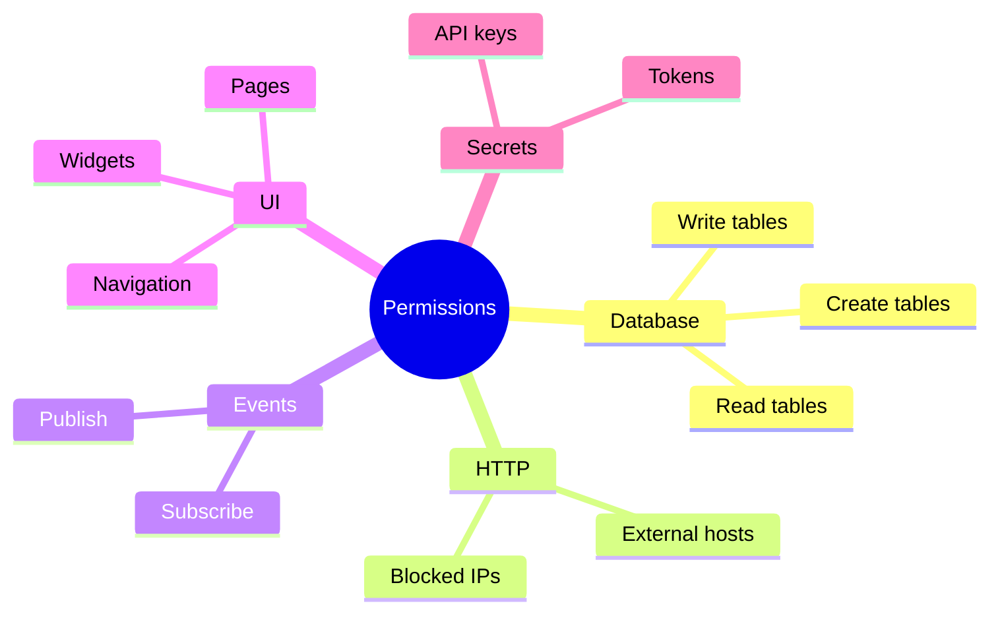
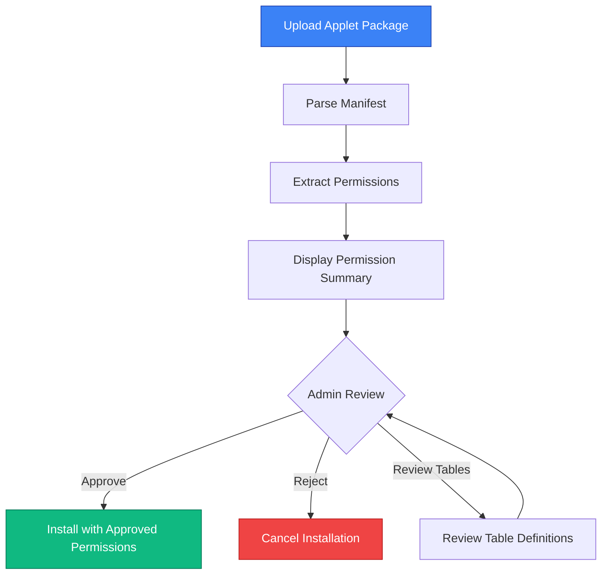
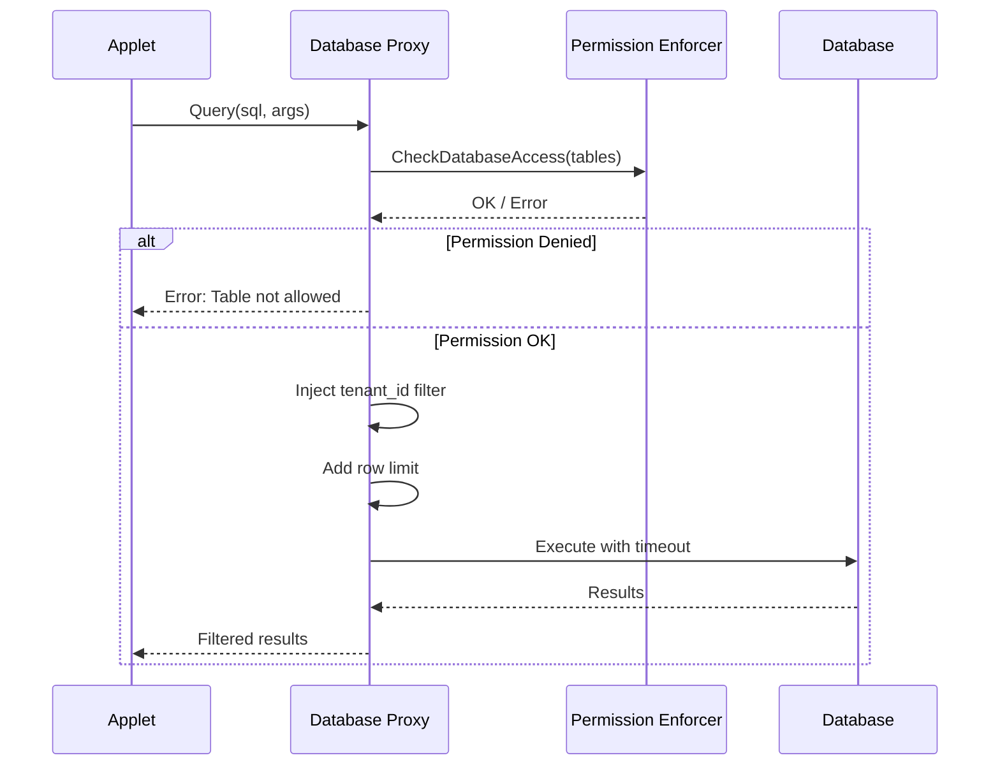
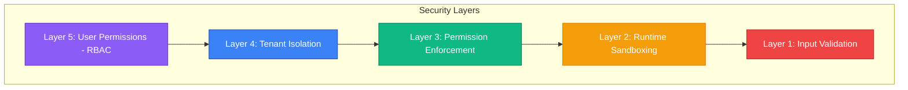
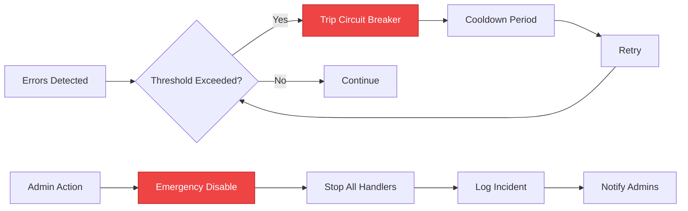

# Permission & Security Model

**Status:** Draft

## Overview

The permission model defines what applets can and cannot do. It operates at three levels:



## Permission Categories



### 1. Database Permissions

```yaml
permissions:
  database:
    read:
      - clients
      - chats
      - chat_messages
    write:
      - clients
      - chats
    createTables: true
```

| Access Type | Capabilities |
|-------------|--------------|
| **Read** | SELECT queries only, automatic tenant_id filtering, row limit (1000), query timeout (5s) |
| **Write** | INSERT, UPDATE, DELETE, automatic tenant_id injection, audit logging |
| **Create Tables** | Requires admin approval, prefixed with `applet_{id}_`, automatic tenant_id column |

### 2. External HTTP Permissions

```yaml
permissions:
  http:
    external:
      - "api.openai.com"
      - "*.dify.ai"
      - "api.stripe.com"
```

**Allowed:**
- HTTPS connections to declared hosts
- Wildcard subdomains (*.example.com)
- Standard HTTP methods

**Blocked (Always):**
- Private IP ranges (10.x, 172.16.x, 192.168.x)
- Localhost (127.0.0.1, ::1)
- Cloud metadata endpoints (169.254.169.254)
- Non-HTTPS connections (configurable)

### 3. Event Permissions

```yaml
permissions:
  events:
    subscribe:
      - "chat.message.created"
      - "client.created"
    publish:
      - "ai.response.generated"
```

### 4. UI Permissions

```yaml
permissions:
  ui:
    navigation: true
    pages: true
    widgets: true
```

### 5. Secret Permissions

```yaml
permissions:
  secrets:
    - name: "OPENAI_API_KEY"
      required: true
    - name: "WEBHOOK_SECRET"
      required: false
```

## Permission Enforcement

### Installation Flow



### Runtime Enforcement

```go
type PermissionEnforcer struct {
    allowedTables     map[string]TablePermission
    allowedHosts      []string
    allowedEvents     []string
    publishableEvents []string
}

func (e *PermissionEnforcer) CheckDatabaseAccess(table string, operation string) error {
    perm, ok := e.allowedTables[table]
    if !ok {
        return ErrTableNotAllowed{Table: table}
    }
    if operation == "write" && !perm.Write {
        return ErrWriteNotAllowed{Table: table}
    }
    return nil
}

func (e *PermissionEnforcer) CheckHTTPAccess(host string) error {
    for _, allowed := range e.allowedHosts {
        if matchHost(host, allowed) {
            return nil
        }
    }
    return ErrHostNotAllowed{Host: host}
}
```

### Database Query Interception



## User-Level Permissions

### Applet Permission Keys

Applets define their own permission keys:

```yaml
appletPermissions:
  - key: "ai-chat.config.read"
    name: { en: "View AI Chat Configuration" }
  - key: "ai-chat.config.write"
    name: { en: "Edit AI Chat Configuration" }
  - key: "ai-chat.assist"
    name: { en: "Use AI Assistant" }
```

### Integration with SDK RBAC

```go
// Applet permissions are registered with SDK
func (a *Applet) RegisterPermissions(app application.Application) {
    for _, perm := range a.Manifest.AppletPermissions {
        app.RegisterPermission(permission.Permission{
            Key:         fmt.Sprintf("applet.%s.%s", a.ID, perm.Key),
            Name:        perm.Name,
            Description: perm.Description,
            Module:      fmt.Sprintf("applet-%s", a.ID),
        })
    }
}

// Checked in handlers
func (h *Handler) ServeHTTP(w http.ResponseWriter, r *http.Request) {
    if !sdkcomposables.CanUser(r.Context(), "applet.ai-chat.config.write") {
        http.Error(w, "Forbidden", http.StatusForbidden)
        return
    }
    // ... handle request
}
```

## Security Boundaries

### Sandboxing Layers



| Layer | Purpose |
|-------|---------|
| **Layer 5** | What can this user do within the applet? |
| **Layer 4** | All data queries filtered by tenant_id |
| **Layer 3** | Applet can only access declared resources |
| **Layer 2** | Process isolation, resource limits |
| **Layer 1** | All inputs sanitized, SQL parameterized |

### Threat Model

| Threat | Mitigation |
|--------|------------|
| SQL Injection | Parameterized queries only, no raw SQL |
| Cross-Tenant Access | Automatic tenant_id filtering |
| SSRF | Host allowlist, IP validation |
| Resource Exhaustion | CPU/memory/time limits |
| Data Exfiltration | Audit logging, rate limits |
| Privilege Escalation | Permission checks at every layer |
| Code Injection | No eval(), no dynamic code execution |

## Audit Logging

All applet actions are logged:

```go
type AuditLog struct {
    Timestamp   time.Time
    AppletID    string
    TenantID    string
    UserID      *uint
    Action      string    // "db.query", "http.request", "event.publish"
    Resource    string    // Table name, URL, event type
    Details     JSONB     // Query, request body, etc.
    Success     bool
    Error       *string
    DurationMs  int
}
```

## Rate Limiting

```yaml
# Per-applet limits
rateLimits:
  http:
    requestsPerMinute: 1000
    requestsPerHour: 10000
  database:
    queriesPerMinute: 100
    rowsPerMinute: 10000
  events:
    publishPerMinute: 30
  external:
    requestsPerMinute: 60
```

## Emergency Controls



```go
// Circuit breaker for misbehaving applets
type CircuitBreaker struct {
    ErrorThreshold    int           // Errors before tripping
    ErrorWindow       time.Duration // Window to count errors
    CooldownDuration  time.Duration // How long to stay open
}

// Admin can disable applet instantly
func (m *Manager) EmergencyDisable(appletID string, reason string) error {
    // Stop all handlers
    // Log incident
    // Notify admins
    // Preserve state for investigation
}
```

---

## Next Steps

- Review [Database](./database.md) for data access patterns
- See [Distribution](./distribution.md) for packaging
- Check [Architecture](./architecture.md) for system design
