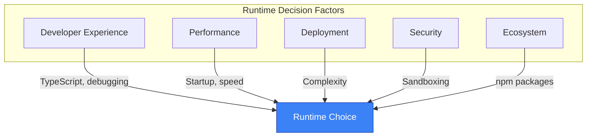
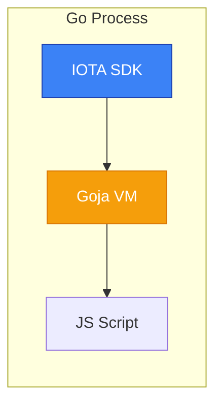
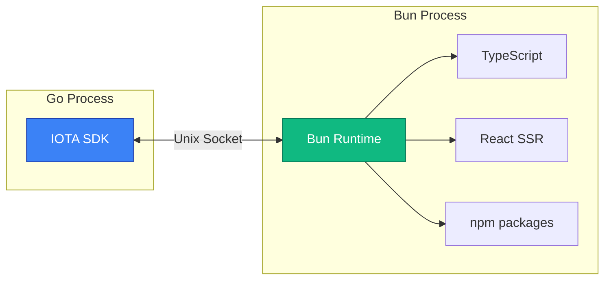
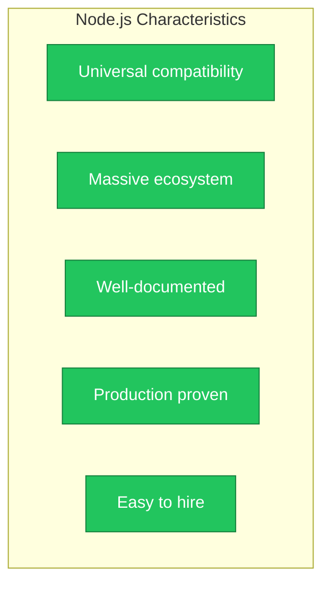
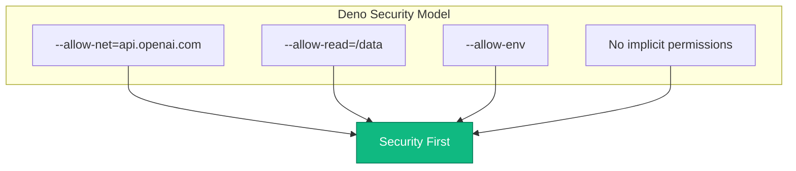
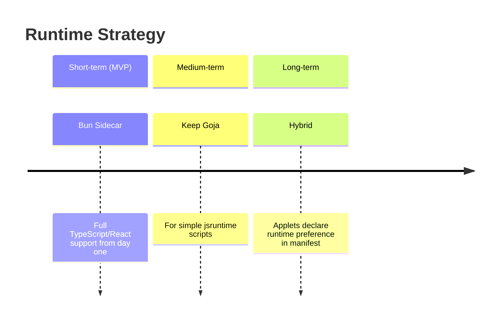
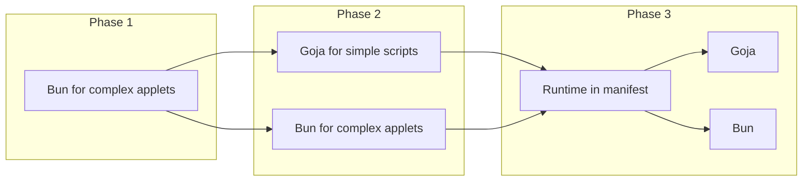
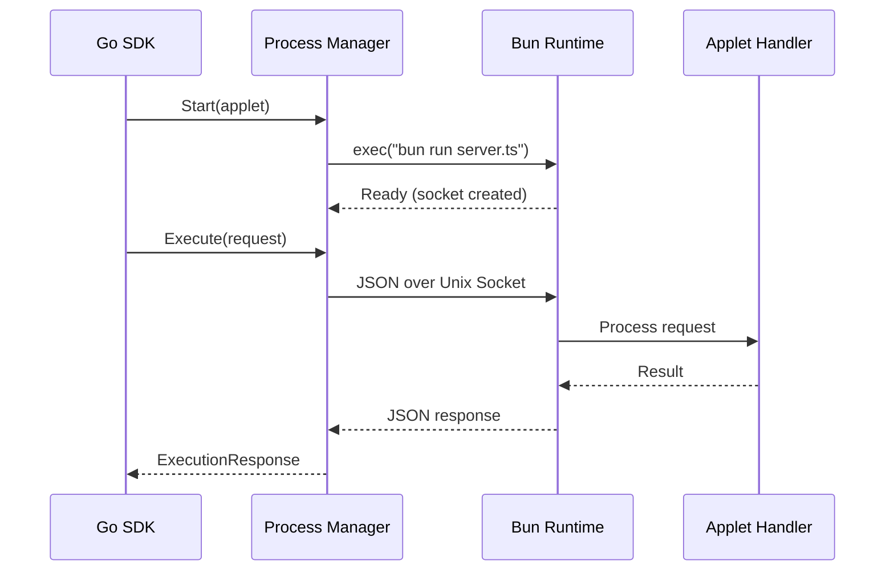
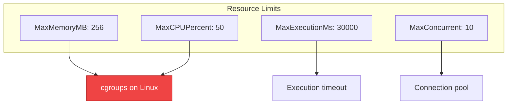

# Runtime Options: JavaScript Execution Engines

**Status:** Draft

## Overview

This document compares JavaScript runtime options for executing applet backend code. The choice impacts:

- Developer experience (TypeScript support, debugging)
- Performance (startup time, execution speed)
- Deployment complexity
- Security (sandboxing capabilities)
- Ecosystem access (npm packages)



## Comparison Matrix

| Feature | Goja | Bun | Node.js | Deno | V8 (cgo) |
|---------|------|-----|---------|------|----------|
| **Deployment** | Embedded | Sidecar | Sidecar | Sidecar | Embedded |
| **Go Integration** | Native | IPC | IPC | IPC | FFI (cgo) |
| **TypeScript** | Transpile | Native | Via tsc | Native | Transpile |
| **ES Version** | ES5.1+ | ES2024 | ES2024 | ES2024 | ES2024 |
| **async/await** | Polyfill | Native | Native | Native | Native |
| **npm Packages** | No | Yes | Yes | Partial | No |
| **Startup Time** | ~1ms | ~25ms | ~50ms | ~30ms | ~50ms |
| **Execution Speed** | Slow | Fast | Fast | Fast | Fast |
| **Memory Safety** | Go GC | Separate | Separate | Separate | Manual |
| **Sandboxing** | Language | Process | Process | Built-in | Language |
| **Windows Support** | Yes | Yes | Yes | Yes | Yes |
| **React SSR** | Limited | Native | Native | Native | Limited |

## Detailed Analysis

### Option 1: Goja (Embedded)

**What it is:** Pure Go JavaScript interpreter, no external dependencies



```go
import "github.com/dop251/goja"

func executeScript(source string, context map[string]interface{}) (interface{}, error) {
    vm := goja.New()

    // Inject SDK APIs
    vm.Set("sdk", map[string]interface{}{
        "db": databaseAPI,
        "http": httpAPI,
        "log": loggingAPI,
    })

    // Execute
    result, err := vm.RunString(source)
    return result.Export(), err
}
```

**Capabilities:**
- ES5.1 full support
- ES6+ partial (let/const, arrow functions, template literals, classes)
- No native async/await (requires promise polyfill)
- No native modules (require/import)

**TypeScript Workflow:**


| Aspect | Details |
|--------|---------|
| **Pros** | Zero external dependencies, single binary deployment, direct Go function calls, memory managed by Go GC |
| **Cons** | Limited ES6+ features, no async/await (major DX issue), slow execution (10-100x slower than V8), no npm packages |
| **Best For** | Simple webhook handlers, data transformations, scheduled tasks |
| **Not For** | Complex React UIs, heavy computation, async-heavy code |

---

### Option 2: Bun (Sidecar)

**What it is:** Modern JavaScript runtime built on JavaScriptCore (Safari's engine)



**Capabilities:**
- Full ES2024 support
- Native TypeScript (no transpilation needed)
- Native JSX/TSX support
- Built-in bundler, test runner, package manager
- npm compatible
- Web-standard APIs (fetch, WebSocket, etc.)

**Applet Server Example:**
```typescript
// applet-server.ts
import { serve } from "bun";

const handlers = new Map<string, Function>();

// Load applet handlers
import * as configHandler from "./handlers/config";
handlers.set("config", configHandler.default);

serve({
  unix: "/tmp/applet-ai-chat.sock",
  async fetch(req) {
    const { handler, context, payload } = await req.json();
    const fn = handlers.get(handler);
    if (!fn) {
      return Response.json({ error: "Handler not found" }, { status: 404 });
    }
    const result = await fn(context, payload);
    return Response.json(result);
  },
});
```

| Aspect | Details |
|--------|---------|
| **Pros** | Native TypeScript, fastest startup (~25ms), built-in bundler, full npm compatibility, native React SSR |
| **Cons** | External process to manage, IPC overhead, newer runtime (less battle-tested) |
| **Best For** | React-based applet UIs, complex TypeScript services, external API integrations |

---

### Option 3: Node.js (Sidecar)

**What it is:** The established JavaScript runtime



**Capabilities:**
- Full ES2024 support
- TypeScript via ts-node or pre-compilation
- Largest ecosystem (npm)
- Battle-tested, stable

| Aspect | Details |
|--------|---------|
| **Pros** | Universal compatibility, massive ecosystem, well-documented, production proven |
| **Cons** | Slower startup than Bun (~50ms), requires TypeScript compilation step, larger memory footprint |
| **Best For** | When npm compatibility is critical, complex applications with many dependencies |

---

### Option 4: Deno (Sidecar)

**What it is:** Secure-by-default JavaScript runtime by Node's creator



**Capabilities:**
- Native TypeScript
- Permission-based security
- Web-standard APIs
- ES modules only

**Security Model:**
```bash
# Explicit permissions
deno run --allow-net=api.openai.com --allow-read=/data applet.ts
```

| Aspect | Details |
|--------|---------|
| **Pros** | Security-first design, native TypeScript, web-standard APIs, good sandboxing |
| **Cons** | npm compatibility requires compatibility layer, smaller ecosystem |
| **Best For** | Security-critical applets, when sandboxing is paramount |

---

### Option 5: V8 via cgo (Embedded)

**What it is:** Google's V8 engine embedded via cgo bindings

```go
import "rogchap.com/v8go"

func executeScript(source string) (string, error) {
    ctx := v8.NewContext()
    val, err := ctx.RunScript(source, "applet.js")
    return val.String(), err
}
```

| Aspect | Details |
|--------|---------|
| **Pros** | Fast execution (native V8), full ES2024 support, embedded in Go process |
| **Cons** | Requires cgo (complicates cross-compilation), large binary size (~20MB), complex memory management |
| **Best For** | When embedded + fast execution is required, compute-intensive applets |

---

## Recommendation



### Primary Runtime: Bun

**Rationale:**

1. **Developer Experience:** Native TypeScript, no build step for development
2. **Performance:** Fastest sidecar option
3. **React Support:** Native JSX/TSX and SSR
4. **Modern:** Built for today's JavaScript ecosystem
5. **Bundler Included:** Simplifies applet packaging

### Secondary Runtime: Goja (for jsruntime scripts)

Keep existing jsruntime spec for simple scripts:

- Webhook handlers
- Event processors
- Scheduled tasks
- One-off executions

**Migration Path:**



```yaml
# manifest.yaml
runtime:
  engine: bun  # or "goja" for simple handlers
  version: ">=1.0.0"
```

## Implementation Details

### Bun Process Management



```go
type BunRuntime struct {
    process *exec.Cmd
    socket  string
    mu      sync.Mutex
}

func (r *BunRuntime) Start(applet *Applet) error {
    r.socket = fmt.Sprintf("/tmp/applet-%s.sock", applet.ID)

    r.process = exec.Command("bun", "run", applet.ServerPath)
    r.process.Env = append(os.Environ(),
        fmt.Sprintf("SOCKET_PATH=%s", r.socket),
        fmt.Sprintf("APPLET_ID=%s", applet.ID),
    )

    return r.process.Start()
}

func (r *BunRuntime) Execute(ctx context.Context, req *ExecutionRequest) (*ExecutionResponse, error) {
    conn, err := net.Dial("unix", r.socket)
    if err != nil {
        return nil, err
    }
    defer conn.Close()

    // Send request
    if err := json.NewEncoder(conn).Encode(req); err != nil {
        return nil, err
    }

    // Read response
    var resp ExecutionResponse
    if err := json.NewDecoder(conn).Decode(&resp); err != nil {
        return nil, err
    }

    return &resp, nil
}
```

### Health Checks

```go
func (r *BunRuntime) Health() (*HealthStatus, error) {
    resp, err := r.Execute(context.Background(), &ExecutionRequest{
        Type:    "health",
        Handler: "__health__",
    })
    if err != nil {
        return &HealthStatus{Status: "unhealthy", Error: err.Error()}, nil
    }
    return &HealthStatus{Status: "healthy"}, nil
}
```

### Resource Limits



```go
type ResourceLimits struct {
    MaxMemoryMB     int           `yaml:"max_memory_mb"`
    MaxCPUPercent   int           `yaml:"max_cpu_percent"`
    MaxExecutionMs  int           `yaml:"max_execution_ms"`
    MaxConcurrent   int           `yaml:"max_concurrent"`
}

// Applied via cgroups on Linux, process limits on other platforms
```

## Open Questions

1. **Hot Reload:** Should Bun process restart on applet code changes, or use Bun's built-in hot reload?

2. **Process Pool:** One Bun process per applet, or shared pool with isolation?

3. **Startup Strategy:** Start all applets on SDK boot, or lazy-start on first request?

4. **Crash Recovery:** Auto-restart crashed applets? How many retries? Circuit breaker?

5. **Logging:** Capture stdout/stderr from Bun process? Structured logging format?

---

## Next Steps

- Review [Architecture](./architecture.md) for system design
- See [Frontend](./frontend.md) for UI framework options
- Check [Permissions](./permissions.md) for security model
