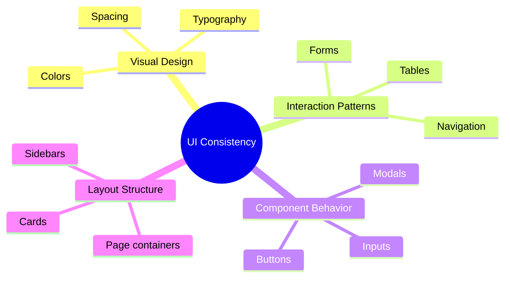
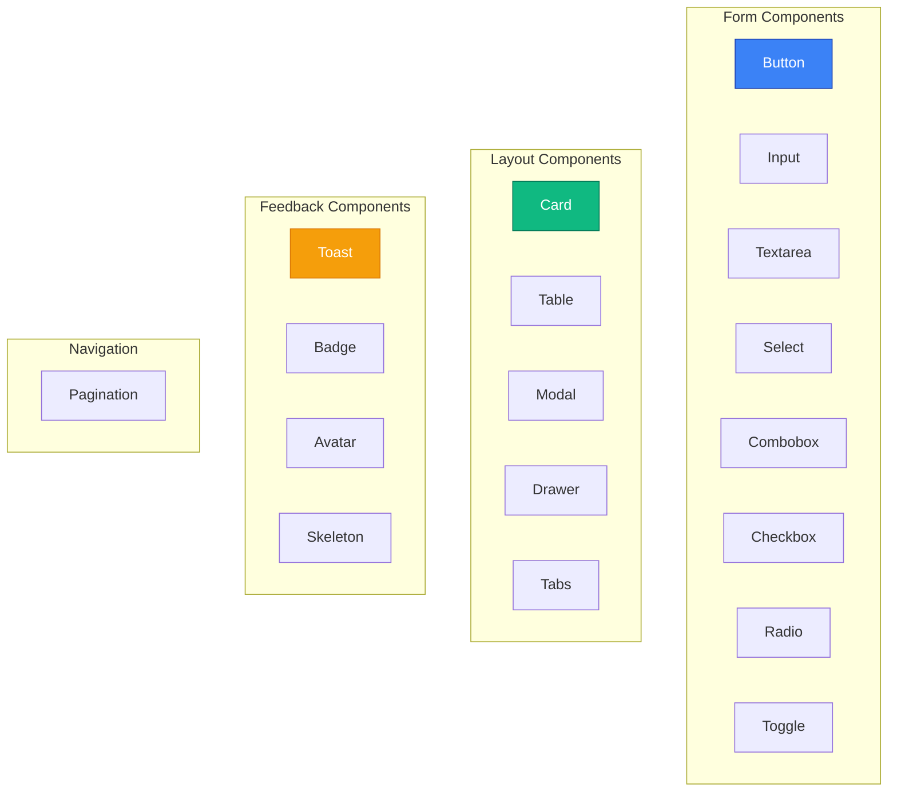
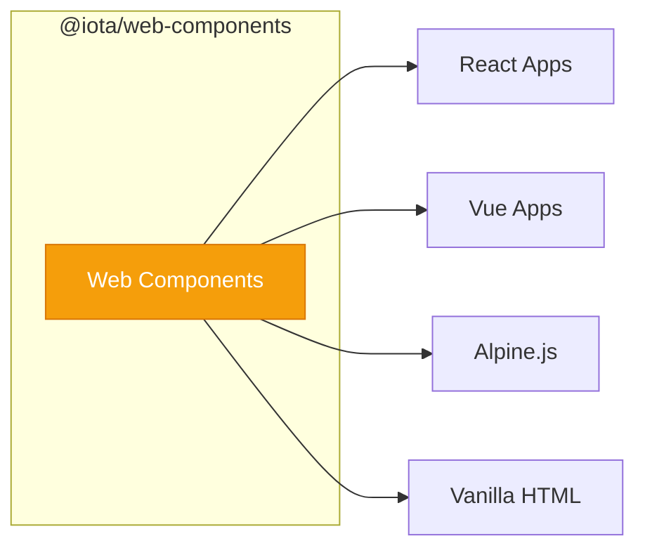
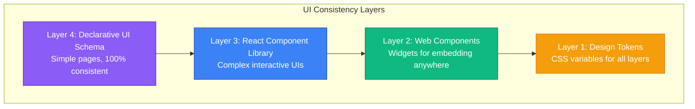
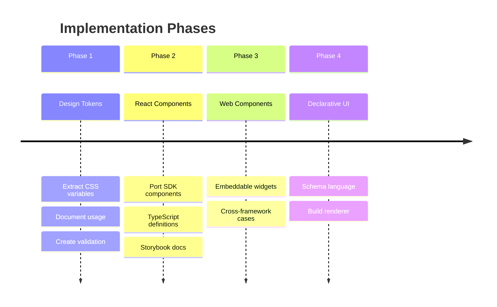
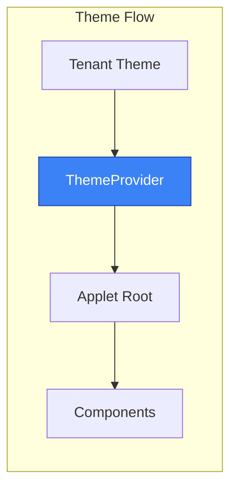

# UI Consistency Specification

**Status:** Draft

## Problem Statement

Applets must look native to IOTA SDK. Users should not perceive applet pages as "third-party" or "foreign." This requires:



## Current SDK Design System

### Visual Language

```css
/* Current SDK Tailwind theme (approximate) */
:root {
  /* Colors */
  --color-primary: #3b82f6;       /* Blue */
  --color-secondary: #6b7280;     /* Gray */
  --color-success: #10b981;       /* Green */
  --color-warning: #f59e0b;       /* Amber */
  --color-danger: #ef4444;        /* Red */

  /* Background */
  --color-bg-primary: #ffffff;
  --color-bg-secondary: #f9fafb;
  --color-bg-tertiary: #f3f4f6;

  /* Text */
  --color-text-primary: #111827;
  --color-text-secondary: #6b7280;
  --color-text-muted: #9ca3af;

  /* Border */
  --color-border: #e5e7eb;
  --color-border-focus: #3b82f6;

  /* Typography */
  --font-family: 'Inter', sans-serif;
  --font-size-xs: 0.75rem;
  --font-size-sm: 0.875rem;
  --font-size-base: 1rem;
  --font-size-lg: 1.125rem;
  --font-size-xl: 1.25rem;

  /* Spacing */
  --spacing-1: 0.25rem;
  --spacing-2: 0.5rem;
  --spacing-3: 0.75rem;
  --spacing-4: 1rem;
  --spacing-6: 1.5rem;
  --spacing-8: 2rem;

  /* Border Radius */
  --radius-sm: 0.25rem;
  --radius-md: 0.375rem;
  --radius-lg: 0.5rem;
  --radius-xl: 0.75rem;

  /* Shadows */
  --shadow-sm: 0 1px 2px 0 rgb(0 0 0 / 0.05);
  --shadow-md: 0 4px 6px -1px rgb(0 0 0 / 0.1);
  --shadow-lg: 0 10px 15px -3px rgb(0 0 0 / 0.1);
}
```

### Existing Components



| Component | Description | Used For |
|-----------|-------------|----------|
| Button | Primary, secondary, ghost, danger variants | Actions |
| Input | Text, password, email, number | Form inputs |
| Textarea | Multi-line text | Long text input |
| Select | Dropdown selection | Option selection |
| Combobox | Searchable dropdown | Large option sets |
| Checkbox | Boolean toggle | Multiple selection |
| Radio | Exclusive selection | Single selection |
| Toggle | On/off switch | Boolean settings |
| Card | Container with header/body | Content grouping |
| Table | Data grid with sorting/pagination | Lists |
| Modal | Dialog overlay | Confirmations |
| Drawer | Side panel | Forms, details |
| Toast | Notification popup | Feedback |
| Tabs | Content switching | Navigation |
| Badge | Status indicator | Labels |
| Avatar | User image | Identity |
| Pagination | Page navigation | Lists |
| Skeleton | Loading placeholder | Loading states |

## UI Consistency Strategy

### Strategy 1: Design Token Export

Export CSS variables that applets must use:

```css
/* @iota/design-tokens/tokens.css */
:root {
  /* All tokens defined here */
}

/* Applet root inherits tokens */
.applet-container {
  font-family: var(--iota-font-family);
  color: var(--iota-color-text-primary);
  background: var(--iota-color-bg-primary);
}
```

**Enforcement:**
- Applets must import token CSS
- Linter warns on hardcoded colors/fonts
- Review process checks visual consistency

| Aspect | Details |
|--------|---------|
| **Pros** | Simple to implement, flexible for developers, automatic theme support |
| **Cons** | Relies on developer discipline, can't enforce layout patterns |

---

### Strategy 2: Component Library (React)

Publish SDK components as npm package:

```typescript
// @iota/components
export { Button } from './Button';
export { Input } from './Input';
export { Select } from './Select';
export { Card } from './Card';
export { Table } from './Table';
export { Modal } from './Modal';
// ... all components
```

**Usage in Applet:**
```tsx
import { Button, Card, Input, Select } from '@iota/components';

export function ConfigPage() {
  return (
    <Card title="Configuration">
      <Input label="API Key" type="password" />
      <Select label="Model" options={models} />
      <Button variant="primary">Save</Button>
    </Card>
  );
}
```

**Component API Design:**
```typescript
// Button.tsx
interface ButtonProps {
  children: React.ReactNode;
  variant?: 'primary' | 'secondary' | 'ghost' | 'danger';
  size?: 'sm' | 'md' | 'lg';
  disabled?: boolean;
  loading?: boolean;
  icon?: React.ReactNode;
  iconPosition?: 'left' | 'right';
  fullWidth?: boolean;
  type?: 'button' | 'submit' | 'reset';
  onClick?: () => void;
}

export function Button({
  children,
  variant = 'secondary',
  size = 'md',
  ...props
}: ButtonProps) {
  return (
    <button
      className={cn(
        'iota-button',
        `iota-button--${variant}`,
        `iota-button--${size}`,
        props.fullWidth && 'iota-button--full-width',
        props.loading && 'iota-button--loading',
      )}
      {...props}
    >
      {props.loading && <Spinner />}
      {props.icon && props.iconPosition === 'left' && props.icon}
      {children}
      {props.icon && props.iconPosition === 'right' && props.icon}
    </button>
  );
}
```

| Aspect | Details |
|--------|---------|
| **Pros** | Guaranteed visual consistency, consistent behavior, automatic theme support, TypeScript types |
| **Cons** | Requires maintaining React library, bundle size impact, framework lock-in |

---

### Strategy 3: Web Components Library

Framework-agnostic components using Web Components:



```typescript
// @iota/web-components
import { IotaButton } from '@iota/web-components/button';
import { IotaCard } from '@iota/web-components/card';
import { IotaInput } from '@iota/web-components/input';

// Auto-registers custom elements
```

**Usage (Any Framework):**
```html
<!-- HTML/Alpine.js -->
<iota-card title="Configuration">
  <iota-input label="API Key" type="password"></iota-input>
  <iota-select label="Model" :options="models"></iota-select>
  <iota-button variant="primary" @click="save">Save</iota-button>
</iota-card>
```

```tsx
// React
export function ConfigPage() {
  return (
    <iota-card title="Configuration">
      <iota-input label="API Key" type="password" />
      <iota-select label="Model" options={JSON.stringify(models)} />
      <iota-button variant="primary" onClick={save}>Save</iota-button>
    </iota-card>
  );
}
```

| Aspect | Details |
|--------|---------|
| **Pros** | Framework agnostic, native browser support, style encapsulation |
| **Cons** | SSR is complex, React integration has quirks, state management manual |

---

### Strategy 4: Declarative UI Schema

Applets define UI declaratively, SDK renders:

```yaml
# applet/ui/pages/config.yaml
page:
  title: { key: "Config.Title" }
  layout: standard
  sections:
    - type: card
      title: { key: "Config.AISettings" }
      content:
        - type: form
          id: config-form
          action: /api/applets/ai-chat/config
          method: POST
          fields:
            - name: modelName
              type: select
              label: { key: "Config.Model" }
              source: /api/applets/ai-chat/models
              required: true

            - name: systemPrompt
              type: textarea
              label: { key: "Config.SystemPrompt" }
              rows: 6
              maxLength: 5000

            - name: temperature
              type: slider
              label: { key: "Config.Temperature" }
              min: 0
              max: 2
              step: 0.1
              default: 0.7

          actions:
            - type: submit
              label: { key: "Common.Save" }
              variant: primary
```

**SDK renders:**
```go
func renderPage(definition PageDefinition, ctx context.Context) templ.Component {
    return layout.Standard(layout.StandardProps{
        Title: t(ctx, definition.Title),
        Content: renderSections(definition.Sections, ctx),
    })
}
```

| Aspect | Details |
|--------|---------|
| **Pros** | Guaranteed consistency, no frontend code needed for simple UIs, automatic accessibility |
| **Cons** | Limited flexibility, complex UIs impossible, custom components blocked |

---

## Recommended Approach

### Layered Strategy



### Implementation Priority



1. **Phase 1: Design Tokens**
   - Extract current SDK styles to CSS variables
   - Document token usage
   - Create validation tooling

2. **Phase 2: React Component Library**
   - Port SDK components to React
   - Full TypeScript definitions
   - Storybook documentation
   - Publish as `@iota/components`

3. **Phase 3: Web Components (for widgets)**
   - Create embeddable widgets
   - Use for cross-framework cases
   - Focus on chat widgets, buttons, etc.

4. **Phase 4: Declarative UI Schema**
   - Design schema language
   - Build renderer
   - Use for simple config pages

### Package Structure

```
@iota/
├── design-tokens/          # CSS variables, Tailwind config
│   ├── tokens.css
│   ├── tailwind.config.js
│   └── index.ts
├── components/             # React components
│   ├── Button/
│   ├── Input/
│   ├── Card/
│   └── index.ts
├── web-components/         # Web Components
│   ├── button.ts
│   ├── card.ts
│   └── index.ts
└── applet-sdk/            # Full SDK for applet development
    ├── hooks/
    ├── utils/
    └── index.ts
```

### Validation & Enforcement

```typescript
// build-time validation
import { validateAppletUI } from '@iota/applet-validator';

const result = await validateAppletUI('./dist');

// Checks:
// - Uses @iota/components (no custom buttons, inputs)
// - No hardcoded colors (must use CSS variables)
// - Follows layout patterns
// - Accessibility compliance
```

### Theme Support



```typescript
// @iota/components supports theming
import { ThemeProvider } from '@iota/components';

// SDK wraps applet with theme
<ThemeProvider theme={tenantTheme}>
  <AppletRoot />
</ThemeProvider>
```

```css
/* Applet automatically inherits tenant theme */
.applet-container {
  --iota-color-primary: var(--tenant-primary, #3b82f6);
}
```

---

## Next Steps

- Review [Frontend](./frontend.md) for framework options
- See [Manifest](./manifest.md) for configuration schema
- Check [Examples](./examples.md) for reference implementations
