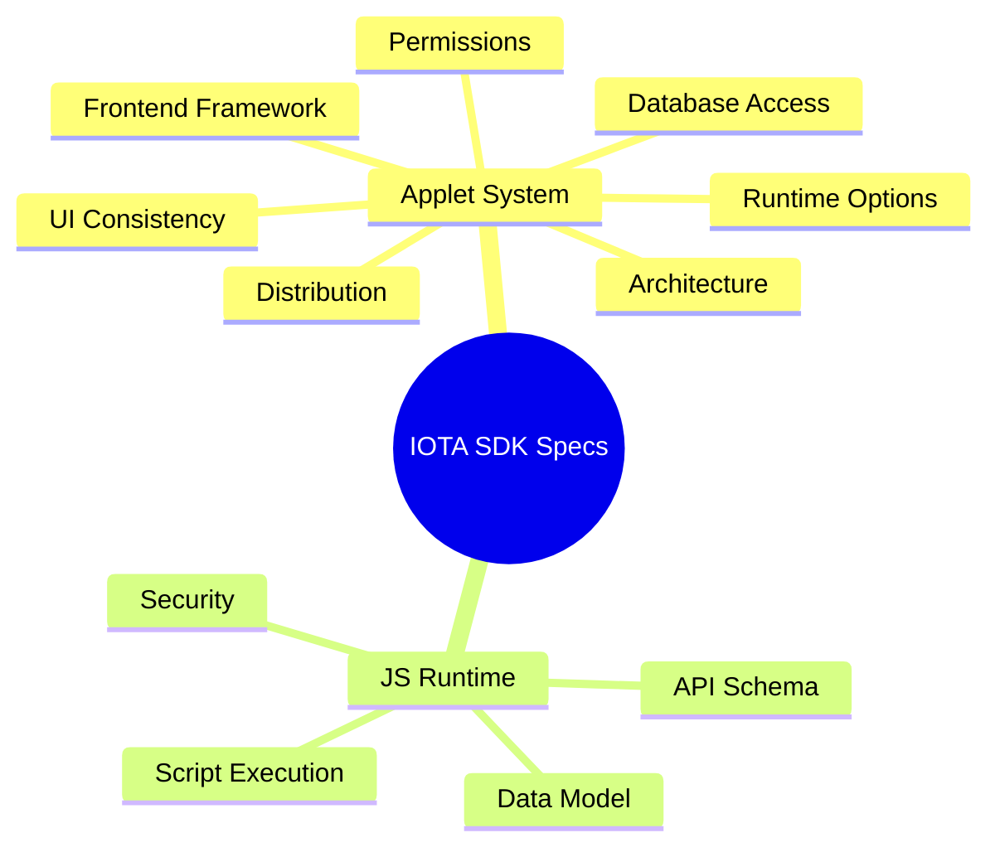
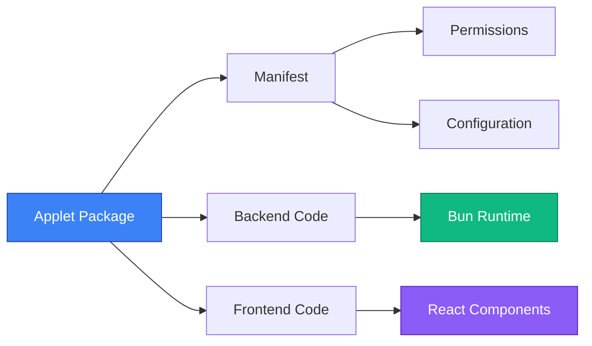
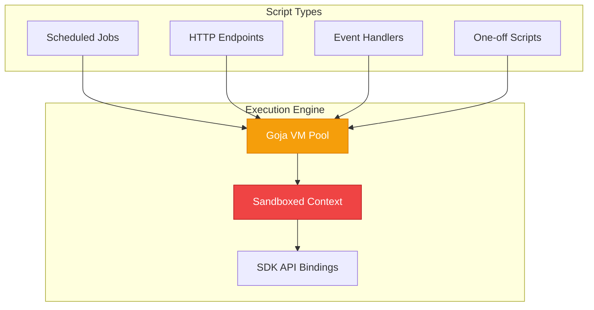
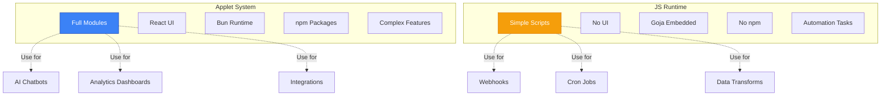

# Technical Specifications

This section contains detailed technical specifications and design documents for planned and in-development IOTA SDK features. These specifications serve as reference documentation for architecture decisions, implementation details, and future roadmap items.

## Overview

## Available Specifications

### [Applet System](./applets/)
**Status:** Draft | **Priority:** High

A comprehensive plugin/extension system that enables JavaScript-based modules to extend IOTA SDK functionality without Go code or SDK recompilation.

**Key Features:**
- Runtime-installable extensions
- React + TypeScript frontends
- Bun as JavaScript runtime
- Tenant-isolated data access
- Permission-based security model

[Explore Applet System Specification →](./applets/)

---

### [JavaScript Runtime](./jsruntime/)
**Status:** Draft | **Priority:** Medium

Embedded JavaScript execution engine for user-defined scripts, scheduled jobs, and dynamic endpoints using Goja.

**Key Features:**
- Embedded Goja JavaScript engine
- Sandboxed execution environment
- Database and HTTP API access
- Scheduled task execution
- Event-driven automation

[Explore JS Runtime Specification →](./jsruntime/)

---

## Specification Status Legend

| Status | Description |
|--------|-------------|
| **Draft** | Initial ideation, gathering requirements |
| **In Review** | Under technical review |
| **Approved** | Ready for implementation |
| **In Progress** | Implementation underway |
| **Complete** | Implemented and documented |

## Comparison: Applet System vs JS Runtime

| Aspect | Applet System | JS Runtime |
|--------|---------------|------------|
| **Complexity** | Full modules with UI | Simple scripts |
| **Runtime** | Bun (external process) | Goja (embedded) |
| **TypeScript** | Native support | Requires transpilation |
| **npm Packages** | Full access | Not available |
| **UI Components** | React pages/widgets | None |
| **Use Case** | Feature extensions | Automation scripts |

## Contributing to Specifications

Specifications follow a structured process:

1. **Propose** - Create a draft in `.claude/spec/` or `docs/specs/`
2. **Discuss** - Gather feedback and refine requirements
3. **Review** - Technical review by maintainers
4. **Approve** - Finalize for implementation
5. **Implement** - Build the feature
6. **Document** - Update user-facing documentation

---

For questions or feedback on specifications, please [open an issue](https://github.com/iota-uz/iota-sdk/issues) on GitHub.
