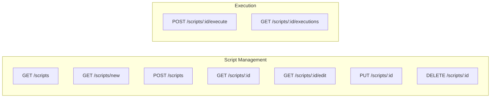
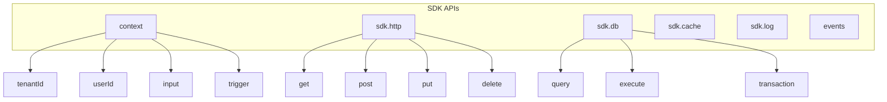

# API Schema: JavaScript Runtime

**Status:** Draft

## HTMX Endpoints



| Method | Path | Purpose | Response |
|--------|------|---------|----------|
| GET | /scripts | List all scripts | HTML page with scripts table |
| GET | /scripts/new | Show create form | HTML page with Monaco editor |
| POST | /scripts | Create new script | Redirect to /scripts/:id |
| GET | /scripts/:id | View script details | HTML page with execution history |
| GET | /scripts/:id/edit | Show edit form | HTML page with Monaco editor |
| PUT | /scripts/:id | Update script | Redirect to /scripts/:id |
| DELETE | /scripts/:id | Delete script | HTML fragment (remove table row) |
| POST | /scripts/:id/execute | Execute script manually | HTML fragment (execution row) |
| GET | /scripts/:id/executions | List executions (HTMX poll) | HTML fragment (execution rows) |

### Endpoint: POST /scripts

**Purpose:** Create new script from form submission

**Authorization:** `scripts.create` permission

**Request:** Form fields (CamelCase):
- `Name` (string, required, min: 3, max: 100)
- `Description` (string, optional, max: 500)
- `Source` (string, required) - JavaScript code
- `Type` (string, required, enum: scheduled/http/event/oneoff/embedded)
- `Status` (string, default: draft)
- `CronExpression` (string, required if Type=scheduled)
- `HTTPPath` (string, required if Type=http)
- `HTTPMethods` ([]string, required if Type=http)
- `EventTypes` ([]string, required if Type=event)
- `MaxExecutionTimeMs` (int, optional, default: 30000)
- `MaxMemoryBytes` (int, optional, default: 67108864)

**Response:**
- Success: Redirect to `/scripts/:id`
- Validation error: Re-render form with error messages

## JavaScript SDK API

**Purpose:** APIs injected into script execution context via Goja VM



### Context API

**Global:** `context`

**Properties:**
- `context.tenantId: string` (read-only) - Current tenant UUID
- `context.userId: number | null` (read-only) - Authenticated user ID
- `context.organizationId: string | null` (read-only) - Organization UUID
- `context.scriptId: string` (read-only) - Executing script UUID
- `context.executionId: string` (read-only) - Current execution UUID
- `context.input: object` - Input parameters passed to script
- `context.trigger: object` - Trigger information

**Trigger Object:**
- `type: string` - Trigger type (cron/http/event/manual/api)
- `eventType: string | null` - Event type (for event triggers)
- `eventPayload: object | null` - Event data (for event triggers)
- `httpRequest: object | null` - HTTP request details (for HTTP triggers)
- `cronExpression: string | null` - Cron schedule (for cron triggers)

### HTTP Client API

**Namespace:** `sdk.http`

**Methods:**
```typescript
sdk.http.get(url: string, options?: HttpOptions): Promise<HttpResponse>
sdk.http.post(url: string, body: any, options?: HttpOptions): Promise<HttpResponse>
sdk.http.put(url: string, body: any, options?: HttpOptions): Promise<HttpResponse>
sdk.http.delete(url: string, options?: HttpOptions): Promise<HttpResponse>
sdk.http.patch(url: string, body: any, options?: HttpOptions): Promise<HttpResponse>
```

**HttpOptions:**
- `headers?: object` - Custom HTTP headers
- `query?: object` - Query parameters
- `timeout?: number` - Request timeout in milliseconds (default: 10000)

**HttpResponse:**
- `status: number` - HTTP status code
- `headers: object` - Response headers
- `body: string | object` - Response body (auto-parsed JSON)

**Errors:**
- `Error: SSRF protection` - Blocked private IP or cloud metadata endpoint
- `Error: Rate limit exceeded` - Exceeded 60 requests/minute

### Database API

**Namespace:** `sdk.db`

**Methods:**
```typescript
sdk.db.query(sql: string, params: any[]): Promise<object[]>
sdk.db.execute(sql: string, params: any[]): Promise<number>
sdk.db.queryOne(sql: string, params: any[]): Promise<object | null>
sdk.db.transaction(fn: (tx: Transaction) => Promise<void>): Promise<void>
```

**Security:**
- Automatic `tenant_id` injection in WHERE clause
- Parameterized queries only (no string concatenation)
- Read-only access (no DDL/DCL)
- Row limit: max 1000 rows
- Query timeout: max 5 seconds

**Errors:**
- `Error: Unauthorized operation` - Attempted DDL/DCL
- `Error: SQL injection detected` - String concatenation in query
- `Error: Row limit exceeded` - Query returned > 1000 rows

### Cache API

**Namespace:** `sdk.cache`

**Methods:**
```typescript
sdk.cache.get(key: string): Promise<any | null>
sdk.cache.set(key: string, value: any, ttl?: number): Promise<boolean>
sdk.cache.delete(key: string): Promise<boolean>
sdk.cache.exists(key: string): Promise<boolean>
sdk.cache.increment(key: string, delta?: number): Promise<number>
```

**Automatic Prefixing:**
- Keys automatically prefixed with `tenant:{tenantId}:script:{scriptId}:`

### Logging API

**Namespace:** `sdk.log`

**Methods:**
```typescript
sdk.log.debug(message: string, metadata?: object): void
sdk.log.info(message: string, metadata?: object): void
sdk.log.warn(message: string, metadata?: object): void
sdk.log.error(message: string, metadata?: object): void
```

**Automatic Context:** tenant_id, user_id, script_id, execution_id, timestamp

### Events API

**Global:** `events`

**Methods:**
```typescript
events.publish(eventType: string, payload: object): Promise<boolean>
```

**Event Types:** Follow convention `module.entity.action` (e.g., "user.created", "order.updated")

## Error Handling

| Error Code | Condition | Response |
|------------|-----------|----------|
| 400 | Validation failure | Re-render form with inline error messages |
| 401 | Unauthenticated | Redirect to login page |
| 403 | Insufficient permissions | 403 Forbidden page |
| 404 | Script not found | 404 Not Found page |
| 409 | Duplicate name or HTTP path | Re-render form with conflict error |
| 500 | Execution error | Display error message with execution ID |
| 504 | Execution timeout | Display timeout message |

---

## Next Steps

- Review [UX Spec](./ux.md) for user interface design
- See [Technical Spec](./technical.md) for implementation details
