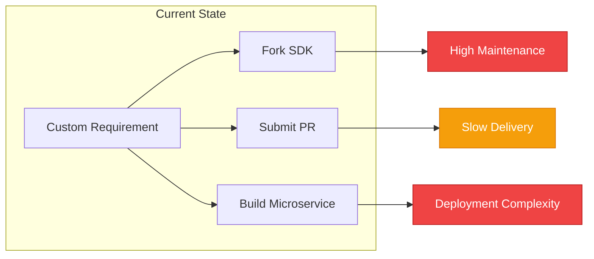
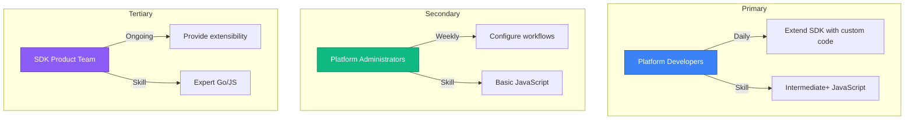
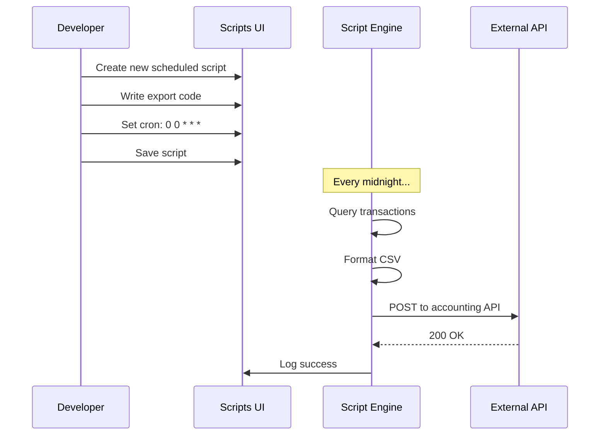
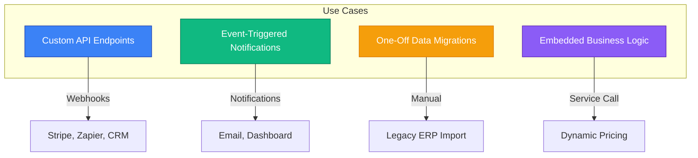
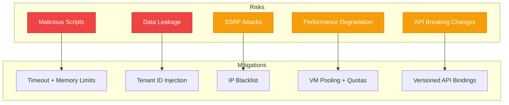

# Business Spec: JavaScript Runtime

**Status:** Draft

## Problem Statement

IOTA SDK provides robust multi-tenant business management capabilities, but customers frequently require custom business logic tailored to their specific workflows, integrations, and processes. Currently, implementing custom logic requires forking the SDK codebase, submitting pull requests, or building separate microservices—all of which increase development time, maintenance burden, and deployment complexity.

**Business Impact:**
- **Lost Revenue:** Customers abandon IOTA SDK for more flexible platforms that support custom extensibility
- **Slow Time-to-Market:** Custom feature requests take weeks to implement via pull requests
- **High Support Costs:** Manual workarounds and one-off customizations create technical debt
- **Low Adoption:** Rigid, one-size-fits-all platform limits appeal to diverse industries

**Who Experiences It:**
- **Platform Users (Developers):** Cannot automate repetitive tasks, integrate with third-party APIs, or implement custom business rules without SDK team intervention
- **Platform Administrators:** Lack tools to configure custom workflows, notifications, and data transformations
- **SDK Product Team:** Overwhelmed with feature requests for niche use cases that don't justify core product changes

## Target Audience

### Primary: Platform Developers
- **Goal:** Extend IOTA SDK functionality with custom JavaScript code
- **Frequency:** Daily (for automation, integrations, custom logic)
- **Technical Skill:** Intermediate to advanced JavaScript knowledge

### Secondary: Platform Administrators
- **Goal:** Configure custom workflows, notifications, and data transformations without code changes
- **Frequency:** Weekly (for business rule updates, scheduled tasks)
- **Technical Skill:** Basic JavaScript knowledge (copy-paste examples)

### Tertiary: SDK Product Team
- **Goal:** Provide extensibility framework to reduce custom feature requests
- **Frequency:** Ongoing (feature development, support)
- **Technical Skill:** Expert Go and JavaScript knowledge

## Use Cases

### Primary: Scheduled Data Exports

**Actor:** Platform Developer
**Goal:** Automatically export financial reports to external accounting system every night

**Flow:**

1. Developer navigates to "Scripts" section in IOTA SDK admin panel
2. Clicks "New Script" and selects "Scheduled (Cron)" type
3. Writes JavaScript code to query transactions, format CSV, and POST to external API
4. Configures cron expression `0 0 * * *` (midnight daily) with timezone
5. Saves script with metadata tags (category: "exports", team: "finance")
6. Script executes automatically every night, logs success/failure to execution history
7. Developer monitors execution history, views output logs, adjusts code as needed

**Success Criteria:**
- Script executes reliably at scheduled time (±1 minute accuracy)
- Execution history provides debugging information (logs, errors, duration)
- Failed executions trigger alerts (email, Slack notification)

### Secondary Use Cases

**Custom API Endpoints:**
- Developer creates HTTP endpoint script (`/api/scripts/webhook-handler`) to receive webhooks from third-party CRM
- Script validates incoming payload, creates new client record in IOTA SDK database, returns success response
- Use for: Stripe webhooks, Zapier integrations, custom mobile app APIs

**Event-Triggered Notifications:**
- Administrator creates event-triggered script listening to `payment.processed` event
- Script sends email notification to customer with payment receipt, updates internal dashboard
- Use for: User onboarding emails, inventory alerts, approval workflows

**One-Off Data Migrations:**
- Developer creates one-off script to migrate legacy data from old ERP system
- Script executes manually via UI, displays progress updates, logs inserted records
- Use for: Database cleanup, bulk updates, ad-hoc reporting

**Embedded Business Logic:**
- Developer creates embedded script for dynamic pricing calculation
- Go service layer invokes script with order details, script returns calculated price
- Use for: Custom validation rules, extensible calculators, plugin architecture

## Requirements

### In Scope

| Category | Features |
|----------|----------|
| **Script Management** | CRUD operations via web UI (create, edit, delete, enable/disable) |
| **Code Editor** | Monaco Editor with JavaScript syntax highlighting, autocomplete, error detection |
| **Scheduled Execution** | Cron-based scheduling with standard syntax, timezone support, overlap prevention |
| **HTTP Endpoints** | Map scripts to HTTP routes, access request data, return custom responses |
| **Event Triggers** | Subscribe to domain events, execute asynchronously, retry on failure |
| **One-Off Execution** | Manual script execution via UI or API with input parameters |
| **Execution History** | Persistent logs with status, output, errors, duration, timestamps |
| **Version Control** | Immutable snapshots of script code changes for audit trail and rollback |
| **Resource Limits** | Configurable timeout, memory limits, concurrent execution quotas |
| **Multi-Tenant Isolation** | Scripts can only access data within their tenant context |
| **RBAC Integration** | Permission checks for script creation, execution, deletion |
| **Sandbox Security** | Restricted access to system resources (no file system, controlled HTTP) |

### Out of Scope

- **NPM Package Support:** No external JavaScript dependencies (future consideration)
- **TypeScript Support:** JavaScript (ES5/ES6 subset) only (future consideration)
- **Real-Time Debugging:** No breakpoints or step-through debugging (future consideration)
- **Distributed Execution:** Scripts execute on single node (no multi-node coordination)
- **Custom UI Components:** Scripts cannot render frontend UI (backend execution only)
- **WebSocket Support:** No long-lived connections (HTTP request/response only)

### Future Scope

- **NPM Integration:** Allow importing vetted NPM packages (e.g., lodash, moment.js) with security scanning
- **TypeScript Compilation:** Transpile TypeScript to JavaScript before execution
- **Debugger Integration:** Attach debugger to running scripts via browser DevTools protocol
- **Script Marketplace:** Share and discover community-contributed scripts (e.g., Stripe integration template)
- **Advanced Monitoring:** Distributed tracing (OpenTelemetry), APM integration (DataDog, New Relic)
- **Collaborative Editing:** Multi-user editing with conflict resolution (similar to Google Docs)

## Assumptions

- **Users have JavaScript knowledge:** Target audience understands basic JavaScript syntax and async programming
- **Database schema is stable:** Scripts query existing tables via SDK-provided APIs (not raw SQL)
- **Event bus is reliable:** Domain events are published consistently with at-least-once delivery guarantees
- **External APIs are accessible:** Scripts can make HTTP requests to third-party services (firewalls allow outbound connections)
- **Execution environment is Linux:** Goja runtime runs on Linux-based Docker containers (not Windows/macOS)

## Risks & Mitigations

| Risk | Impact | Mitigation |
|------|--------|------------|
| **Malicious Scripts:** User writes infinite loop or memory-intensive code | High | Enforce strict timeout (30s), memory limits (256MB), VM isolation per tenant |
| **Data Leakage:** Script accesses data from other tenants | Critical | Automatic tenant_id injection in execution context, repository-level filtering |
| **SSRF Attacks:** Script sends HTTP requests to internal services | High | HTTP client whitelist/blacklist, block private IP ranges (10.x, 192.168.x) |
| **Performance Degradation:** Too many concurrent scripts slow down system | Medium | VM pooling with per-tenant quotas, queue management, graceful degradation |
| **API Breaking Changes:** SDK updates break existing scripts | Medium | Versioned API bindings, deprecation warnings, migration guides |
| **Dependency Hell:** Future NPM support introduces security vulnerabilities | Medium | Vetted package whitelist, automated security scanning (Snyk, npm audit) |
| **Execution Failures:** Transient errors cause script failures | Low | Automatic retry with exponential backoff (event-triggered only), dead letter queue |

## Open Questions

- **[TBD]** What is the pricing model for script execution? (e.g., free tier: 1000 executions/month, paid tier: unlimited)
- **[TBD]** Should HTTP endpoint scripts support streaming responses? (e.g., Server-Sent Events for real-time data)
- **[TBD]** Should scripts have access to GraphQL API in addition to REST-like SDK APIs?
- **[TBD]** What is the retention policy for execution logs? (e.g., 30 days default, configurable per tenant)
- **[TBD]** Should administrators be able to share scripts across multiple tenants? (e.g., global template library)

---

## Next Steps

- Review [Decisions](./decisions.md) for technology choices
- See [Technical Spec](./technical.md) for implementation details
- Check [UX Spec](./ux.md) for user interface design
