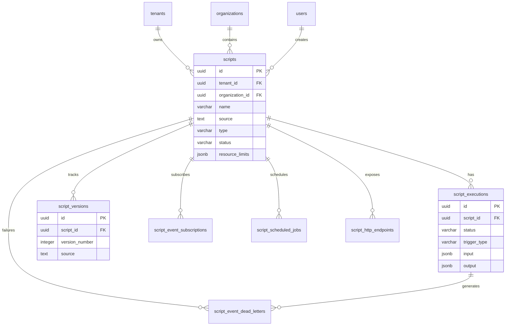

# Data Model: JavaScript Runtime

**Status:** Draft

## Entity Relationships



## Tables

### scripts (Core Table)

**Purpose:** Main table storing script definitions with metadata, resource limits, and trigger configuration.

```sql
CREATE TABLE scripts (
    id UUID PRIMARY KEY DEFAULT gen_random_uuid(),
    tenant_id UUID NOT NULL REFERENCES tenants(id),
    organization_id UUID NOT NULL REFERENCES organizations(id),
    name VARCHAR(255) NOT NULL,
    description TEXT,
    source TEXT NOT NULL,
    type VARCHAR(50) NOT NULL CHECK (type IN ('scheduled', 'http', 'event', 'oneoff', 'embedded')),
    status VARCHAR(50) NOT NULL CHECK (status IN ('draft', 'active', 'paused', 'disabled', 'archived')),
    resource_limits JSONB NOT NULL DEFAULT '{
        "max_execution_time_ms": 30000,
        "max_memory_bytes": 67108864,
        "max_concurrent_runs": 5,
        "max_api_calls_per_minute": 60,
        "max_output_size_bytes": 1048576
    }'::jsonb,
    cron_expression VARCHAR(255),
    http_path VARCHAR(500),
    http_methods TEXT[],
    event_types TEXT[],
    metadata JSONB DEFAULT '{}'::jsonb,
    tags TEXT[] DEFAULT ARRAY[]::TEXT[],
    created_at TIMESTAMP WITH TIME ZONE DEFAULT NOW(),
    updated_at TIMESTAMP WITH TIME ZONE DEFAULT NOW(),
    created_by INTEGER REFERENCES users(id),
    CONSTRAINT uq_scripts_tenant_name UNIQUE (tenant_id, name),
    CONSTRAINT uq_scripts_tenant_http_path UNIQUE (tenant_id, http_path)
);

-- Performance indexes
CREATE INDEX idx_scripts_tenant_status ON scripts(tenant_id, status);
CREATE INDEX idx_scripts_tenant_type_status ON scripts(tenant_id, type, status);
CREATE INDEX idx_scripts_http_path ON scripts(tenant_id, http_path) WHERE http_path IS NOT NULL;
CREATE INDEX idx_scripts_event_types ON scripts USING GIN(event_types);
CREATE INDEX idx_scripts_cron ON scripts(tenant_id, cron_expression) WHERE cron_expression IS NOT NULL;
```

**Fields:**

| Column | Type | Description |
|--------|------|-------------|
| id | UUID | Primary key |
| tenant_id | UUID | Multi-tenant isolation |
| name | VARCHAR(255) | Script name (unique per tenant) |
| source | TEXT | JavaScript source code |
| type | VARCHAR(50) | scheduled/http/event/oneoff/embedded |
| status | VARCHAR(50) | draft/active/paused/disabled/archived |
| resource_limits | JSONB | Timeout, memory, concurrency limits |
| cron_expression | VARCHAR(255) | Cron schedule (for scheduled type) |
| http_path | VARCHAR(500) | HTTP endpoint path (for http type) |
| event_types | TEXT[] | Domain events to subscribe to |

### script_executions (Execution History)

**Purpose:** Execution history with input/output, status, metrics, and error tracking.

```sql
CREATE TABLE script_executions (
    id UUID PRIMARY KEY DEFAULT gen_random_uuid(),
    script_id UUID NOT NULL REFERENCES scripts(id) ON DELETE CASCADE,
    tenant_id UUID NOT NULL REFERENCES tenants(id),
    status VARCHAR(50) NOT NULL CHECK (status IN ('pending', 'running', 'completed', 'failed', 'timeout', 'cancelled')),
    trigger_type VARCHAR(50) NOT NULL CHECK (trigger_type IN ('cron', 'http', 'event', 'manual', 'api')),
    trigger_data JSONB DEFAULT '{}'::jsonb,
    input JSONB DEFAULT '{}'::jsonb,
    output JSONB,
    error TEXT,
    metrics JSONB DEFAULT '{}'::jsonb,
    started_at TIMESTAMP WITH TIME ZONE DEFAULT NOW(),
    completed_at TIMESTAMP WITH TIME ZONE
);

CREATE INDEX idx_executions_script ON script_executions(script_id);
CREATE INDEX idx_executions_tenant_status ON script_executions(tenant_id, status);
CREATE INDEX idx_executions_tenant_started ON script_executions(tenant_id, started_at DESC);
```

### script_versions (Audit Trail)

**Purpose:** Immutable version history for script source code changes.

```sql
CREATE TABLE script_versions (
    id UUID PRIMARY KEY DEFAULT gen_random_uuid(),
    script_id UUID NOT NULL REFERENCES scripts(id) ON DELETE CASCADE,
    tenant_id UUID NOT NULL REFERENCES tenants(id),
    version_number INTEGER NOT NULL,
    source TEXT NOT NULL,
    change_description TEXT,
    created_at TIMESTAMP WITH TIME ZONE DEFAULT NOW(),
    created_by INTEGER REFERENCES users(id),
    CONSTRAINT uq_versions_script_number UNIQUE (script_id, version_number)
);
```

### script_event_subscriptions (Event Routing)

```sql
CREATE TABLE script_event_subscriptions (
    id UUID PRIMARY KEY DEFAULT gen_random_uuid(),
    script_id UUID NOT NULL REFERENCES scripts(id) ON DELETE CASCADE,
    tenant_id UUID NOT NULL REFERENCES tenants(id),
    event_type VARCHAR(255) NOT NULL,
    is_active BOOLEAN DEFAULT true,
    created_at TIMESTAMP WITH TIME ZONE DEFAULT NOW(),
    CONSTRAINT uq_subs_script_event UNIQUE (script_id, event_type)
);

CREATE INDEX idx_event_subs_tenant_event ON script_event_subscriptions(tenant_id, event_type) WHERE is_active = true;
```

### script_scheduled_jobs (Cron Scheduler State)

```sql
CREATE TABLE script_scheduled_jobs (
    id UUID PRIMARY KEY DEFAULT gen_random_uuid(),
    script_id UUID NOT NULL UNIQUE REFERENCES scripts(id) ON DELETE CASCADE,
    tenant_id UUID NOT NULL REFERENCES tenants(id),
    cron_expression VARCHAR(255) NOT NULL,
    timezone VARCHAR(100) DEFAULT 'UTC',
    next_run_at TIMESTAMP WITH TIME ZONE,
    last_run_at TIMESTAMP WITH TIME ZONE,
    last_run_status VARCHAR(50),
    is_running BOOLEAN DEFAULT false,
    created_at TIMESTAMP WITH TIME ZONE DEFAULT NOW(),
    updated_at TIMESTAMP WITH TIME ZONE DEFAULT NOW()
);

CREATE INDEX idx_scheduled_next_run ON script_scheduled_jobs(next_run_at) WHERE is_running = false;
```

### script_http_endpoints (HTTP Routing)

```sql
CREATE TABLE script_http_endpoints (
    id UUID PRIMARY KEY DEFAULT gen_random_uuid(),
    script_id UUID NOT NULL UNIQUE REFERENCES scripts(id) ON DELETE CASCADE,
    tenant_id UUID NOT NULL REFERENCES tenants(id),
    http_path VARCHAR(500) NOT NULL,
    http_methods TEXT[] NOT NULL,
    is_active BOOLEAN DEFAULT true,
    created_at TIMESTAMP WITH TIME ZONE DEFAULT NOW(),
    CONSTRAINT uq_endpoints_tenant_path UNIQUE (tenant_id, http_path)
);
```

### script_event_dead_letters (Failure Tracking)

```sql
CREATE TABLE script_event_dead_letters (
    id UUID PRIMARY KEY DEFAULT gen_random_uuid(),
    script_id UUID NOT NULL REFERENCES scripts(id) ON DELETE CASCADE,
    tenant_id UUID NOT NULL REFERENCES tenants(id),
    execution_id UUID REFERENCES script_executions(id) ON DELETE SET NULL,
    event_type VARCHAR(255) NOT NULL,
    event_data JSONB NOT NULL,
    error TEXT NOT NULL,
    retry_count INTEGER DEFAULT 0,
    last_retry_at TIMESTAMP WITH TIME ZONE,
    created_at TIMESTAMP WITH TIME ZONE DEFAULT NOW()
);
```

## Deletion Strategy

**Approach:** Hard delete with CASCADE

- Delete script → CASCADE deletes all related records
- execution_id in dead_letters SET NULL if execution deleted independently

---

## Next Steps

- Review [API Schema](./api-schema.md) for endpoint definitions
- See [Technical Spec](./technical.md) for implementation details
