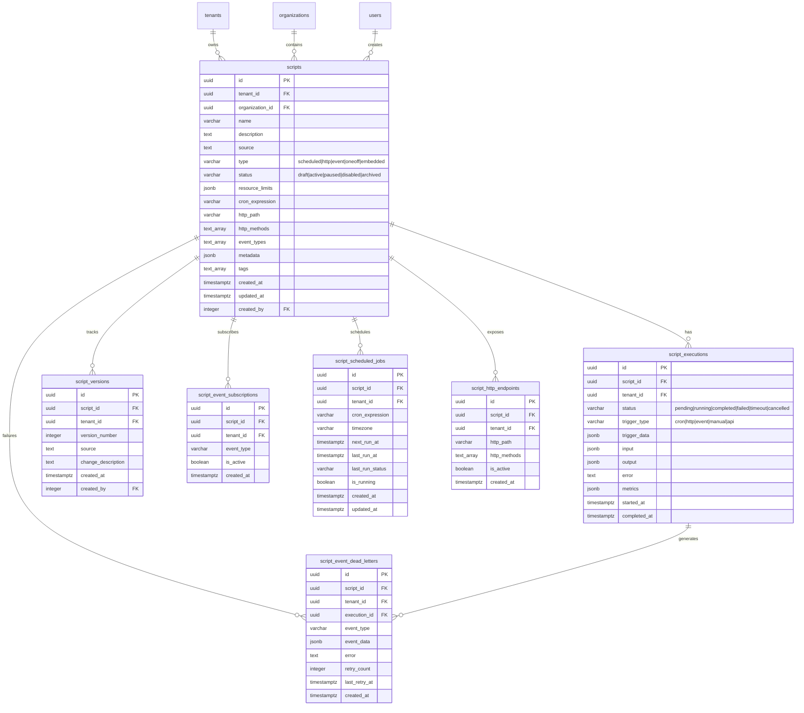

# Data Model: JavaScript Runtime

**Status:** Draft

## Entity Relationships



## Tables

### scripts (Core Table)

**Purpose:** Main table storing script definitions with metadata, resource limits, and trigger configuration.

```sql
CREATE TABLE scripts (
    id UUID PRIMARY KEY DEFAULT gen_random_uuid(),
    tenant_id UUID NOT NULL REFERENCES tenants(id),
    organization_id UUID NOT NULL REFERENCES organizations(id),
    name VARCHAR(255) NOT NULL,
    description TEXT,
    source TEXT NOT NULL,
    type VARCHAR(50) NOT NULL CHECK (type IN ('scheduled', 'http', 'event', 'oneoff', 'embedded')),
    status VARCHAR(50) NOT NULL CHECK (status IN ('draft', 'active', 'paused', 'disabled', 'archived')),
    resource_limits JSONB NOT NULL DEFAULT '{
        "max_execution_time_ms": 30000,
        "max_memory_bytes": 67108864,
        "max_concurrent_runs": 5,
        "max_api_calls_per_minute": 60,
        "max_output_size_bytes": 1048576
    }'::jsonb,
    cron_expression VARCHAR(255),
    http_path VARCHAR(500),
    http_methods TEXT[],
    event_types TEXT[],
    metadata JSONB DEFAULT '{}'::jsonb,
    tags TEXT[] DEFAULT ARRAY[]::TEXT[],
    created_at TIMESTAMP WITH TIME ZONE DEFAULT NOW(),
    updated_at TIMESTAMP WITH TIME ZONE DEFAULT NOW(),
    created_by INTEGER REFERENCES users(id),
    CONSTRAINT uq_scripts_tenant_name UNIQUE (tenant_id, name),
    CONSTRAINT uq_scripts_tenant_http_path UNIQUE (tenant_id, http_path)
);

-- Performance indexes
CREATE INDEX idx_scripts_tenant_status ON scripts(tenant_id, status);
CREATE INDEX idx_scripts_tenant_type_status ON scripts(tenant_id, type, status);
CREATE INDEX idx_scripts_http_path ON scripts(tenant_id, http_path) WHERE http_path IS NOT NULL;
CREATE INDEX idx_scripts_event_types ON scripts USING GIN(event_types);
CREATE INDEX idx_scripts_cron ON scripts(tenant_id, cron_expression) WHERE cron_expression IS NOT NULL;
CREATE INDEX idx_scripts_metadata ON scripts USING GIN(metadata);
CREATE INDEX idx_scripts_tags ON scripts USING GIN(tags);
CREATE INDEX idx_scripts_fulltext ON scripts USING GIN(to_tsvector('english', name || ' ' || COALESCE(description, '')));
```

**Fields:**

| Column | Type | Nullable | Description |
|--------|------|----------|-------------|
| id | UUID | No | Primary key (auto-generated) |
| tenant_id | UUID | No | Multi-tenant isolation (FK to tenants) |
| organization_id | UUID | No | Organization scope (FK to organizations) |
| name | VARCHAR(255) | No | Script name (unique per tenant) |
| description | TEXT | Yes | Human-readable description |
| source | TEXT | No | JavaScript source code |
| type | VARCHAR(50) | No | Trigger type: scheduled/http/event/oneoff/embedded |
| status | VARCHAR(50) | No | Lifecycle state: draft/active/paused/disabled/archived |
| resource_limits | JSONB | No | Execution constraints (timeout, memory, concurrency) |
| cron_expression | VARCHAR(255) | Yes | Cron schedule (required for type=scheduled) |
| http_path | VARCHAR(500) | Yes | HTTP endpoint path (required for type=http, unique per tenant) |
| http_methods | TEXT[] | Yes | HTTP methods (GET, POST, PUT, DELETE, PATCH) |
| event_types | TEXT[] | Yes | Domain event types to subscribe to |
| metadata | JSONB | No | Custom key-value pairs for tagging/filtering |
| tags | TEXT[] | No | User-defined tags for categorization |
| created_at | TIMESTAMPTZ | No | Creation timestamp |
| updated_at | TIMESTAMPTZ | No | Last update timestamp |
| created_by | INTEGER | Yes | User who created the script (FK to users) |

**Business Rules:**
- Name unique per tenant
- HTTP path unique per tenant
- Scheduled scripts require cron_expression
- HTTP scripts require http_path
- Event scripts require at least one event type
- Status transitions: draft → active → paused/disabled → archived

### script_executions (Execution History)

**Purpose:** Execution history with input/output, status, metrics, and error tracking.

```sql
CREATE TABLE script_executions (
    id UUID PRIMARY KEY DEFAULT gen_random_uuid(),
    script_id UUID NOT NULL REFERENCES scripts(id) ON DELETE CASCADE,
    tenant_id UUID NOT NULL REFERENCES tenants(id),
    status VARCHAR(50) NOT NULL CHECK (status IN ('pending', 'running', 'completed', 'failed', 'timeout', 'cancelled')),
    trigger_type VARCHAR(50) NOT NULL CHECK (trigger_type IN ('cron', 'http', 'event', 'manual', 'api')),
    trigger_data JSONB DEFAULT '{}'::jsonb,
    input JSONB DEFAULT '{}'::jsonb,
    output JSONB,
    error TEXT,
    metrics JSONB DEFAULT '{}'::jsonb,
    started_at TIMESTAMP WITH TIME ZONE DEFAULT NOW(),
    completed_at TIMESTAMP WITH TIME ZONE
);

CREATE INDEX idx_executions_script ON script_executions(script_id);
CREATE INDEX idx_executions_tenant_script ON script_executions(tenant_id, script_id);
CREATE INDEX idx_executions_tenant_status ON script_executions(tenant_id, status);
CREATE INDEX idx_executions_tenant_started ON script_executions(tenant_id, started_at DESC);
CREATE INDEX idx_executions_tenant_trigger ON script_executions(tenant_id, trigger_type);
CREATE INDEX idx_executions_pending ON script_executions(tenant_id, status) WHERE status = 'pending';
CREATE INDEX idx_executions_running ON script_executions(tenant_id, status) WHERE status = 'running';
```

**Fields:**

| Column | Type | Nullable | Description |
|--------|------|----------|-------------|
| id | UUID | No | Primary key (auto-generated) |
| script_id | UUID | No | Reference to scripts table (CASCADE delete) |
| tenant_id | UUID | No | Multi-tenant isolation |
| status | VARCHAR(50) | No | Execution state: pending/running/completed/failed/timeout/cancelled |
| trigger_type | VARCHAR(50) | No | What initiated execution: cron/http/event/manual/api |
| trigger_data | JSONB | No | Context about trigger (event payload, HTTP request, cron trigger) |
| input | JSONB | No | Input parameters passed to script |
| output | JSONB | Yes | Script return value (null until completed) |
| error | TEXT | Yes | Error message if execution failed |
| metrics | JSONB | No | Performance metrics (duration_ms, memory_used_bytes, api_call_count, database_query_count) |
| started_at | TIMESTAMPTZ | No | Execution start time |
| completed_at | TIMESTAMPTZ | Yes | Execution completion time (null while running) |

**Business Rules:**
- Status starts as 'pending'
- Status transitions: pending → running → completed/failed/timeout/cancelled
- completed_at is null until execution finishes
- Metrics captured at completion

### script_versions (Audit Trail)

**Purpose:** Immutable version history for script source code changes.

```sql
CREATE TABLE script_versions (
    id UUID PRIMARY KEY DEFAULT gen_random_uuid(),
    script_id UUID NOT NULL REFERENCES scripts(id) ON DELETE CASCADE,
    tenant_id UUID NOT NULL REFERENCES tenants(id),
    version_number INTEGER NOT NULL,
    source TEXT NOT NULL,
    change_description TEXT,
    created_at TIMESTAMP WITH TIME ZONE DEFAULT NOW(),
    created_by INTEGER REFERENCES users(id),
    CONSTRAINT uq_versions_script_number UNIQUE (script_id, version_number)
);

CREATE INDEX idx_versions_script ON script_versions(script_id);
CREATE INDEX idx_versions_script_created ON script_versions(script_id, created_at DESC);
CREATE INDEX idx_versions_tenant ON script_versions(tenant_id);
```

**Fields:**

| Column | Type | Nullable | Description |
|--------|------|----------|-------------|
| id | UUID | No | Primary key (auto-generated) |
| script_id | UUID | No | Reference to scripts table (CASCADE delete) |
| tenant_id | UUID | No | Multi-tenant isolation |
| version_number | INTEGER | No | Sequential version number (1, 2, 3, ...) |
| source | TEXT | No | Complete source code snapshot |
| change_description | TEXT | Yes | Human-readable change explanation |
| created_at | TIMESTAMPTZ | No | Version creation timestamp |
| created_by | INTEGER | Yes | User who made the change (FK to users) |

**Business Rules:**
- Version number unique per script
- Versions are immutable (no updates, only inserts)
- Sequential version numbering enforced

### script_event_subscriptions (Event Routing)

**Purpose:** Event-triggered script registrations for fast event-to-script lookup.

```sql
CREATE TABLE script_event_subscriptions (
    id UUID PRIMARY KEY DEFAULT gen_random_uuid(),
    script_id UUID NOT NULL REFERENCES scripts(id) ON DELETE CASCADE,
    tenant_id UUID NOT NULL REFERENCES tenants(id),
    event_type VARCHAR(255) NOT NULL,
    is_active BOOLEAN DEFAULT true,
    created_at TIMESTAMP WITH TIME ZONE DEFAULT NOW(),
    CONSTRAINT uq_subs_script_event UNIQUE (script_id, event_type)
);

CREATE INDEX idx_event_subs_tenant_event ON script_event_subscriptions(tenant_id, event_type) WHERE is_active = true;
CREATE INDEX idx_event_subs_script ON script_event_subscriptions(script_id);
```

**Fields:**

| Column | Type | Nullable | Description |
|--------|------|----------|-------------|
| id | UUID | No | Primary key (auto-generated) |
| script_id | UUID | No | Reference to scripts table (CASCADE delete) |
| tenant_id | UUID | No | Multi-tenant isolation |
| event_type | VARCHAR(255) | No | Domain event name (e.g., "user.created") |
| is_active | BOOLEAN | No | Subscription active flag (default: true) |
| created_at | TIMESTAMPTZ | No | Subscription creation timestamp |

**Business Rules:**
- One subscription per script + event_type pair
- Fast O(1) lookup for event routing

### script_scheduled_jobs (Cron Scheduler State)

**Purpose:** Cron job state tracking (next run time, last run, execution status).

```sql
CREATE TABLE script_scheduled_jobs (
    id UUID PRIMARY KEY DEFAULT gen_random_uuid(),
    script_id UUID NOT NULL UNIQUE REFERENCES scripts(id) ON DELETE CASCADE,
    tenant_id UUID NOT NULL REFERENCES tenants(id),
    cron_expression VARCHAR(255) NOT NULL,
    timezone VARCHAR(100) DEFAULT 'UTC',
    next_run_at TIMESTAMP WITH TIME ZONE,
    last_run_at TIMESTAMP WITH TIME ZONE,
    last_run_status VARCHAR(50),
    is_running BOOLEAN DEFAULT false,
    created_at TIMESTAMP WITH TIME ZONE DEFAULT NOW(),
    updated_at TIMESTAMP WITH TIME ZONE DEFAULT NOW()
);

CREATE INDEX idx_scheduled_next_run ON script_scheduled_jobs(next_run_at) WHERE is_running = false;
CREATE INDEX idx_scheduled_script ON script_scheduled_jobs(script_id);
CREATE INDEX idx_scheduled_tenant ON script_scheduled_jobs(tenant_id);
```

**Fields:**

| Column | Type | Nullable | Description |
|--------|------|----------|-------------|
| id | UUID | No | Primary key (auto-generated) |
| script_id | UUID | No | Reference to scripts table (UNIQUE, CASCADE delete) |
| tenant_id | UUID | No | Multi-tenant isolation |
| cron_expression | VARCHAR(255) | No | Cron schedule definition |
| timezone | VARCHAR(100) | No | Timezone for cron evaluation (default: UTC) |
| next_run_at | TIMESTAMPTZ | Yes | Next scheduled execution time |
| last_run_at | TIMESTAMPTZ | Yes | Last execution timestamp |
| last_run_status | VARCHAR(50) | Yes | Status of last execution |
| is_running | BOOLEAN | No | Lock to prevent overlapping executions |
| created_at | TIMESTAMPTZ | No | Job creation timestamp |
| updated_at | TIMESTAMPTZ | No | Last update timestamp |

**Business Rules:**
- One scheduled job per script
- is_running prevents overlapping executions

### script_http_endpoints (HTTP Routing)

**Purpose:** HTTP endpoint routing table for fast path-to-script lookup.

```sql
CREATE TABLE script_http_endpoints (
    id UUID PRIMARY KEY DEFAULT gen_random_uuid(),
    script_id UUID NOT NULL UNIQUE REFERENCES scripts(id) ON DELETE CASCADE,
    tenant_id UUID NOT NULL REFERENCES tenants(id),
    http_path VARCHAR(500) NOT NULL,
    http_methods TEXT[] NOT NULL,
    is_active BOOLEAN DEFAULT true,
    created_at TIMESTAMP WITH TIME ZONE DEFAULT NOW(),
    CONSTRAINT uq_endpoints_tenant_path UNIQUE (tenant_id, http_path)
);

CREATE INDEX idx_http_endpoints_path ON script_http_endpoints(tenant_id, http_path) WHERE is_active = true;
CREATE INDEX idx_http_endpoints_script ON script_http_endpoints(script_id);
```

**Fields:**

| Column | Type | Nullable | Description |
|--------|------|----------|-------------|
| id | UUID | No | Primary key (auto-generated) |
| script_id | UUID | No | Reference to scripts table (UNIQUE, CASCADE delete) |
| tenant_id | UUID | No | Multi-tenant isolation |
| http_path | VARCHAR(500) | No | URL path (unique per tenant) |
| http_methods | TEXT[] | No | Allowed HTTP methods (GET, POST, PUT, DELETE, PATCH) |
| is_active | BOOLEAN | No | Endpoint active flag (default: true) |
| created_at | TIMESTAMPTZ | No | Endpoint creation timestamp |

**Business Rules:**
- One endpoint per script
- HTTP path unique per tenant

### script_event_dead_letters (Failure Tracking)

**Purpose:** Failed event-triggered executions for retry or manual review.

```sql
CREATE TABLE script_event_dead_letters (
    id UUID PRIMARY KEY DEFAULT gen_random_uuid(),
    script_id UUID NOT NULL REFERENCES scripts(id) ON DELETE CASCADE,
    tenant_id UUID NOT NULL REFERENCES tenants(id),
    execution_id UUID REFERENCES script_executions(id) ON DELETE SET NULL,
    event_type VARCHAR(255) NOT NULL,
    event_data JSONB NOT NULL,
    error TEXT NOT NULL,
    retry_count INTEGER DEFAULT 0,
    last_retry_at TIMESTAMP WITH TIME ZONE,
    created_at TIMESTAMP WITH TIME ZONE DEFAULT NOW()
);

CREATE INDEX idx_dead_letters_tenant ON script_event_dead_letters(tenant_id);
CREATE INDEX idx_dead_letters_script ON script_event_dead_letters(script_id);
CREATE INDEX idx_dead_letters_created ON script_event_dead_letters(tenant_id, created_at DESC);
CREATE INDEX idx_dead_letters_retry ON script_event_dead_letters(retry_count) WHERE retry_count < 3;
```

**Fields:**

| Column | Type | Nullable | Description |
|--------|------|----------|-------------|
| id | UUID | No | Primary key (auto-generated) |
| script_id | UUID | No | Reference to scripts table (CASCADE delete) |
| tenant_id | UUID | No | Multi-tenant isolation |
| execution_id | UUID | Yes | Reference to failed execution (SET NULL on delete) |
| event_type | VARCHAR(255) | No | Event type that triggered execution |
| event_data | JSONB | No | Original event payload |
| error | TEXT | No | Error message from failed execution |
| retry_count | INTEGER | No | Number of retry attempts (default: 0) |
| last_retry_at | TIMESTAMPTZ | Yes | Timestamp of last retry attempt |
| created_at | TIMESTAMPTZ | No | Failure creation timestamp |

**Business Rules:**
- Maximum 3 retry attempts (enforced by application)

## Deletion Strategy

**Approach:** Hard delete with CASCADE

**Rationale:**
- Scripts and all related data (executions, versions, subscriptions) should be permanently removed when a script is deleted
- Version history provides audit trail while script exists
- Execution history provides debugging context while script exists
- Once script is deleted, all related data is no longer needed

**Cascade behavior:**
- Delete script → CASCADE deletes:
  - script_executions (all execution history)
  - script_versions (all version history)
  - script_event_subscriptions (all event subscriptions)
  - script_scheduled_jobs (scheduler state)
  - script_http_endpoints (HTTP routing)
  - script_event_dead_letters (failure tracking)
- execution_id in dead_letters SET NULL if execution deleted independently

## Migrations

### Migration: {timestamp}_create_jsruntime_tables.sql

```sql
-- +migrate Up

-- Core scripts table
CREATE TABLE scripts (
    id UUID PRIMARY KEY DEFAULT gen_random_uuid(),
    tenant_id UUID NOT NULL REFERENCES tenants(id),
    organization_id UUID NOT NULL REFERENCES organizations(id),
    name VARCHAR(255) NOT NULL,
    description TEXT,
    source TEXT NOT NULL,
    type VARCHAR(50) NOT NULL CHECK (type IN ('scheduled', 'http', 'event', 'oneoff', 'embedded')),
    status VARCHAR(50) NOT NULL CHECK (status IN ('draft', 'active', 'paused', 'disabled', 'archived')),
    resource_limits JSONB NOT NULL DEFAULT '{
        "max_execution_time_ms": 30000,
        "max_memory_bytes": 67108864,
        "max_concurrent_runs": 5,
        "max_api_calls_per_minute": 60,
        "max_output_size_bytes": 1048576
    }'::jsonb,
    cron_expression VARCHAR(255),
    http_path VARCHAR(500),
    http_methods TEXT[],
    event_types TEXT[],
    metadata JSONB DEFAULT '{}'::jsonb,
    tags TEXT[] DEFAULT ARRAY[]::TEXT[],
    created_at TIMESTAMP WITH TIME ZONE DEFAULT NOW(),
    updated_at TIMESTAMP WITH TIME ZONE DEFAULT NOW(),
    created_by INTEGER REFERENCES users(id),
    CONSTRAINT uq_scripts_tenant_name UNIQUE (tenant_id, name),
    CONSTRAINT uq_scripts_tenant_http_path UNIQUE (tenant_id, http_path)
);

-- Execution history
CREATE TABLE script_executions (
    id UUID PRIMARY KEY DEFAULT gen_random_uuid(),
    script_id UUID NOT NULL REFERENCES scripts(id) ON DELETE CASCADE,
    tenant_id UUID NOT NULL REFERENCES tenants(id),
    status VARCHAR(50) NOT NULL CHECK (status IN ('pending', 'running', 'completed', 'failed', 'timeout', 'cancelled')),
    trigger_type VARCHAR(50) NOT NULL CHECK (trigger_type IN ('cron', 'http', 'event', 'manual', 'api')),
    trigger_data JSONB DEFAULT '{}'::jsonb,
    input JSONB DEFAULT '{}'::jsonb,
    output JSONB,
    error TEXT,
    metrics JSONB DEFAULT '{}'::jsonb,
    started_at TIMESTAMP WITH TIME ZONE DEFAULT NOW(),
    completed_at TIMESTAMP WITH TIME ZONE
);

-- Version audit trail
CREATE TABLE script_versions (
    id UUID PRIMARY KEY DEFAULT gen_random_uuid(),
    script_id UUID NOT NULL REFERENCES scripts(id) ON DELETE CASCADE,
    tenant_id UUID NOT NULL REFERENCES tenants(id),
    version_number INTEGER NOT NULL,
    source TEXT NOT NULL,
    change_description TEXT,
    created_at TIMESTAMP WITH TIME ZONE DEFAULT NOW(),
    created_by INTEGER REFERENCES users(id),
    CONSTRAINT uq_versions_script_number UNIQUE (script_id, version_number)
);

-- Event subscriptions
CREATE TABLE script_event_subscriptions (
    id UUID PRIMARY KEY DEFAULT gen_random_uuid(),
    script_id UUID NOT NULL REFERENCES scripts(id) ON DELETE CASCADE,
    tenant_id UUID NOT NULL REFERENCES tenants(id),
    event_type VARCHAR(255) NOT NULL,
    is_active BOOLEAN DEFAULT true,
    created_at TIMESTAMP WITH TIME ZONE DEFAULT NOW(),
    CONSTRAINT uq_subs_script_event UNIQUE (script_id, event_type)
);

-- Scheduled jobs
CREATE TABLE script_scheduled_jobs (
    id UUID PRIMARY KEY DEFAULT gen_random_uuid(),
    script_id UUID NOT NULL UNIQUE REFERENCES scripts(id) ON DELETE CASCADE,
    tenant_id UUID NOT NULL REFERENCES tenants(id),
    cron_expression VARCHAR(255) NOT NULL,
    timezone VARCHAR(100) DEFAULT 'UTC',
    next_run_at TIMESTAMP WITH TIME ZONE,
    last_run_at TIMESTAMP WITH TIME ZONE,
    last_run_status VARCHAR(50),
    is_running BOOLEAN DEFAULT false,
    created_at TIMESTAMP WITH TIME ZONE DEFAULT NOW(),
    updated_at TIMESTAMP WITH TIME ZONE DEFAULT NOW()
);

-- HTTP endpoints
CREATE TABLE script_http_endpoints (
    id UUID PRIMARY KEY DEFAULT gen_random_uuid(),
    script_id UUID NOT NULL UNIQUE REFERENCES scripts(id) ON DELETE CASCADE,
    tenant_id UUID NOT NULL REFERENCES tenants(id),
    http_path VARCHAR(500) NOT NULL,
    http_methods TEXT[] NOT NULL,
    is_active BOOLEAN DEFAULT true,
    created_at TIMESTAMP WITH TIME ZONE DEFAULT NOW(),
    CONSTRAINT uq_endpoints_tenant_path UNIQUE (tenant_id, http_path)
);

-- Dead letter queue
CREATE TABLE script_event_dead_letters (
    id UUID PRIMARY KEY DEFAULT gen_random_uuid(),
    script_id UUID NOT NULL REFERENCES scripts(id) ON DELETE CASCADE,
    tenant_id UUID NOT NULL REFERENCES tenants(id),
    execution_id UUID REFERENCES script_executions(id) ON DELETE SET NULL,
    event_type VARCHAR(255) NOT NULL,
    event_data JSONB NOT NULL,
    error TEXT NOT NULL,
    retry_count INTEGER DEFAULT 0,
    last_retry_at TIMESTAMP WITH TIME ZONE,
    created_at TIMESTAMP WITH TIME ZONE DEFAULT NOW()
);

-- Indexes
CREATE INDEX idx_scripts_tenant_status ON scripts(tenant_id, status);
CREATE INDEX idx_scripts_tenant_type_status ON scripts(tenant_id, type, status);
CREATE INDEX idx_scripts_http_path ON scripts(tenant_id, http_path) WHERE http_path IS NOT NULL;
CREATE INDEX idx_scripts_event_types ON scripts USING GIN(event_types);
CREATE INDEX idx_scripts_cron ON scripts(tenant_id, cron_expression) WHERE cron_expression IS NOT NULL;
CREATE INDEX idx_scripts_metadata ON scripts USING GIN(metadata);
CREATE INDEX idx_scripts_tags ON scripts USING GIN(tags);
CREATE INDEX idx_scripts_fulltext ON scripts USING GIN(to_tsvector('english', name || ' ' || COALESCE(description, '')));

CREATE INDEX idx_executions_script ON script_executions(script_id);
CREATE INDEX idx_executions_tenant_script ON script_executions(tenant_id, script_id);
CREATE INDEX idx_executions_tenant_status ON script_executions(tenant_id, status);
CREATE INDEX idx_executions_tenant_started ON script_executions(tenant_id, started_at DESC);
CREATE INDEX idx_executions_tenant_trigger ON script_executions(tenant_id, trigger_type);
CREATE INDEX idx_executions_pending ON script_executions(tenant_id, status) WHERE status = 'pending';
CREATE INDEX idx_executions_running ON script_executions(tenant_id, status) WHERE status = 'running';

CREATE INDEX idx_versions_script ON script_versions(script_id);
CREATE INDEX idx_versions_script_created ON script_versions(script_id, created_at DESC);
CREATE INDEX idx_versions_tenant ON script_versions(tenant_id);

CREATE INDEX idx_event_subs_tenant_event ON script_event_subscriptions(tenant_id, event_type) WHERE is_active = true;
CREATE INDEX idx_event_subs_script ON script_event_subscriptions(script_id);

CREATE INDEX idx_scheduled_next_run ON script_scheduled_jobs(next_run_at) WHERE is_running = false;
CREATE INDEX idx_scheduled_script ON script_scheduled_jobs(script_id);
CREATE INDEX idx_scheduled_tenant ON script_scheduled_jobs(tenant_id);

CREATE INDEX idx_http_endpoints_path ON script_http_endpoints(tenant_id, http_path) WHERE is_active = true;
CREATE INDEX idx_http_endpoints_script ON script_http_endpoints(script_id);

CREATE INDEX idx_dead_letters_tenant ON script_event_dead_letters(tenant_id);
CREATE INDEX idx_dead_letters_script ON script_event_dead_letters(script_id);
CREATE INDEX idx_dead_letters_created ON script_event_dead_letters(tenant_id, created_at DESC);
CREATE INDEX idx_dead_letters_retry ON script_event_dead_letters(retry_count) WHERE retry_count < 3;

-- +migrate Down

DROP TABLE IF EXISTS script_event_dead_letters CASCADE;
DROP TABLE IF EXISTS script_http_endpoints CASCADE;
DROP TABLE IF EXISTS script_scheduled_jobs CASCADE;
DROP TABLE IF EXISTS script_event_subscriptions CASCADE;
DROP TABLE IF EXISTS script_versions CASCADE;
DROP TABLE IF EXISTS script_executions CASCADE;
DROP TABLE IF EXISTS scripts CASCADE;
```

## Open Questions

None
