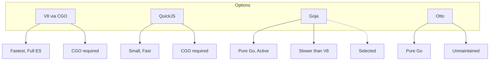
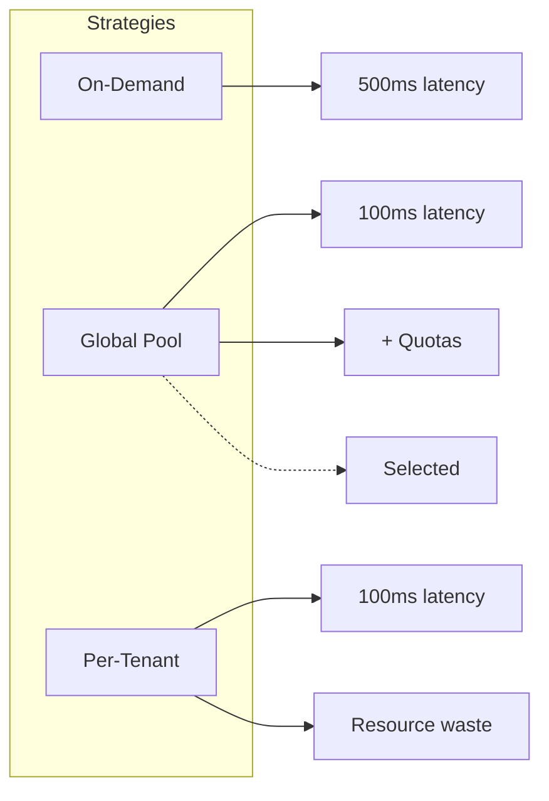
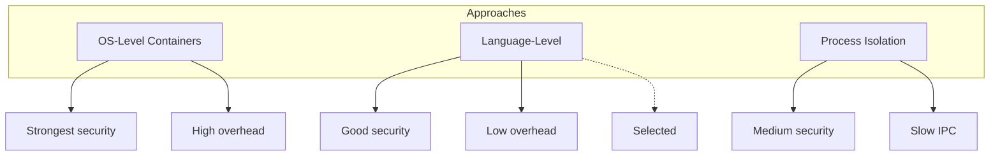
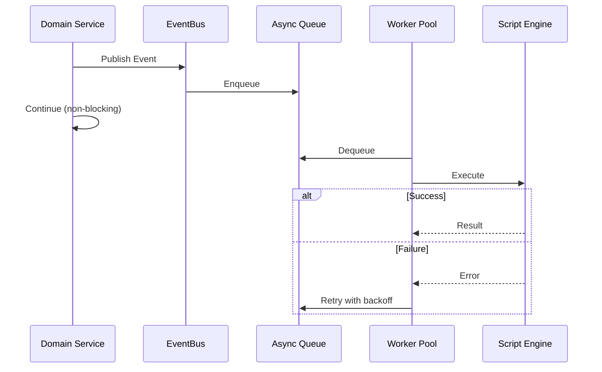

# Decisions Log: JavaScript Runtime

**Status:** Draft

## Decisions

| Date | Decision | Options | Chosen | Rationale |
|------|----------|---------|--------|-----------|
| 2024-12-21 | JavaScript Engine | V8 (via cgo), QuickJS, Goja, Otto | Goja | Pure Go (no CGO), memory-safe, active maintenance, ES6 support |
| 2024-12-21 | VM Pooling Strategy | On-demand creation, Global pool, Per-tenant pools | Global pool with per-tenant quotas | Simpler implementation, fair resource allocation, easier monitoring |
| 2024-12-21 | Sandboxing Approach | OS-level (containers), Language-level (remove globals), Process isolation | Language-level sandboxing | Lightweight, low overhead, sufficient for scripting use case |
| 2024-12-21 | Event Processing | Synchronous, Async queue with workers, Stream processing (Kafka) | Async queue with workers | Decouples event publishing from script execution, enables retry logic, scales horizontally |
| 2024-12-21 | Script Versioning | Git integration, Database snapshots, No versioning | Database snapshots | Simpler to implement, no external dependencies, sufficient for audit trail |
| 2024-12-21 | Code Editor | Textarea, CodeMirror, Monaco Editor, Ace Editor | Monaco Editor | Industry standard (VS Code), IntelliSense support, diff view, extensible |
| 2024-12-21 | API Binding Style | REST-like SDK wrappers, Direct repository access, GraphQL | REST-like SDK wrappers | Abstraction prevents breaking changes, enforces tenant isolation, familiar API |

## Decision Details

### 2024-12-21: JavaScript Engine Selection

**Context:** Need to execute user-defined JavaScript code in a secure, multi-tenant Go application. Engine must be embeddable, memory-safe, and support modern JavaScript features.



**Options:**

1. **V8 (via cgo):**
   - **Pros:** Industry-standard, fastest performance, full ECMAScript support
   - **Cons:** Requires CGO, large binary size (~20MB), memory management complexity

2. **QuickJS:**
   - **Pros:** Small footprint, fast startup, ES2020 support
   - **Cons:** Requires CGO, less mature Go bindings

3. **Goja (Pure Go):**
   - **Pros:** No CGO dependencies, excellent Go interoperability, active maintenance, ES6 support
   - **Cons:** Slower than V8/QuickJS, limited ES2015+ features

4. **Otto:**
   - **Pros:** Pure Go, simple API
   - **Cons:** Unmaintained (last commit 2021), ES5 only

**Decision:** Goja

**Rationale:**
- Zero CGO: Simplified deployment across platforms
- Go Native: Direct access to Go types without serialization overhead
- Active Maintenance: Regular updates, security patches
- Sufficient Performance: For scripting use case, not CPU-intensive workloads
- Memory Safety: Go's garbage collector handles VM cleanup

### 2024-12-21: VM Pooling Strategy

**Context:** Creating new Goja VM instances on every script execution incurs ~500ms cold-start latency.



**Decision:** Global pool with per-tenant quotas

**Rationale:**
- Performance: Pre-warmed VMs reduce p95 latency from 500ms to <100ms
- Simplicity: Single pool manager, easier monitoring
- Fairness: Per-tenant limits prevent resource starvation
- Scalability: Pool size adjusts dynamically (min 10, max 100 VMs)

### 2024-12-21: Sandboxing Approach

**Context:** User-defined scripts must not access file system or make unrestricted network calls.



**Decision:** Language-level sandboxing

**Sandbox Rules:**
- ✅ Allowed: Pure JavaScript, SDK APIs (`iota.db`, `iota.http`)
- ❌ Blocked: `eval()`, `Function()`, `require()`, `import`, file system, process spawning

### 2024-12-21: Event Processing Architecture

**Context:** Event-triggered scripts must execute asynchronously.



**Decision:** Async queue with workers

**Implementation:**
- Worker pool: 10-100 workers
- Retry: 5 attempts with exponential backoff (2s, 4s, 8s, 16s, 32s)
- Dead Letter Queue for permanently failed events

### 2024-12-21: Script Versioning Strategy

**Context:** Need audit trail and rollback capability for script changes.

**Decision:** Database snapshots

**Schema:**
```sql
CREATE TABLE script_versions (
    id BIGSERIAL PRIMARY KEY,
    script_id BIGINT NOT NULL REFERENCES scripts(id),
    version_number INT NOT NULL,
    source_code TEXT NOT NULL,
    change_description TEXT,
    created_by BIGINT REFERENCES users(id),
    created_at TIMESTAMPTZ DEFAULT NOW(),
    UNIQUE (script_id, version_number)
);
```

### 2024-12-21: Code Editor Selection

**Decision:** Monaco Editor

**Rationale:**
- Best-in-Class UX: Same editor as VS Code
- IntelliSense: Autocomplete for SDK APIs
- Diff View: Side-by-side version comparison
- Trade-off: 2MB bundle size acceptable for admin UI

### 2024-12-21: API Binding Style

**Decision:** REST-like SDK Wrappers

**API Examples:**
```javascript
// Database queries
const users = await iota.db.query('users', { limit: 10, where: { active: true } });

// HTTP requests
const response = await iota.http.post('https://api.stripe.com/v1/charges', {
    headers: { 'Authorization': 'Bearer sk_test_...' },
    body: { amount: 1000, currency: 'usd' }
});
```

## Open Decisions

- **[TBD]** VM pool sizing: How many VMs per tenant?
- **[TBD]** Event retry backoff: What base and max values?
- **[TBD]** HTTP client timeout: Default timeout for `iota.http.*` calls?
- **[TBD]** Execution log retention: How long to keep execution history?
- **[TBD]** NPM package support: Which packages to whitelist?

---

## Next Steps

- Review [Technical Spec](./technical.md) for implementation details
- See [Data Model](./data-model.md) for database schema
