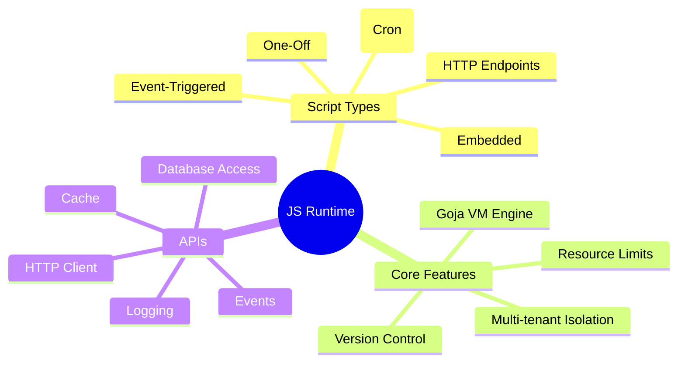
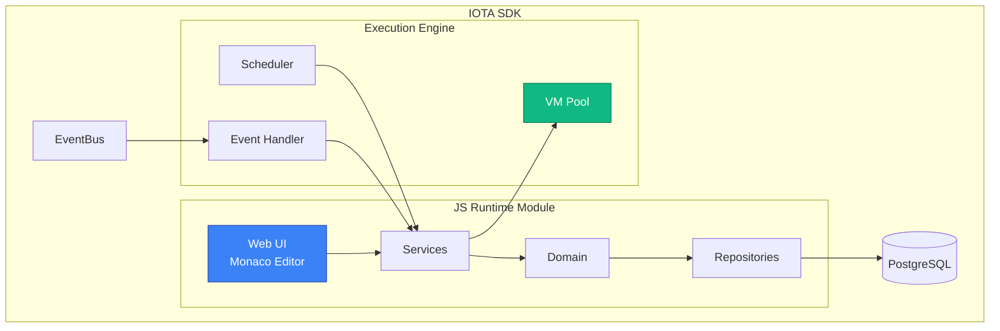

# JavaScript Runtime

**Status:** Draft
**Created:** 2024-12-21

## Overview

The JavaScript Runtime feature enables IOTA SDK users to extend platform functionality through user-defined JavaScript code execution in a secure, multi-tenant sandboxed environment.

## Documents

| Document | Purpose | Status |
|----------|---------|--------|
| [Business](./business.md) | Business requirements and use cases | Draft |
| [Decisions](./decisions.md) | Technology and architecture decisions | Draft |
| [Technical](./technical.md) | System design and implementation | Ready |
| [Data Model](./data-model.md) | Database schema and entities | Draft |
| [API Schema](./api-schema.md) | HTMX endpoints and SDK APIs | Draft |
| [UX](./ux.md) | User interface and workflows | Draft |

## Architecture Overview

## Quick Links

- **Problem Statement:** [business.md#problem-statement](./business.md#problem-statement)
- **Use Cases:** [business.md#use-cases](./business.md#use-cases)
- **Technology Decisions:** [decisions.md#decisions](./decisions.md#decisions)
- **Domain Model:** [data-model.md](./data-model.md)
- **Security Model:** [technical.md#security-considerations](./technical.md#security-considerations)

## Related GitHub Issues

**Core Infrastructure:**
- [#411](https://github.com/iota-uz/iota-sdk/issues/411) - JavaScript Runtime Core
- [#412](https://github.com/iota-uz/iota-sdk/issues/412) - VM Pooling & Resource Management
- [#413](https://github.com/iota-uz/iota-sdk/issues/413) - Script Versioning & Audit Trail
- [#148](https://github.com/iota-uz/iota-sdk/issues/148) - Monaco Editor Integration

**Trigger Mechanisms:**
- [#414](https://github.com/iota-uz/iota-sdk/issues/414) - Scheduled Scripts (Cron)
- [#415](https://github.com/iota-uz/iota-sdk/issues/415) - HTTP Endpoint Scripts
- [#416](https://github.com/iota-uz/iota-sdk/issues/416) - Event-Triggered Scripts
- [#417](https://github.com/iota-uz/iota-sdk/issues/417) - One-Off Script Execution

**API & Bindings:**
- [#418](https://github.com/iota-uz/iota-sdk/issues/418) - Standard Library API
- [#419](https://github.com/iota-uz/iota-sdk/issues/419) - Database Access API
- [#420](https://github.com/iota-uz/iota-sdk/issues/420) - HTTP Client API

## Open Questions

- **From business.md:** Pricing model for script execution quotas (free tier, paid tiers)
- **From decisions.md:** VM pool sizing strategy (per-tenant vs global pool)
- **From decisions.md:** Event retry backoff parameters (exponential base, max attempts)
- **From technical:** HTTP endpoint path conflict resolution strategy
- **From security:** Rate limiting per tenant (requests/minute, concurrent executions)

---

## Next Steps

- Review [Business Requirements](./business.md) for use cases
- See [Technical Spec](./technical.md) for implementation details
- Check [Data Model](./data-model.md) for database schema
