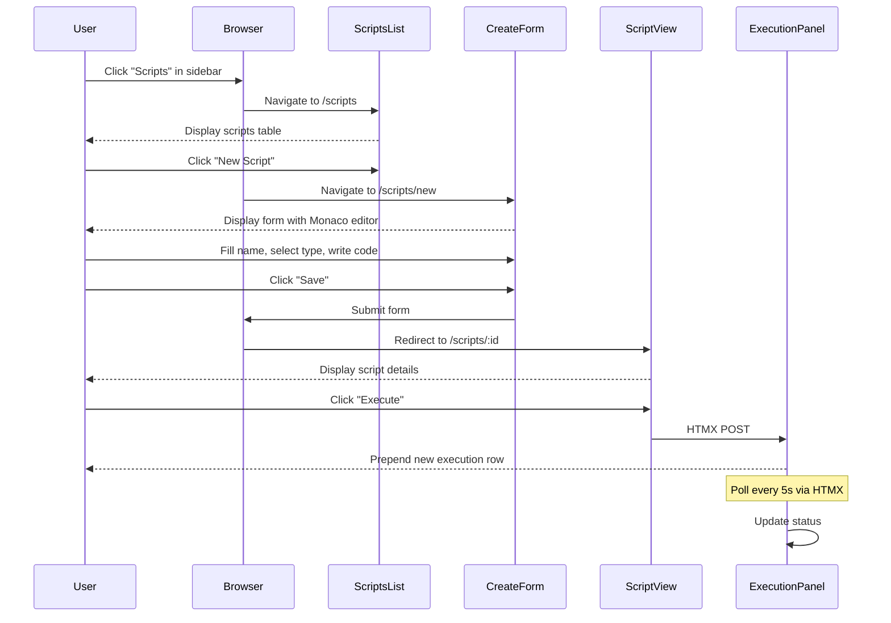
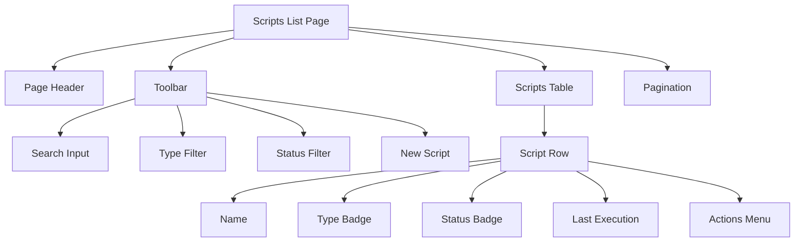
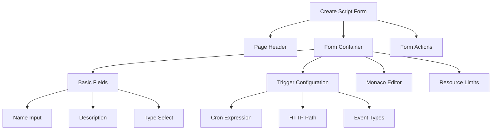
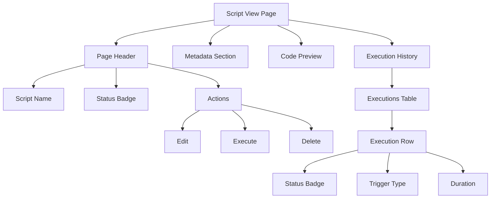

# UX Spec: JavaScript Runtime

**Status:** Draft

## Entry Points

- **Sidebar Navigation**: "Scripts" menu item in main navigation (requires `scripts.read` permission)
- **Direct URL**: `/scripts` - Scripts list page
- **Quick Actions**: "New Script" button in scripts list (requires `scripts.create` permission)
- **Context Menu**: Script actions (Edit, Execute, Delete) in table rows

## User Flow

### Primary: Create and Execute Script

**Steps:**
1. User clicks "Scripts" in sidebar
2. System displays scripts list page with table
3. User clicks "New Script" button
4. System displays create form with Monaco editor
5. User fills form fields:
   - Name (required)
   - Description (optional)
   - Type (select: Manual, Scheduled, Event, HTTP, Embedded)
   - Trigger config (conditional based on type)
   - JavaScript code in Monaco editor
   - Resource limits (expandable advanced section)
6. User clicks "Save"
7. System validates input and creates script
8. System redirects to script view page
9. User clicks "Execute" button
10. System creates execution and displays real-time status updates

## Pages / Components

### Scripts List Page

**URL:** `/scripts`

**Components:**
- **Page Header**: "Scripts" title
- **Toolbar**: Search input, type filter, status filter, "New Script" button
- **Scripts Table**: Columns (Name, Type, Status, Last Execution, Actions)
- **Pagination**: Page number links, Previous/Next buttons
- **Empty State**: Message when no scripts match filters

### Create Script Form

**URL:** `/scripts/new`

**Components:**
- **Name Input**: Text field (required, min 3 chars)
- **Description Textarea**: Multi-line text (optional)
- **Type Select**: Dropdown (Manual, Scheduled, Event, HTTP, Embedded)
- **Trigger Configuration**: Conditional fields based on type selection
- **Monaco Editor**: JavaScript code editor
- **Resource Limits**: Expandable accordion with numeric inputs

### Script View Page

**URL:** `/scripts/:id`

**Components:**
- **Script Name**: H1 title with status badge
- **Action Buttons**: Edit, Execute, Delete (permission-based)
- **Metadata Section**: Type, trigger config, resource limits, timestamps
- **Code Preview**: Monaco editor in read-only mode
- **Execution History**: Table with recent 20 executions (auto-refreshes every 5s)

## States

### Loading

- Display skeleton table rows with shimmer effect
- Show loading spinner in execution history section

### Empty

**No Scripts:**
- Message: "No scripts yet. Create your first script to get started."
- Action: "New Script" button

**No Results:**
- Message: "No scripts match your filters."
- Action: "Clear Filters" button

### Error

**Script Not Found:**
- Message: "Script not found or you don't have permission to view it."
- Recovery: "Return to Scripts List" button

**Execution Failed:**
- Display error message in execution row (red background)
- Expandable error details with stack trace
- Recovery: "Retry" button

### Success

**Script Created:**
- Redirect to script view page
- Toast notification: "Script created successfully"

**Script Updated:**
- Redirect to script view page
- Toast notification: "Script updated. Version X created."

**Execution Started:**
- HTMX prepend execution row with animation
- Toast notification: "Execution started"

## Form Design

| Field | Type | Required | Validation |
|-------|------|----------|------------|
| Name | Text input | Yes | min: 3, max: 100, unique per tenant |
| Description | Textarea | No | max: 500 |
| Type | Select | Yes | enum: manual, scheduled, event, http, embedded |
| Cron Expression | Text input | If scheduled | Valid cron syntax (5 fields) |
| HTTP Path | Text input | If http | Starts with /, unique per tenant |
| HTTP Methods | Checkbox group | If http | At least one method selected |
| Event Types | Multi-select | If event | At least one event type selected |
| Source Code | Monaco editor | Yes | Valid JavaScript syntax |
| Max Execution Time | Number input | No | min: 1000, max: 300000 (ms) |
| Max Memory | Number input | No | min: 1048576, max: 536870912 (bytes) |

## Responsive Behavior

**Desktop (≥1024px):**
- Scripts table shows all columns
- Monaco editor full width (60% of viewport)
- Form in two-column layout

**Tablet (768px - 1023px):**
- Scripts table hides "Last Execution" column
- Monaco editor full width (80% of viewport)
- Form in single-column layout

**Mobile (<768px):**
- Scripts table shows Name + Actions only
- Monaco editor full width (95% of viewport)
- Execution history shows cards instead of table

## Accessibility

**Keyboard Navigation:**
- Tab order: Toolbar → Table rows → Pagination → Actions
- Enter/Space: Activate buttons and links
- Escape: Close modals and dropdowns
- Monaco editor: Full keyboard editing support

**Screen Reader:**
- Page title announced on navigation
- Table headers announced
- Status badges announced: "Status: Active", "Status: Failed"
- HTMX updates announced: "Execution started"

**ARIA Labels:**
- `aria-label="Search scripts"` on search input
- `aria-label="Filter by type"` on type dropdown
- `aria-label="Edit script {name}"` on edit button
- `aria-live="polite"` on execution history

---

## Next Steps

- Review [API Schema](./api-schema.md) for endpoint definitions
- See [Technical Spec](./technical.md) for implementation details
