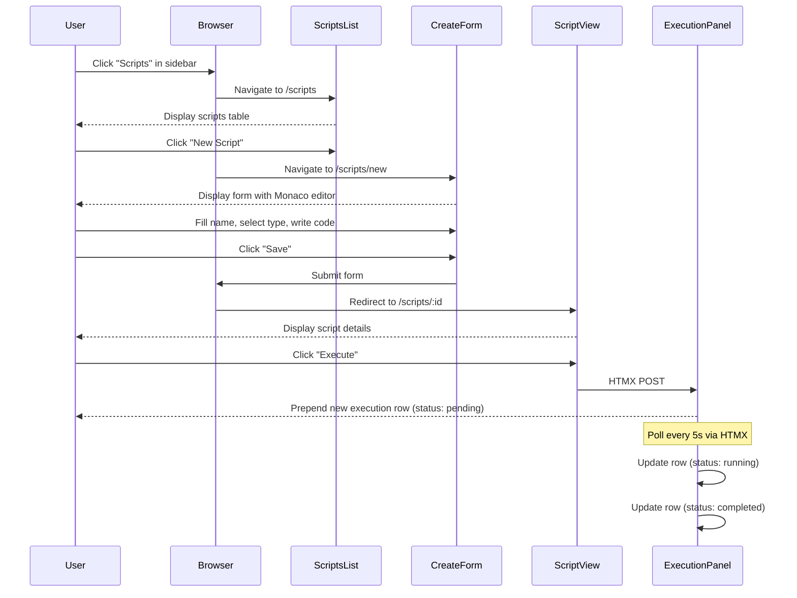
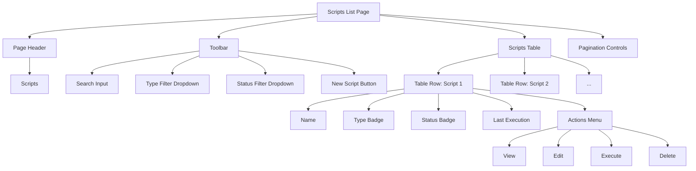
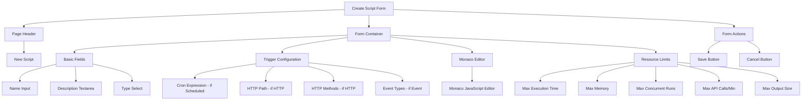
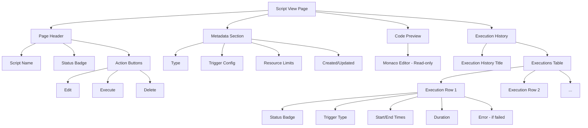

# UX Spec: JavaScript Runtime

**Status:** Draft

## Entry Points

- **Sidebar Navigation**: "Scripts" menu item in main navigation (requires `scripts.read` permission)
- **Direct URL**: `/scripts` - Scripts list page
- **Quick Actions**: "New Script" button in scripts list (requires `scripts.create` permission)
- **Context Menu**: Script actions (Edit, Execute, Delete) in table rows

## User Flow

### Primary: Create and Execute Script

**Steps:**
1. User clicks "Scripts" in sidebar
2. System displays scripts list page with table
3. User clicks "New Script" button
4. System displays create form with Monaco editor
5. User fills form fields:
   - Name (required)
   - Description (optional)
   - Type (select: Manual, Scheduled, Event, HTTP, Embedded)
   - Trigger config (conditional based on type):
     - Scheduled: Cron expression input
     - HTTP: Path and methods checkboxes
     - Event: Event types multi-select
   - JavaScript code in Monaco editor
   - Resource limits (expandable advanced section)
6. User clicks "Save"
7. System validates input and creates script
8. System redirects to script view page
9. User clicks "Execute" button
10. System creates execution (status: pending)
11. System displays execution row with real-time status updates
12. Execution completes → row shows final status (completed/failed)

### Alternative Flows

**Edit Existing Script:**
1. User clicks "Edit" action in scripts table row
2. System displays edit form with pre-filled data
3. User modifies fields and saves
4. System creates new version and redirects to script view

**Search and Filter:**
1. User enters text in search input
2. System filters table via HTMX (partial reload)
3. User selects type/status filters
4. System refines results via HTMX

**View Execution History:**
1. User navigates to script view page
2. System displays recent 20 executions
3. System auto-refreshes every 5 seconds via HTMX
4. User clicks execution row to expand details (output/error)

**Delete Script:**
1. User clicks "Delete" action in table row
2. System displays confirmation dialog (HTMX confirm)
3. User confirms deletion
4. System deletes script and removes table row via HTMX

## Pages / Components

### Scripts List Page

**Type:** Page
**URL:** `/scripts`

**Components:**

- **Page Header**: "Scripts" title
- **Toolbar**: Search input, type filter, status filter, "New Script" button
- **Scripts Table**: Columns (Name, Type, Status, Last Execution, Actions)
- **Pagination**: Page number links, Previous/Next buttons
- **Empty State**: Displayed when no scripts match filters

### Create Script Form

**Type:** Page
**URL:** `/scripts/new`

**Components:**

- **Name Input**: Text field (required, min 3 chars)
- **Description Textarea**: Multi-line text (optional)
- **Type Select**: Dropdown (Manual, Scheduled, Event, HTTP, Embedded)
- **Trigger Configuration**: Conditional fields based on type selection
  - **Scheduled**: Cron expression input with validation
  - **HTTP**: Path input + methods checkboxes (GET, POST, PUT, DELETE, PATCH)
  - **Event**: Multi-select for event types
- **Monaco Editor**: JavaScript code editor (syntax highlighting, auto-complete)
- **Resource Limits**: Expandable accordion with numeric inputs
- **Save Button**: Submit form
- **Cancel Button**: Return to scripts list

### Script View Page

**Type:** Page
**URL:** `/scripts/:id`

**Components:**

- **Script Name**: H1 title with status badge
- **Action Buttons**: Edit, Execute, Delete (permission-based visibility)
- **Metadata Section**: Type, trigger config, resource limits, timestamps
- **Code Preview**: Monaco editor in read-only mode
- **Execution History**: Table with recent 20 executions (auto-refreshes every 5s via HTMX)
  - Status badge with color coding
  - Trigger type icon
  - Started/Completed timestamps
  - Duration (formatted: 1.2s, 345ms)
  - Error message (if failed, expandable)

### Edit Script Form

**Type:** Page
**URL:** `/scripts/:id/edit`

**Components:** Same as Create Script Form, but pre-filled with existing data

- **Save Button**: Updates script and creates new version
- **Version Note**: "Saving will create version X" indicator

## States

### Loading

**Scripts List:**
- Display skeleton table rows (3-5 rows with shimmer effect)
- Show loading spinner in toolbar

**Script View:**
- Display skeleton layout with placeholders
- Show loading spinner in execution history section

**Create/Edit Form:**
- Display skeleton form fields
- Show loading spinner in Monaco editor container

### Empty

**Scripts List (No Scripts):**
- Message: "No scripts yet. Create your first script to get started."
- Action: "New Script" button (prominent, centered)

**Scripts List (No Results from Filters):**
- Message: "No scripts match your filters."
- Action: "Clear Filters" button

**Execution History (No Executions):**
- Message: "No executions yet. Click 'Execute' to run this script."
- Action: "Execute" button

### Error

**Script Not Found:**
- Message: "Script not found or you don't have permission to view it."
- Recovery: "Return to Scripts List" button

**Execution Failed:**
- Display error message in execution row (red background)
- Expandable error details with stack trace (if available)
- Recovery: "Retry" button (creates new execution)

**Form Validation Error:**
- Inline error messages below invalid fields (red text)
- Field borders highlighted in red
- Error summary at top of form
- Recovery: Fix errors and resubmit

**Network Error:**
- Toast notification: "Connection lost. Retrying..."
- Auto-retry after 3 seconds
- Recovery: Manual "Retry" button if auto-retry fails

### Success

**Script Created:**
- Type: Redirect to script view page
- Toast notification: "Script created successfully"

**Script Updated:**
- Type: Redirect to script view page
- Toast notification: "Script updated. Version X created."

**Script Deleted:**
- Type: HTMX remove table row with fade-out animation
- Toast notification: "Script deleted"

**Execution Started:**
- Type: HTMX prepend execution row with slide-down animation
- Toast notification: "Execution started"

**Execution Completed:**
- Type: HTMX update execution row status badge (pending → completed)
- Color change: yellow → green
- Toast notification: "Execution completed in 1.2s"

## Form Design

### Create/Edit Script Form

| Field | Type | Required | Validation |
|-------|------|----------|------------|
| Name | Text input | Yes | min: 3, max: 100, unique per tenant |
| Description | Textarea | No | max: 500 |
| Type | Select | Yes | enum: manual, scheduled, event, http, embedded |
| Cron Expression | Text input | Conditional (if Type=scheduled) | Valid cron syntax (5 fields) |
| HTTP Path | Text input | Conditional (if Type=http) | Starts with /, unique per tenant |
| HTTP Methods | Checkbox group | Conditional (if Type=http) | At least one method selected |
| Event Types | Multi-select | Conditional (if Type=event) | At least one event type selected |
| Source Code | Monaco editor | Yes | Valid JavaScript syntax (soft validation) |
| Max Execution Time | Number input | No | min: 1000, max: 300000 (ms), default: 30000 |
| Max Memory | Number input | No | min: 1048576, max: 536870912 (bytes), default: 67108864 |
| Max Concurrent Runs | Number input | No | min: 1, max: 20, default: 5 |
| Max API Calls/Min | Number input | No | min: 1, max: 300, default: 60 |
| Max Output Size | Number input | No | min: 1024, max: 10485760 (bytes), default: 1048576 |

**Validation Messages:**

| Rule | Message |
|------|---------|
| Required | "{field} is required" |
| Min Length | "{field} must be at least {min} characters" |
| Max Length | "{field} must not exceed {max} characters" |
| Unique | "{field} already exists for this tenant" |
| Cron Syntax | "Invalid cron expression. Format: minute hour day month weekday" |
| HTTP Path Format | "HTTP path must start with /" |
| At Least One | "Select at least one {field}" |
| Number Range | "{field} must be between {min} and {max}" |

## Responsive Behavior

**Desktop (≥1024px):**
- Scripts table shows all columns
- Monaco editor full width (60% of viewport)
- Form in two-column layout (labels left, inputs right)
- Execution history table shows all columns

**Tablet (768px - 1023px):**
- Scripts table hides "Last Execution" column
- Monaco editor full width (80% of viewport)
- Form in single-column layout
- Execution history table stacks columns vertically on row click

**Mobile (<768px):**
- Scripts table shows Name + Actions only (other data in expandable row)
- Monaco editor full width (95% of viewport)
- Form in single-column layout with larger inputs
- Execution history shows cards instead of table
- Sidebar navigation collapses to hamburger menu

## Accessibility

**Keyboard Navigation:**
- Tab order: Toolbar → Table rows → Pagination → Actions
- Enter/Space: Activate buttons and links
- Escape: Close modals and dropdowns
- Arrow keys: Navigate table rows
- Monaco editor: Full keyboard editing support (Ctrl+S to save, Ctrl+F to find)

**Screen Reader:**
- Page title announced on navigation: "Scripts - IOTA SDK"
- Table headers announced: "Scripts table with 4 columns"
- Status badges announced: "Status: Active", "Status: Failed"
- Loading states announced: "Loading scripts..."
- Error messages announced immediately: "Error: Script name is required"
- Success messages announced: "Script created successfully"
- HTMX updates announced: "Execution started", "Execution completed"

**Focus Management:**
- Focus moves to page title on navigation
- Focus returns to trigger button after modal close
- Focus moves to first error field on validation failure
- Focus visible indicators (blue outline)
- Skip to content link at page top

**Color Contrast:**
- All text meets WCAG AA (4.5:1 for normal text, 3:1 for large text)
- Status badges use color + icon (not color alone)
- Error states use red + icon + text
- Loading states use spinner + text

**ARIA Labels:**
- `aria-label="Search scripts"` on search input
- `aria-label="Filter by type"` on type dropdown
- `aria-label="Edit script {name}"` on edit button
- `aria-label="Delete script {name}"` on delete button
- `aria-label="Execution {id} status: {status}"` on status badges
- `aria-live="polite"` on execution history (HTMX updates)
- `aria-busy="true"` on loading states

## Open Questions

None
