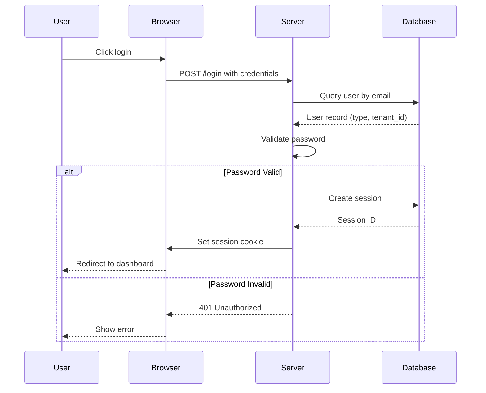
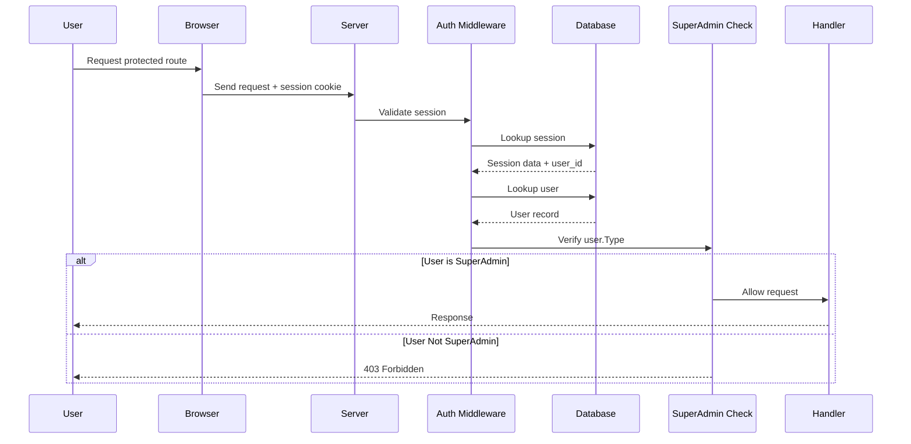

# Technical Architecture

## Module Structure

The SuperAdmin module is located at `modules/superadmin/` and contains:

```
modules/superadmin/
├── middleware/
│   ├── superadmin_auth.go          # Super admin authorization middleware
│   └── superadmin_auth_test.go     # Middleware tests
├── presentation/
│   ├── controllers/
│   │   ├── dashboard_controller.go # Dashboard controller
│   │   ├── tenants_controller.go   # Tenant management
│   │   └── *_controller_test.go    # Controller tests
│   ├── templates/
│   │   ├── pages/
│   │   │   ├── dashboard/          # Dashboard templates
│   │   │   └── tenants/            # Tenant management templates
│   │   └── layouts/                # Layout templates
│   └── locales/
│       ├── en.toml                 # English translations
│       ├── ru.toml                 # Russian translations
│       └── uz.toml                 # Uzbek translations
├── services/
│   └── analytics_service.go        # Platform analytics
├── infrastructure/
│   └── persistence/
│       ├── analytics_query_repository.go    # Analytics queries
│       └── *_repository_test.go             # Repository tests
├── domain/
│   ├── entities/
│   │   ├── tenant_info.go          # Tenant info entity
│   │   ├── analytics.go            # Analytics data structures
│   │   └── time_series.go          # Time-series data
│   └── analytics_query_repository.go       # Repository interface
├── module.go                       # Module registration
├── nav_items.go                    # Navigation items
└── links.go                        # Navigation links
```

## Minimal Module Loading

The SuperAdmin server loads only essential modules:

```go
// Loaded Modules
- core         // User authentication, sessions
- superadmin   // Platform management

// NOT Loaded (unlike main app)
- finance, warehouse, crm, hrm, projects, bichat, website
```

This selective loading:
- Reduces memory footprint
- Improves security (fewer attack surfaces)
- Increases performance
- Simplifies deployment

## Middleware Stack

The request flow through SuperAdmin middleware:

```
Request
  ↓
Logging Middleware (request ID, method, path)
  ↓
Database Middleware (provides database pool)
  ↓
Authorization Middleware (validates session)
  ↓
RedirectNotAuthenticated (redirects to login if needed)
  ↓
ProvideUser Middleware (injects user into context)
  ↓
RequireSuperAdmin Middleware (checks user.Type == "superadmin")
  ↓
ProvideDynamicLogo Middleware
  ↓
ProvideLocalizer Middleware (translation support)
  ↓
NavItems Middleware (navigation)
  ↓
WithPageContext Middleware (page context injection)
  ↓
Handler
```

### Key Middleware Components

**RequireSuperAdmin()**:
```go
// Validates user type is "superadmin"
// Returns 403 Forbidden if not super admin
// Applied to all SuperAdmin routes
```

**Authorization()**:
```go
// Validates session cookie
// Retrieves user from database
// Injects user into request context
```

**Database Middleware**:
```go
// Provides database pool to handlers
// Ensures connection from pool available
// Supports transaction context
```

## Authentication Flow

### Super Admin Authentication Process



### Request Validation Flow



## Session Management

Sessions for SuperAdmin follow the same pattern as the main application:

1. **Session Creation**
   - User logs in with credentials
   - Server creates session record in database
   - Session ID stored in HTTP-only cookie
   - Session linked to user_id

2. **Session Validation**
   - Each request validates session cookie
   - Session lookup in database
   - User data retrieved from users table
   - User type checked (must be "superadmin")

3. **Session Expiration**
   - Configurable via `SESSION_DURATION` environment variable
   - Default: 720 hours (30 days)
   - Automatic cleanup of expired sessions
   - User-initiated logout invalidates session

## Controllers

### DashboardController

**File**: `modules/superadmin/presentation/controllers/dashboard_controller.go`

**Routes**:
- `GET /` - Dashboard page (HTMX template)
- `GET /metrics` - Metrics data endpoint (JSON for HTMX)

**Features**:
- Empty dashboard on initial page load
- HTMX loads metrics dynamically
- Optional date filtering (startDate, endDate)
- Time-series data for trends

**Dependencies**:
- AnalyticsService - provides metrics
- Database pool - for queries
- User context - for audit logging

### TenantsController

**File**: `modules/superadmin/presentation/controllers/tenants_controller.go`

**Routes**:
- `GET /superadmin/tenants` - List tenants with filtering
- `POST /superadmin/tenants/export` - Export tenant data
- `GET /superadmin/tenants/{id}/users` - View tenant users
- `POST /superadmin/tenants/{id}/users/{userId}/reset-password` - Reset password

**Features**:
- Tenant table with pagination/filtering
- HTMX-powered table interactions
- User management per tenant
- Password reset capability
- Data export (CSV)

**Dependencies**:
- TenantRepository - tenant CRUD
- UserService - user management
- Database transactions - multi-step operations

## Services

### AnalyticsService

**File**: `modules/superadmin/services/analytics_service.go`

**Methods**:
- `GetDashboardMetrics(ctx, startDate, endDate)` - Platform metrics
- `GetTenantMetrics(ctx, tenantID)` - Single tenant metrics
- `GetUserMetrics(ctx)` - User statistics
- `GetTimeSeries(ctx, metric, startDate, endDate)` - Time-series data

**Responsibilities**:
- Aggregating cross-tenant metrics
- Calculating DAU/WAU/MAU
- Preparing analytics for dashboard
- Caching results for performance

## Repositories

### AnalyticsQueryRepository

**File**: `modules/superadmin/infrastructure/persistence/analytics_query_repository.go`

**Methods**:
- `GetTenantCount(ctx)` - Count tenants by status
- `GetUserCount(ctx)` - Total user count
- `GetActiveUsers(ctx, days)` - DAU/WAU/MAU calculation
- `GetTenantSignups(ctx, startDate, endDate)` - Signup trends
- `GetUserSignups(ctx, startDate, endDate)` - User signup trends
- `GetSystemMetrics(ctx)` - Storage, API usage

**Implementation**:
- Parameterized SQL queries (no concatenation)
- Efficient aggregation queries with proper indexing
- Time-zone aware date calculations
- Connection pooling for performance

## Data Model

### User Types

```go
const (
    TypeRegular    = "regular"    // Normal tenant users
    TypeSuperAdmin = "superadmin" // Platform administrators
)
```

**Super Admin User Example**:
```sql
INSERT INTO users (
    id, email, first_name, last_name, type, tenant_id, created_at, updated_at
) VALUES (
    gen_random_uuid(),
    'admin@platform.com',
    'Super',
    'Admin',
    'superadmin',
    NULL,  -- No tenant affiliation
    NOW(),
    NOW()
);
```

### Tenant Information

```go
type TenantInfo interface {
    ID() uuid.UUID
    Name() string
    Status() string // active, trial, suspended, deleted
    UserCount() int
    CreatedAt() time.Time
    Plan() string
}
```

## Deployment Considerations

### Separate Service
- Different container/process from main application
- Separate environment configuration
- Different domain name recommended
- Can scale independently

### Database Connection
- Same PostgreSQL as main application
- Separate connection pool recommended
- Read-only access for analytics queries
- Write access for tenant operations

### Environment Variables
- Same as main application (shared database)
- `DOMAIN` should point to super admin domain
- `LOG_LEVEL` for debugging

### Security Headers
- HTTPS enforced in production
- Content-Security-Policy headers
- X-Frame-Options to prevent clickjacking
- CSRF protection on forms

## Testing

### Controller Tests
**File**: `*_controller_test.go`

Tests cover:
- Authentication required
- Super admin check required
- Valid response format
- Error handling
- HTMX requests

### Repository Tests
**File**: `*_repository_test.go`

Tests cover:
- CRUD operations
- Query performance
- Data accuracy
- Transaction handling

### Middleware Tests
**File**: `middleware/superadmin_auth_test.go`

Tests cover:
- Super admin validation
- Non-admin rejection
- Session validation
- Error responses

## Error Handling

All errors use structured error handling:

```go
const op serrors.Op = "controllers.DashboardController.GetMetrics"
return serrors.E(op, err)
```

Error responses include:
- Operation name for tracking
- Error type (validation, not found, permission)
- User-friendly message
- HTTP status code

## Performance Considerations

1. **Analytics Queries**
   - Use database views for complex aggregations
   - Create indexes on common filters (tenant_id, created_at)
   - Cache metrics for 5-minute TTL

2. **Dashboard**
   - Load metrics via HTMX after page render
   - Don't block initial page load
   - Implement pagination for large datasets

3. **User Management**
   - Batch operations where possible
   - Use transactions for data consistency
   - Index user searches

## Security Measures

1. **Access Control**
   - All routes require super admin check
   - Session validation on every request
   - No API tokens (session cookies only)

2. **Query Safety**
   - All queries use parameterized statements
   - SQL injection prevention built-in
   - Prepared statements for all queries

3. **Audit Logging**
   - All operations logged with user context
   - Timestamp and action logged
   - IP address and user agent captured
   - Searchable audit trail

4. **Data Protection**
   - Soft deletes for data recovery
   - No permanent data destruction
   - Backups of all operations
