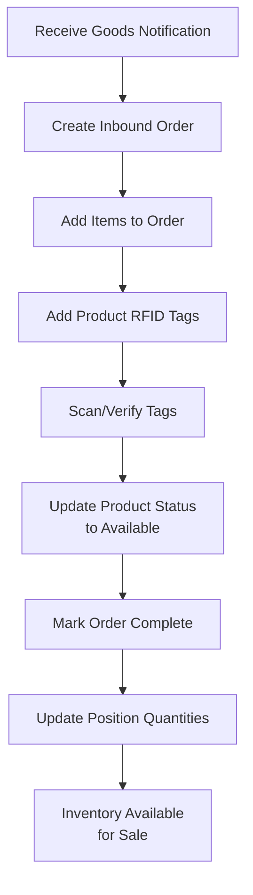
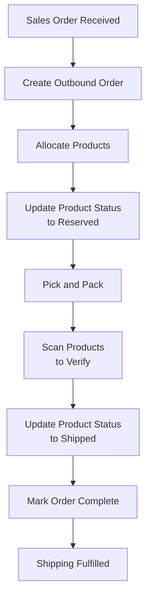
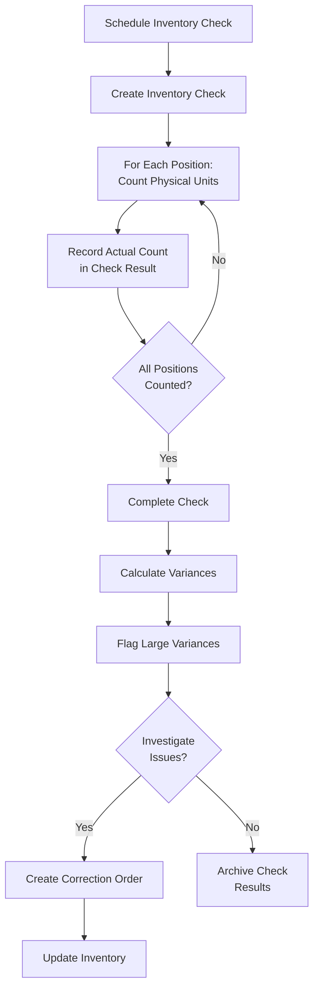
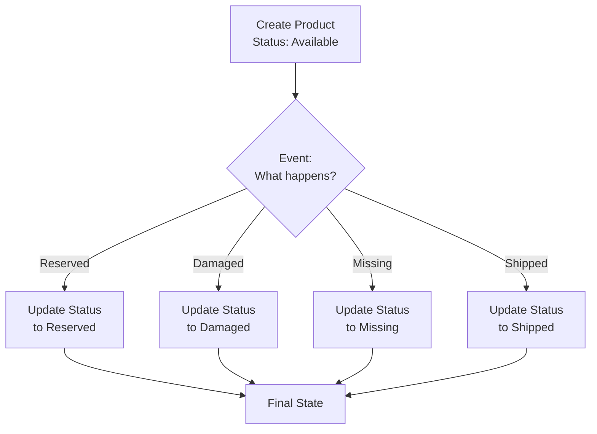

# Warehouse Module - Business Requirements

## Problem Statement

Organizations managing physical inventory face significant operational challenges:

- **Inventory Inaccuracy**: Discrepancy between recorded and actual stock levels
- **Manual Processes**: Time-consuming manual counting and record-keeping
- **Product Tracking**: Difficulty tracking individual items through warehouse
- **Order Management**: Lack of visibility into inbound/outbound movements
- **Scalability**: Systems struggle with large inventory volumes
- **Visibility**: Limited real-time insight into warehouse operations

## Target Audience

| User Type | Responsibilities |
|-----------|-----------------|
| **Warehouse Managers** | Oversee inventory, process orders, manage staff |
| **Inventory Staff** | Count inventory, receive/ship goods, scan RFID |
| **Accountants** | Verify inventory accuracy, track variances |
| **Supervisors** | Monitor operations, generate reports |
| **System Administrators** | Configure catalog, manage units, system settings |

## Business Objectives

### Primary Goals

1. **Accurate Inventory**: Maintain accurate stock levels and variances < 2%
2. **Efficient Processing**: Reduce order processing time by 50%
3. **Product Tracking**: Enable tracking of individual items through RFID
4. **Visibility**: Real-time inventory status and movement visibility
5. **Scalability**: Support unlimited products and positions

### Secondary Goals

1. Reduce manual labor in inventory processes
2. Improve customer satisfaction through faster order fulfillment
3. Enable data-driven inventory decisions
4. Support compliance and audit requirements
5. Integrate with financial systems for accurate costing

## Entity Definitions

### Position (Aggregate Root)
Represents a catalog item or SKU in the warehouse.

**Attributes**:
- Title: Product/SKU name
- Barcode: Standard or custom barcode
- Unit: Measurement unit (pieces, kg, meters, etc.)
- Images: Product photos
- Quantity: Total available units
- Status: Active/inactive

**Business Rules**:
- Position must have unique title per tenant
- Barcode unique within tenant
- Position cannot be deleted if products exist
- Images are optional but recommended
- Quantity calculated from product count

### Product (Entity)
Individual trackable item instance.

**Attributes**:
- RFID Tag: Unique identification
- Position Reference: Which SKU this is
- Status: Available, Reserved, Damaged, Missing
- Creation/Update Timestamps

**Business Rules**:
- RFID tag unique within tenant
- Product status lifecycle: Available → Reserved → Shipped/Damaged/Missing
- Product is immutable once created (only status changes)
- Deleted products tracked separately (soft delete)
- Status changes trigger events

### Order (Aggregate Root)
Warehouse movement order.

**Order Types**:
- **Inbound**: Receiving goods into warehouse
- **Outbound**: Shipping goods from warehouse

**Attributes**:
- Type: Inbound or Outbound
- Status: Draft, Processing, Completed
- Items: Line items (position + products)
- Timestamps: Created, completed

**Business Rules**:
- Order must have at least one item
- Items reference specific products
- Status progresses: Draft → Processing → Completed
- Completed orders immutable
- Cancellation allowed only in Draft state

### Item (Entity)
Line item in an order.

**Attributes**:
- Position: Which SKU
- Products: Specific product instances included
- Quantity: Number of units

**Business Rules**:
- Item must reference existing position
- Products must belong to position
- Quantity must match product count
- Items cannot be modified after order completion

### Inventory Check (Aggregate Root)
Physical inventory verification event.

**Attributes**:
- Name: Check identifier
- Status: In Progress, Completed
- Results: Per-position expected vs. actual counts
- Created By: User who initiated
- Created/Finished Timestamps

**Business Rules**:
- Check records expected quantity from system
- Check records actual quantity counted
- Variance = Expected - Actual
- Check can be marked complete by different user
- Historical checks immutable
- Can generate variance report

### Check Result (Entity)
Per-position result in an inventory check.

**Attributes**:
- Position: Which catalog item
- Expected Quantity: System recorded quantity
- Actual Quantity: Physical count
- Difference: Variance (can be negative)

**Business Rules**:
- One result per position per check
- Captures exact quantities at point in time
- Difference can be positive (overstock) or negative (shortage)
- Large variances flag for investigation

### Unit (Entity)
Measurement unit definition.

**Attributes**:
- Title: Full name (Kilogram, Piece, Meter)
- Short Title: Abbreviation (kg, pcs, m)
- Status: Active/inactive

**Business Rules**:
- Unit title unique within tenant
- Abbreviation unique within tenant
- Cannot delete unit if positions reference it
- Standard units pre-configured

## Business Rules by Entity

### Position Rules

1. **Creation**: Position must have title; barcode optional but recommended
2. **Uniqueness**: Title and barcode unique within tenant
3. **Images**: Optional but recommended for product visibility
4. **Quantity**: Automatically calculated as sum of available products
5. **Deletion**: Cannot delete if products exist (data integrity)
6. **Lifecycle**: Position can be deactivated but not deleted

### Product Rules

1. **Creation**: RFID tag and position required
2. **Status Lifecycle**: Available → Reserved/Damaged/Missing (never back to Available)
3. **RFID Uniqueness**: Unique within tenant
4. **Immutability**: Core attributes never change, only status
5. **Orphans**: Products must always reference valid position

### Order Rules

1. **Item Requirements**: Order must have at least one item
2. **Status Flow**: Draft → Processing → Completed (one-way)
3. **Completion**: All products must be accounted for
4. **Cancellation**: Only allowed in Draft status
5. **Tracking**: Order dates track creation and completion
6. **Audit Trail**: All order changes logged

### Inventory Check Rules

1. **Completeness**: All positions must be counted
2. **Timing**: Check done at point in time (snapshot)
3. **User Tracking**: Records who counted and when
4. **Immutability**: Completed checks cannot be modified
5. **Variance Analysis**: Variances > threshold flagged for review
6. **Correction**: Variances trigger investigation/correction workflow

## Inventory Workflows

### Inbound Workflow

### Outbound Workflow

### Inventory Check Workflow

### Product Lifecycle

## Key Performance Indicators

### Inventory Metrics

| KPI | Target | Measurement |
|-----|--------|-------------|
| **Inventory Accuracy** | > 98% | Variance / Expected Qty |
| **Stock Turnover** | 6x/year | COGS / Avg Inventory |
| **Order Processing Time** | < 2 hours | Time from order to completion |
| **Pick Accuracy** | > 99.5% | Correct items / Total items picked |
| **Inventory Check Time** | 2 hours/1000 items | Labor hours to count |

### Operational Metrics

| KPI | Target | Measurement |
|-----|--------|-------------|
| **Data Availability** | 99.9% | Uptime of inventory system |
| **Product Lookup** | < 50ms | RFID scan to result |
| **Concurrent Users** | 50+ | Simultaneous connections |

## Data Management

### Retention Policies

1. **Active Inventory**: Keep indefinitely
2. **Completed Orders**: Archive after 2 years
3. **Inventory Checks**: Keep 3 years (compliance)
4. **Historical Status**: Track permanently (audit)
5. **Deleted Products**: Soft delete, keep 1 year

### Backup Requirements

1. Daily incremental backups
2. Weekly full backups
3. Monthly archive to cold storage
4. Disaster recovery test quarterly

## Compliance & Audit

1. **Audit Trail**: All inventory movements logged
2. **Change History**: Who changed what and when
3. **Variance Reporting**: Monthly variance analysis
4. **Access Control**: Role-based permissions
5. **Data Integrity**: Referential integrity enforced

## Integration with Other Modules

### Finance Module
- Inventory valuation (FIFO, LIFO, Weighted Average)
- COGS calculation from inventory movements
- Variance impact on financial statements

### CRM Module
- Product availability for customer orders
- Stock levels visible to sales team
- Backorder visibility

### Orders Module (Future)
- Direct integration with sales orders
- Automatic inventory reservation
- Fulfillment tracking

## Future Enhancements

1. **Advanced Analytics**: Trend analysis, forecasting
2. **Barcode Generation**: Auto-generate and print barcodes
3. **RFID Integration**: Real-time RFID reader integration
4. **Multi-Warehouse**: Support multiple warehouse locations
5. **Kitting**: Bundle products into kits
6. **Barcode Scanning**: Mobile app for warehouse staff
7. **Alerts**: Low stock, expiration date, variance alerts
8. **Reports**: Advanced inventory reports and dashboards
9. **Automation**: Auto-reorder points, cycle counting
10. **Cost Analysis**: Product-level costing and margin tracking
