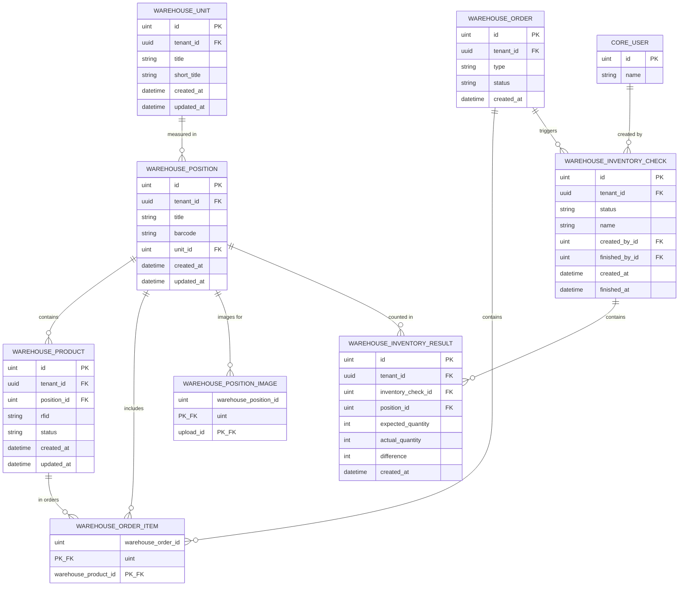

# Warehouse Module - Data Model

## Entity Relationship Diagram



## Table Schemas

### warehouse_positions

**Purpose**: Catalog of warehouse SKUs/items

| Column | Type | Constraints | Description |
|--------|------|-----------|-------------|
| `id` | SERIAL | PRIMARY KEY | Position identifier |
| `tenant_id` | UUID | NOT NULL, FK | Multi-tenant isolation |
| `title` | VARCHAR(255) | NOT NULL, UNIQUE(tenant_id) | Position name/SKU |
| `barcode` | VARCHAR(255) | NULLABLE, UNIQUE(tenant_id) | Barcode identifier |
| `unit_id` | INTEGER | NULLABLE, FK | Unit of measure |
| `created_at` | TIMESTAMP | NOT NULL, DEFAULT NOW() | Creation timestamp |
| `updated_at` | TIMESTAMP | NOT NULL, DEFAULT NOW() | Last update timestamp |

**Indexes**:
```sql
CREATE INDEX idx_warehouse_positions_tenant_id ON warehouse_positions(tenant_id);
CREATE UNIQUE INDEX idx_warehouse_positions_title_unique ON warehouse_positions(tenant_id, title);
CREATE INDEX idx_warehouse_positions_barcode ON warehouse_positions(tenant_id, barcode);
CREATE INDEX idx_warehouse_positions_unit_id ON warehouse_positions(unit_id);
```

**Constraints**:
```sql
ALTER TABLE warehouse_positions
ADD CONSTRAINT fk_warehouse_positions_tenant_id FOREIGN KEY (tenant_id)
  REFERENCES public.tenants(id) ON DELETE CASCADE;
ALTER TABLE warehouse_positions
ADD CONSTRAINT fk_warehouse_positions_unit_id FOREIGN KEY (unit_id)
  REFERENCES warehouse_units(id) ON DELETE SET NULL;
```

### warehouse_products

**Purpose**: Individual product instances

| Column | Type | Constraints | Description |
|--------|------|-----------|-------------|
| `id` | SERIAL | PRIMARY KEY | Product identifier |
| `tenant_id` | UUID | NOT NULL, FK | Multi-tenant isolation |
| `position_id` | INTEGER | NOT NULL, FK | Associated position/SKU |
| `rfid` | VARCHAR(255) | NULLABLE, UNIQUE(tenant_id) | RFID tag identifier |
| `status` | VARCHAR(50) | NOT NULL, DEFAULT 'available' | Product status |
| `created_at` | TIMESTAMP | NOT NULL, DEFAULT NOW() | Creation timestamp |
| `updated_at` | TIMESTAMP | NOT NULL, DEFAULT NOW() | Last update timestamp |

**Status Values**:
- `available` - Ready for use/sale
- `reserved` - Allocated to order/reserved
- `damaged` - Damaged, not usable
- `missing` - Cannot be located
- `shipped` - Shipped to customer

**Indexes**:
```sql
CREATE INDEX idx_warehouse_products_tenant_id ON warehouse_products(tenant_id);
CREATE INDEX idx_warehouse_products_rfid ON warehouse_products(tenant_id, rfid);
CREATE INDEX idx_warehouse_products_position_id ON warehouse_products(position_id);
CREATE INDEX idx_warehouse_products_status ON warehouse_products(tenant_id, status);
```

**Constraints**:
```sql
ALTER TABLE warehouse_products
ADD CONSTRAINT fk_warehouse_products_tenant_id FOREIGN KEY (tenant_id)
  REFERENCES public.tenants(id) ON DELETE CASCADE;
ALTER TABLE warehouse_products
ADD CONSTRAINT fk_warehouse_products_position_id FOREIGN KEY (position_id)
  REFERENCES warehouse_positions(id) ON DELETE RESTRICT;
```

### warehouse_units

**Purpose**: Measurement units for positions

| Column | Type | Constraints | Description |
|--------|------|-----------|-------------|
| `id` | SERIAL | PRIMARY KEY | Unit identifier |
| `tenant_id` | UUID | NOT NULL, FK | Multi-tenant isolation |
| `title` | VARCHAR(255) | NOT NULL, UNIQUE(tenant_id) | Full unit name |
| `short_title` | VARCHAR(10) | NOT NULL, UNIQUE(tenant_id) | Abbreviation |
| `created_at` | TIMESTAMP | NOT NULL, DEFAULT NOW() | Creation timestamp |
| `updated_at` | TIMESTAMP | NOT NULL, DEFAULT NOW() | Last update timestamp |

**Example Units**:
- Title: "Kilogram", Short: "kg"
- Title: "Piece", Short: "pcs"
- Title: "Meter", Short: "m"
- Title: "Liter", Short: "l"

**Indexes**:
```sql
CREATE INDEX idx_warehouse_units_tenant_id ON warehouse_units(tenant_id);
CREATE UNIQUE INDEX idx_warehouse_units_title_unique ON warehouse_units(tenant_id, title);
CREATE UNIQUE INDEX idx_warehouse_units_short_unique ON warehouse_units(tenant_id, short_title);
```

**Constraints**:
```sql
ALTER TABLE warehouse_units
ADD CONSTRAINT fk_warehouse_units_tenant_id FOREIGN KEY (tenant_id)
  REFERENCES public.tenants(id) ON DELETE CASCADE;
```

### warehouse_orders

**Purpose**: Warehouse order transactions

| Column | Type | Constraints | Description |
|--------|------|-----------|-------------|
| `id` | SERIAL | PRIMARY KEY | Order identifier |
| `tenant_id` | UUID | NOT NULL, FK | Multi-tenant isolation |
| `type` | VARCHAR(50) | NOT NULL | Order type (inbound, outbound) |
| `status` | VARCHAR(50) | NOT NULL, DEFAULT 'draft' | Order status |
| `created_at` | TIMESTAMP | NOT NULL, DEFAULT NOW() | Creation timestamp |

**Type Values**:
- `inbound` - Receiving goods into warehouse
- `outbound` - Shipping goods from warehouse

**Status Values**:
- `draft` - Initial state, editable
- `processing` - Order in progress
- `completed` - Order finished

**Indexes**:
```sql
CREATE INDEX idx_warehouse_orders_tenant_id ON warehouse_orders(tenant_id);
CREATE INDEX idx_warehouse_orders_type ON warehouse_orders(type);
CREATE INDEX idx_warehouse_orders_status ON warehouse_orders(tenant_id, status);
CREATE INDEX idx_warehouse_orders_created_at ON warehouse_orders(created_at);
```

**Constraints**:
```sql
ALTER TABLE warehouse_orders
ADD CONSTRAINT fk_warehouse_orders_tenant_id FOREIGN KEY (tenant_id)
  REFERENCES public.tenants(id) ON DELETE CASCADE;
```

### warehouse_order_items

**Purpose**: Line items in orders

| Column | Type | Constraints | Description |
|--------|------|-----------|-------------|
| `warehouse_order_id` | INTEGER | PRIMARY KEY, FK | Parent order |
| `warehouse_product_id` | INTEGER | PRIMARY KEY, FK | Product in order |

**Constraints**:
```sql
ALTER TABLE warehouse_order_items
ADD CONSTRAINT fk_warehouse_order_items_order_id FOREIGN KEY (warehouse_order_id)
  REFERENCES warehouse_orders(id) ON DELETE CASCADE;
ALTER TABLE warehouse_order_items
ADD CONSTRAINT fk_warehouse_order_items_product_id FOREIGN KEY (warehouse_product_id)
  REFERENCES warehouse_products(id) ON DELETE RESTRICT;
```

### warehouse_inventory_checks

**Purpose**: Periodic inventory verification events

| Column | Type | Constraints | Description |
|--------|------|-----------|-------------|
| `id` | SERIAL | PRIMARY KEY | Check identifier |
| `tenant_id` | UUID | NOT NULL, FK | Multi-tenant isolation |
| `status` | VARCHAR(50) | NOT NULL | Check status |
| `name` | VARCHAR(255) | NOT NULL | Check name/identifier |
| `created_by_id` | INTEGER | NOT NULL, FK | User who initiated |
| `created_at` | TIMESTAMP | NOT NULL, DEFAULT NOW() | Check start time |
| `finished_by_id` | INTEGER | NULLABLE, FK | User who completed |
| `finished_at` | TIMESTAMP | NULLABLE | Check completion time |

**Status Values**:
- `in_progress` - Count in progress
- `completed` - Count finished

**Indexes**:
```sql
CREATE INDEX idx_warehouse_inventory_checks_tenant_id ON warehouse_inventory_checks(tenant_id);
CREATE INDEX idx_warehouse_inventory_checks_created_by ON warehouse_inventory_checks(created_by_id);
CREATE INDEX idx_warehouse_inventory_checks_created_at ON warehouse_inventory_checks(created_at);
```

**Constraints**:
```sql
ALTER TABLE warehouse_inventory_checks
ADD CONSTRAINT fk_warehouse_inventory_checks_tenant_id FOREIGN KEY (tenant_id)
  REFERENCES public.tenants(id) ON DELETE CASCADE;
ALTER TABLE warehouse_inventory_checks
ADD CONSTRAINT fk_warehouse_inventory_checks_created_by_id FOREIGN KEY (created_by_id)
  REFERENCES core_users(id) ON DELETE RESTRICT;
ALTER TABLE warehouse_inventory_checks
ADD CONSTRAINT fk_warehouse_inventory_checks_finished_by_id FOREIGN KEY (finished_by_id)
  REFERENCES core_users(id) ON DELETE SET NULL;
```

### warehouse_inventory_results

**Purpose**: Per-position inventory count results

| Column | Type | Constraints | Description |
|--------|------|-----------|-------------|
| `id` | SERIAL | PRIMARY KEY | Result identifier |
| `tenant_id` | UUID | NOT NULL, FK | Multi-tenant isolation |
| `inventory_check_id` | INTEGER | NOT NULL, FK | Parent check |
| `position_id` | INTEGER | NOT NULL, FK | Position counted |
| `expected_quantity` | INTEGER | NOT NULL | System recorded quantity |
| `actual_quantity` | INTEGER | NOT NULL | Physical count |
| `difference` | INTEGER | NOT NULL | Variance (expected - actual) |
| `created_at` | TIMESTAMP | NOT NULL, DEFAULT NOW() | Result timestamp |

**Indexes**:
```sql
CREATE INDEX idx_warehouse_inventory_results_tenant_id ON warehouse_inventory_results(tenant_id);
CREATE INDEX idx_warehouse_inventory_results_check_id ON warehouse_inventory_results(inventory_check_id);
CREATE INDEX idx_warehouse_inventory_results_position_id ON warehouse_inventory_results(position_id);
CREATE INDEX idx_warehouse_inventory_results_difference ON warehouse_inventory_results(difference);
```

**Constraints**:
```sql
ALTER TABLE warehouse_inventory_results
ADD CONSTRAINT fk_warehouse_inventory_results_tenant_id FOREIGN KEY (tenant_id)
  REFERENCES public.tenants(id) ON DELETE CASCADE;
ALTER TABLE warehouse_inventory_results
ADD CONSTRAINT fk_warehouse_inventory_results_check_id FOREIGN KEY (inventory_check_id)
  REFERENCES warehouse_inventory_checks(id) ON DELETE CASCADE;
ALTER TABLE warehouse_inventory_results
ADD CONSTRAINT fk_warehouse_inventory_results_position_id FOREIGN KEY (position_id)
  REFERENCES warehouse_positions(id) ON DELETE RESTRICT;
```

### warehouse_position_images

**Purpose**: Images associated with positions

| Column | Type | Constraints | Description |
|--------|------|-----------|-------------|
| `warehouse_position_id` | INTEGER | PRIMARY KEY, FK | Position |
| `upload_id` | INTEGER | PRIMARY KEY, FK | Uploaded file |

**Constraints**:
```sql
ALTER TABLE warehouse_position_images
ADD CONSTRAINT fk_warehouse_position_images_position_id FOREIGN KEY (warehouse_position_id)
  REFERENCES warehouse_positions(id) ON DELETE CASCADE;
ALTER TABLE warehouse_position_images
ADD CONSTRAINT fk_warehouse_position_images_upload_id FOREIGN KEY (upload_id)
  REFERENCES core_uploads(id) ON DELETE RESTRICT;
```

## Key Relationships

### One-to-Many Relationships

1. **Position → Products**: Position contains many product instances
   - Cardinality: 1:N
   - Cascade: RESTRICT (cannot delete position with products)
   - Use case: Multiple instances of same SKU

2. **Position → Order Items**: Position can be in multiple orders
   - Cardinality: 1:N
   - Cascade: RESTRICT
   - Use case: Same position ordered multiple times

3. **Order → Items**: Order contains multiple line items
   - Cardinality: 1:N
   - Cascade: CASCADE (delete items when order deleted)
   - Constraint: Order must have at least 1 item

4. **Check → Results**: Check contains per-position results
   - Cardinality: 1:N
   - Cascade: CASCADE (delete results when check deleted)
   - Constraint: One result per position per check

5. **Position → Images**: Position can have multiple images
   - Cardinality: 1:N
   - Cascade: CASCADE (delete image associations when position deleted)
   - Constraint: Optional (position can have 0 images)

### Many-to-Many (via Junction Table)

1. **Order ↔ Product** (via warehouse_order_items)
   - Many products in one order
   - One product in multiple orders
   - Products cannot be removed from completed orders

## Tenant Isolation

All tables include `tenant_id` for strict multi-tenant isolation:

```sql
-- All queries include tenant filter:
SELECT * FROM warehouse_positions WHERE id = $1 AND tenant_id = $2;
SELECT * FROM warehouse_products WHERE id = $1 AND tenant_id = $2;
SELECT * FROM warehouse_orders WHERE id = $1 AND tenant_id = $2;
```

**Enforcement Points**:
- Repository automatically adds tenant_id filter
- Database constraints ensure referential integrity within tenant
- Cross-tenant queries return no results
- Cascading deletes respect tenant boundaries

## Query Patterns

### Get Position with Product Count
```sql
SELECT
    p.id, p.title, p.barcode,
    COUNT(pr.id) as product_count,
    COUNT(CASE WHEN pr.status = 'available' THEN 1 END) as available_count
FROM warehouse_positions p
LEFT JOIN warehouse_products pr ON p.id = pr.position_id
WHERE p.id = $1 AND p.tenant_id = $2
GROUP BY p.id, p.title, p.barcode;
```

### Get Order with Items
```sql
SELECT
    o.id, o.type, o.status, o.created_at,
    pr.id as product_id, pr.rfid, pr.status as product_status,
    po.id as position_id, po.title as position_title
FROM warehouse_orders o
JOIN warehouse_order_items oi ON o.id = oi.warehouse_order_id
JOIN warehouse_products pr ON oi.warehouse_product_id = pr.id
JOIN warehouse_positions po ON pr.position_id = po.id
WHERE o.id = $1 AND o.tenant_id = $2
ORDER BY po.title, pr.rfid;
```

### Get Inventory Check with Results
```sql
SELECT
    ic.id, ic.name, ic.status,
    ir.position_id, p.title,
    ir.expected_quantity, ir.actual_quantity, ir.difference
FROM warehouse_inventory_checks ic
JOIN warehouse_inventory_results ir ON ic.id = ir.inventory_check_id
JOIN warehouse_positions p ON ir.position_id = p.id
WHERE ic.id = $1 AND ic.tenant_id = $2
ORDER BY p.title;
```

### Find Products by RFID
```sql
SELECT
    p.id, p.rfid, p.status,
    po.id as position_id, po.title
FROM warehouse_products p
JOIN warehouse_positions po ON p.position_id = po.id
WHERE p.rfid = $1 AND p.tenant_id = $2;
```

### Calculate Position Quantities
```sql
SELECT
    p.id, p.title,
    COUNT(pr.id) as total_products,
    COUNT(CASE WHEN pr.status = 'available' THEN 1 END) as available,
    COUNT(CASE WHEN pr.status = 'reserved' THEN 1 END) as reserved,
    COUNT(CASE WHEN pr.status = 'damaged' THEN 1 END) as damaged
FROM warehouse_positions p
LEFT JOIN warehouse_products pr ON p.id = pr.position_id
WHERE p.tenant_id = $1
GROUP BY p.id, p.title
ORDER BY p.title;
```

## Data Integrity Constraints

### Unique Constraints
- Position title unique per tenant
- Position barcode unique per tenant
- Product RFID unique per tenant
- Unit title unique per tenant
- Unit short abbreviation unique per tenant

### Foreign Key Constraints
- Position → Tenant (CASCADE delete)
- Product → Position (RESTRICT - cannot delete position with products)
- Product → Tenant (CASCADE delete)
- Order → Tenant (CASCADE delete)
- Order Item → Order (CASCADE delete)
- Order Item → Product (RESTRICT - preserve order history)
- Check → Tenant (CASCADE delete)
- Check Result → Check (CASCADE delete)
- Check Result → Position (RESTRICT - preserve check history)
- Position Image → Position (CASCADE delete)
- Position Image → Upload (RESTRICT - preserve files)

## Performance Considerations

### Indexes for Common Queries
- Tenant_id (list operations)
- RFID lookup (product scanning)
- Barcode lookup (position identification)
- Status filtering (available products)
- Created_at ordering (pagination)
- Position_id (product list per position)

### Query Optimization
- Pagination on large result sets
- Batch loading via JOIN
- Aggregates (COUNT, SUM) for statistics
- Denormalization of frequently accessed data
- Separate read model for reporting

### N+1 Prevention
- Use JOIN for related data
- Batch load products for positions
- Aggregate counts in single query
- Service layer caching for units/positions
