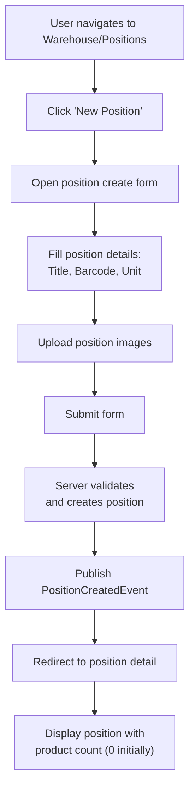
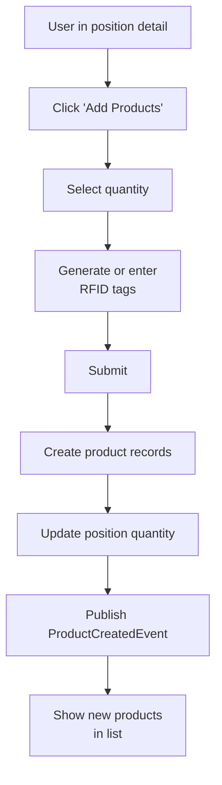
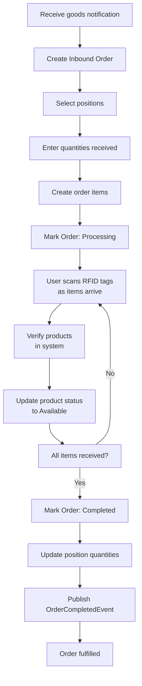
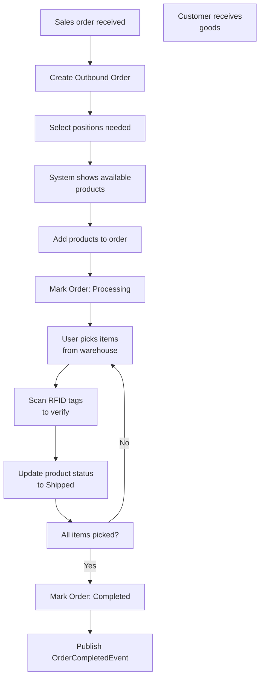

# Warehouse Module - User Experience

## User Flows

### Flow 1: Create Warehouse Position (SKU)



### Flow 2: Add Products to Position



### Flow 3: Process Inbound Order



### Flow 4: Process Outbound Order



### Flow 5: Inventory Check

```mermaid
flowchart TD
    A["Schedule inventory count"] --> B["Create Inventory Check"]
    B --> C["System records expected<br/>quantities for all positions"]
    C --> D["Print inventory sheet<br/>or use mobile app"]
    D --> E["For each position:<br/>Physically count items"]
    E --> F["Enter actual count<br/>in system"]
    G{"Count discrepancy?"}
    F --> G
    G -->|Investigate| H["Investigate location"]
    H --> F
    G -->|Accept| I["Next position"]
    I --> J{"All positions<br/>counted?"}
    J -->|No| E
    J -->|Yes| K["Complete Check"]
    K --> L["System calculates<br/>variances"]
    L --> M{"Large variances<br/>found?"]
    M -->|Yes| N["Flag for review<br/>and correction"]
    M -->|No| O["Archive check results"]
    N --> P["Create correction orders<br/>if needed"]
```

## Page Structure

### Products List Page

**URL**: `/warehouse/products`

**Components**:
- Search/Filter bar
  - Search by RFID, barcode
  - Filter by status (available, reserved, damaged, missing)
  - Filter by position
  - Pagination controls

- Products table
  - RFID tag (clickable)
  - Position title
  - Status with color indicator
  - Created date
  - Actions menu

**Key HTMX Features**:
- Search triggers `hx-get` with debounce
- Status filter via dropdown with `hx-post`
- Pagination via `hx-get`
- Bulk status update via `hx-put`

```templ
templ ProductsList(ctx context.Context, products []ProductVM, filters FilterVM) {
    <div class="products-list">
        <div class="filters">
            <input
                type="text"
                hx-get="/warehouse/products"
                hx-trigger="keyup changed delay:500ms"
                placeholder="Search by RFID..."
            />
            <select hx-post="/warehouse/products" name="status">
                <option value="">All Status</option>
                <option value="available">Available</option>
                <option value="reserved">Reserved</option>
                <option value="damaged">Damaged</option>
                <option value="missing">Missing</option>
            </select>
        </div>

        <table>
            <thead>
                <tr>
                    <th>RFID</th>
                    <th>Position</th>
                    <th>Status</th>
                    <th>Created</th>
                    <th>Actions</th>
                </tr>
            </thead>
            <tbody>
                for _, p := range products {
                    <tr>
                        <td>
                            <a href={ templ.URL("/warehouse/products/" + fmt.Sprint(p.ID)) }>
                                { p.RFID }
                            </a>
                        </td>
                        <td>{ p.Position.Title }</td>
                        <td>
                            <span class={ "status", "status-" + p.Status }>
                                { p.Status }
                            </span>
                        </td>
                        <td>{ p.Created }</td>
                        <td>
                            <button hx-get={ "/warehouse/products/" + fmt.Sprint(p.ID) }>
                                View
                            </button>
                        </td>
                    </tr>
                }
            </tbody>
        </table>
    </div>
}
```

### Positions (Catalog) Page

**URL**: `/warehouse/positions`

**Components**:
- Search/Filter
  - Search by title, barcode
  - Filter by unit
  - Pagination

- Positions grid or table
  - Position image
  - Title
  - Barcode
  - Unit
  - Total quantity (available/reserved)
  - Actions (Edit, View Products, Delete)

**Detail View**:
- Position header with image
- Basic info (title, barcode, unit)
- Product statistics
  - Total products
  - Available count
  - Reserved count
  - Damaged count
- Products table (filterable by status)
- Add products form
- Edit position button
- Delete position button

### Orders Page

**URL**: `/warehouse/orders`

**Components**:
- Filter tabs
  - All Orders
  - Inbound
  - Outbound

- Orders table
  - Order ID
  - Type (icon + label)
  - Status (color-coded)
  - Item count
  - Created date
  - Actions

**Order Detail View**:
- Order header (ID, type, status)
- Timeline
  - Created: date/time
  - Completed: date/time (if applicable)

- Items table
  - Position title
  - Product RFID
  - Status per product
  - Actions (if in draft)

- Order actions
  - Start Processing (if draft)
  - Mark Complete (if processing)
  - Cancel (if draft only)

**Create Order Modal**:
- Order type selector (Inbound/Outbound)
- Position selection (multi-select)
- Quantity per position
- Product selection (available products for outbound)
- Create button

### Inventory Check Page

**URL**: `/warehouse/inventory`

**Components**:
- Checks list
  - Check name
  - Status (in progress/completed)
  - Created date
  - Created by user
  - Actions

- Check detail view
  - Header with check name
  - Status indicator
  - Timeline (started/completed dates)
  - Created by / Completed by

  - Results table (position level)
    - Position title
    - Expected quantity
    - Actual quantity
    - Difference (with color: red for shortage, green for overage)
    - Details button

  - Summary statistics
    - Total positions
    - Positions matching
    - Positions with variance
    - Total variance value

**Variance Investigation**:
- Highlight positions with variance
- Show detailed product list for position
- Note entry for investigation
- Correction order creation

**Create Check Modal**:
- Check name input
- Optional description
- Create button (starts check in progress)

**Count Interface**:
- Show current position to count
- Expected quantity displayed
- Input field for actual count
- Barcode/RFID scanner integration
- Previous/Next buttons
- Mark complete button when all counted

### Units Management Page

**URL**: `/warehouse/units`

**Components**:
- Units list
  - Title
  - Short abbreviation
  - Created date
  - Usage count (positions using this unit)
  - Edit/Delete buttons

**Create/Edit Modal**:
- Title input
- Short abbreviation input
- Save button

**Constraints**:
- Cannot delete unit if positions use it
- Show error message with position count if deletion attempted

## HTMX Patterns

### 1. Product Status Update
```html
<select
    hx-put="/warehouse/products/:id/status"
    hx-trigger="change"
    hx-swap="outerHTML"
>
    <option value="available">Available</option>
    <option value="reserved">Reserved</option>
    <option value="damaged">Damaged</option>
    <option value="missing">Missing</option>
</select>
```

### 2. Order Status Progression
```html
<button
    hx-post="/warehouse/orders/:id/start-processing"
    hx-swap="outerHTML"
    hx-confirm="Mark order as processing?"
>
    Start Processing
</button>
```

### 3. Inventory Count Entry
```html
<form hx-post="/warehouse/inventory/:id/count" hx-swap="outerHTML">
    <input type="hidden" name="PositionID" value="...">
    <input
        type="number"
        name="ActualQuantity"
        placeholder="Enter count..."
        autofocus
    />
    <button type="submit">Record Count</button>
</form>
```

### 4. Auto-refresh Order Items
```html
<table
    id="order-items"
    hx-get="/warehouse/orders/:id/items"
    hx-trigger="every 5s"
    hx-swap="outerHTML"
>
    <!-- Items -->
</table>
```

## Alpine.js Features

### Order Status Badge
```html
<div x-data="{ status: 'draft' }">
    <span
        :class="{
            'badge-blue': status === 'draft',
            'badge-yellow': status === 'processing',
            'badge-green': status === 'completed'
        }"
    >
        { status }
    </span>
</div>
```

### Inventory Variance Highlighting
```html
<div x-data="{ variance: -5 }">
    <tr :class="{ 'row-error': variance < 0, 'row-warning': variance > 10 }">
        <td>Position Name</td>
        <td>100</td>
        <td>95</td>
        <td x-text="variance"></td>
    </tr>
</div>
```

### Position Quantity Calculator
```html
<div x-data="{
    totalProducts: 0,
    available: 0,
    reserved: 0,
    calculateTotals() {
        // Fetch and calculate
    }
}">
    <div @load="calculateTotals()">
        <p>Total: <span x-text="totalProducts"></span></p>
        <p>Available: <span x-text="available"></span></p>
        <p>Reserved: <span x-text="reserved"></span></p>
    </div>
</div>
```

## Form Validation

### Position Create/Edit Form
```go
type CreatePositionDTO struct {
    Title      string `form:"Title" validate:"required,max=255"`
    Barcode    string `form:"Barcode" validate:"max=255"`
    UnitID     uint   `form:"UnitID" validate:"required"`
}
```

### Product Create Form
```go
type CreateProductDTO struct {
    PositionID uint   `form:"PositionID" validate:"required"`
    RFID       string `form:"RFID" validate:"required,unique=warehouse_products"`
    Quantity   int    `form:"Quantity" validate:"required,min=1,max=1000"`
}
```

### Order Create Form
```go
type CreateOrderDTO struct {
    Type      string `form:"Type" validate:"required,oneof=inbound outbound"`
    Positions []struct {
        PositionID uint `form:"PositionID" validate:"required"`
        Quantity   int  `form:"Quantity" validate:"required,min=1"`
    } `form:"Positions" validate:"required,min=1"`
}
```

### Inventory Check Count
```go
type CountDTO struct {
    PositionID    uint `form:"PositionID" validate:"required"`
    ActualQuantity int  `form:"ActualQuantity" validate:"required,min=0"`
}
```

## Responsive Design

### Mobile Considerations

**Products List**:
- Single column layout
- Hide created date on small screens
- Hamburger menu for actions
- Large touch targets (44x44px)

**Order Processing**:
- Full-screen checkout view
- Large input for quantity entry
- One item per "screen" (swipe to next)
- Confirmation checkmarks

**Inventory Count**:
- Full-screen count interface
- Large number input
- Previous/Next/Complete buttons at bottom
- Progress indicator (X of Y items counted)

### Tablet Considerations
- Two-column layout possible
- Side-by-side position + products
- Touch-friendly button sizes (48x48px minimum)

## Accessibility Features

- ARIA labels on buttons and inputs
- Keyboard navigation (Tab, Enter, Escape)
- Focus indicators on interactive elements
- Status indicators not color-only (icons + text)
- Semantic HTML structure
- Screen reader support for dynamic updates (ARIA live regions)

## Real-time Features

### Order Status Updates
- Polling every 5 seconds for order item changes
- Show progress as items processed
- Notify when order complete

### Inventory Counting
- Progress indicator (5/100 positions counted)
- Estimated time remaining
- Pause/resume capability

### Product Scanning
- RFID reader integration
- Auto-advance to next item
- Visual/audio feedback for scans
- Quantity entry with barcode or RFID

## Keyboard Shortcuts

| Shortcut | Action |
|----------|--------|
| `Ctrl+N` | New position/product/order |
| `Ctrl+S` | Save form |
| `Esc` | Close modal/form |
| `Tab` | Navigate fields |
| `Enter` | Submit form |

## Print/Export Features

### Inventory Count Sheet
- Print position list with expected quantities
- Blank columns for physical count
- Barcode for each position
- Date/time header

### Order Packing Slip
- Order details (ID, date)
- Item list with barcodes
- Quantity per item
- Customer info (if available)

### Inventory Report
- Position-level summary
- Available/reserved/damaged counts
- Variance report
- Period: Daily, Weekly, Monthly

## Dark Mode Support

- Theme toggle in header
- Persist selection in localStorage
- CSS variables for colors
- Automatic detection via `prefers-color-scheme`
- Status indicator colors maintain contrast
